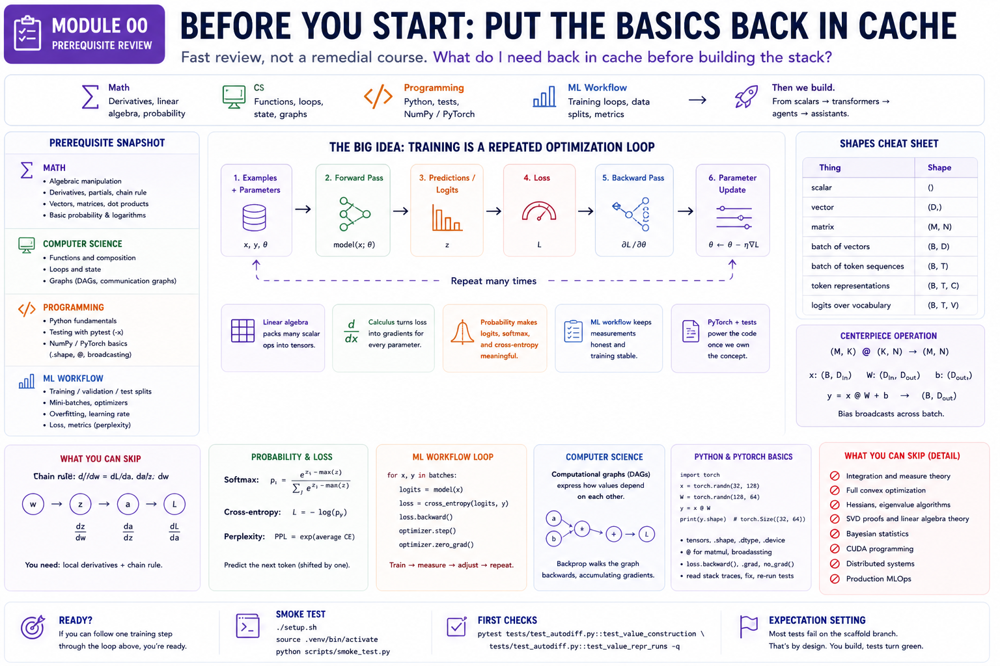
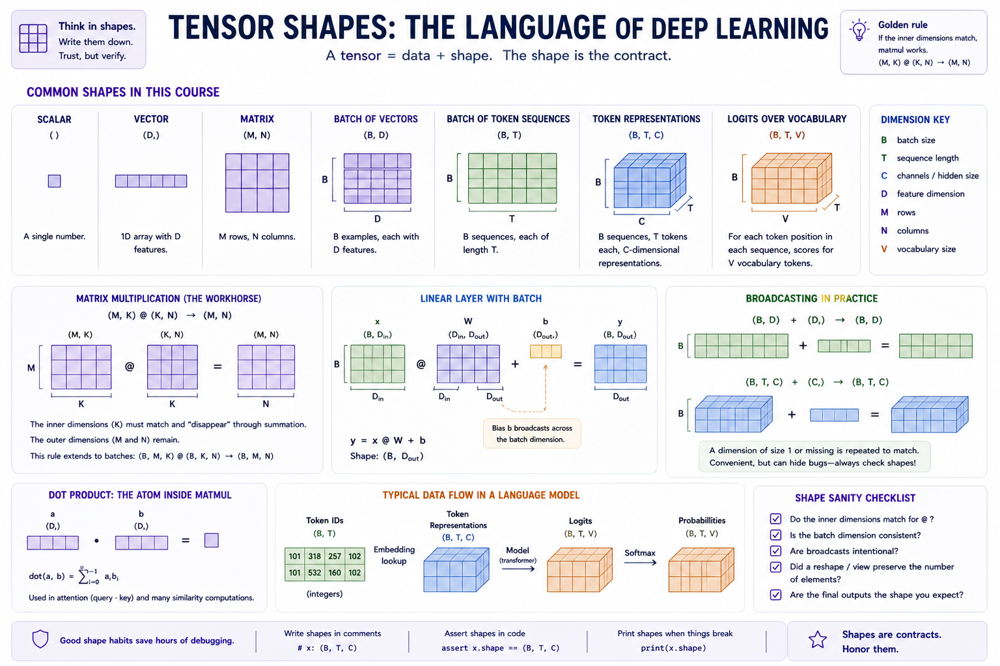
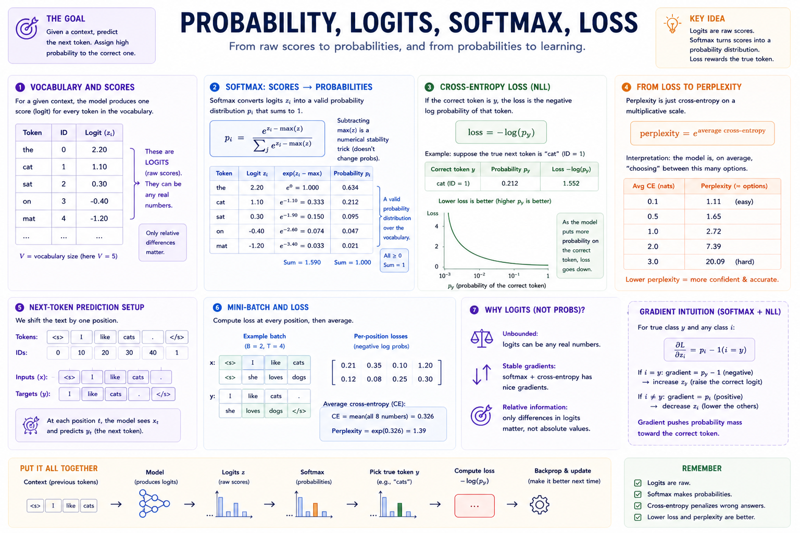

# Module 00 — Prerequisite review

> **Question this module answers:** *What do I need back in cache before building the stack?*



*The prerequisite surface for the course in one pass. Module 00 is not a separate fundamentals course; it is a cache warm-up for the pieces that make the first real loop legible: examples and parameters, a forward pass, logits, loss, backward gradients, and a parameter update.*

This is a fast review, not a remedial course. If these ideas are familiar but rusty, this module should put the right concepts back in working memory before Module 01. If several sections feel new, pause here and use this page as a map for a longer fundamentals pass before starting the course.

## Prerequisites

This module assumes you are already a competent programmer and have seen the math before. The goal is recall, not first exposure.

### Math

- **Algebraic manipulation.** Rearranging formulas, reading subscripts, and following expressions with several variables.
- **Derivatives.** Single-variable derivatives, partial derivatives, and the chain rule.
- **Vectors and matrices.** Dot products, matrix multiplication, and shape reasoning.
- **Basic probability.** Discrete distributions, expected "probability mass over choices," and logarithms.

### Computer science

- **Functions and composition.** The whole course treats models as large composed functions.
- **Loops and state.** Training loops, decode loops, and agent loops are all explicit loops with changing state.
- **Graphs.** Computational graphs in Module 01 are directed acyclic graphs; later attention maps are dense communication graphs over tokens.

### Programming

- **Python.** Classes, functions, list/dict basics, imports, virtual environments, and reading stack traces.
- **Testing.** Running `pytest`, using `-x`, and reading a failing test as a contract.
- **Numerical Python basics.** Enough NumPy or PyTorch familiarity to read `.shape`, use `@`, and understand that vectorized code runs outside the Python interpreter.

### What you can skip

You do **not** need integration, measure theory, full convex optimization, Hessians, eigenvalue algorithms, SVD proofs, Bayesian statistics, CUDA programming, distributed systems, or production MLOps. Those are real topics, but they are not the gate for this course.

## Why we start here

Module 01 starts by building scalar autodiff. That only feels enlightening if derivatives, the chain rule, and "a computation as a graph" are already close at hand. Module 02 immediately moves to tensors and matrix multiplication. Module 03 adds loss functions, mini-batches, and train/validation splits. By Module 04, text has become token IDs; by Module 07, those token IDs are communicating through attention.

This module narrows the prerequisite surface to the parts that will actually be used. It is intentionally incomplete as a math course. You are reviewing just enough to keep the early modules focused on the ideas under study instead of turning every exercise into prerequisite archaeology.

## The big idea

Deep learning is the repeated optimization of a parameterized function:

```text
examples + parameters
          |
          v
    forward pass
          |
          v
 predictions / logits
          |
          v
        loss
          |
          v
    backward pass
          |
          v
      gradients
          |
          v
 parameter update
```

Each prerequisite topic supports one piece of that loop:

- **Linear algebra** packs many scalar operations into tensor operations.
- **Calculus** explains how a loss produces gradients for every parameter.
- **Probability** explains why logits, softmax, cross-entropy, and perplexity are the right language for prediction.
- **ML workflow** keeps training measurements honest.
- **PyTorch and tests** provide the substrate after the from-scratch pieces have taught the underlying idea.

If you can trace one training step through that diagram, the rest of the course has a place to land.

## Concepts to internalize

### Linear algebra and shapes

A tensor is an array plus shape metadata. The shape is not decoration; it is the contract.

Common shapes in this course:

```text
scalar                    ()
vector                    (D,)
matrix                    (M, N)
batch of vectors          (B, D)
batch of token sequences  (B, T)
token representations     (B, T, C)
logits over vocabulary    (B, T, V)
```

The central operation is matrix multiplication:

```text
(M, K) @ (K, N) -> (M, N)
```

The inner dimensions match and disappear through summation; the outer dimensions remain. A linear layer is the same rule with a batch:

```text
x: (B, D_in)
W: (D_in, D_out)
b: (D_out,)

y = x @ W + b
y: (B, D_out)
```

The bias `b` broadcasts across the batch dimension. Broadcasting means a size-1 or missing dimension is conceptually repeated without copying data. It is convenient, but it can also hide shape bugs, so get in the habit of writing expected shapes next to tensor code.



*The shape vocabulary this course will reuse constantly. The same few contracts show up in linear layers, embeddings, attention, logits, and softmax; writing them down is the fastest way to catch a mistaken transpose, missing batch dimension, or accidental broadcast.*

The dot product is the atom inside matmul:

```text
dot(a, b) = a[0]*b[0] + a[1]*b[1] + ... + a[D-1]*b[D-1]
```

Attention later uses dot products to ask "how compatible is this query with that key?" Embeddings use table lookup to turn discrete token IDs into vectors. Transformer blocks are mostly matmuls, broadcasts, elementwise nonlinearities, and reshapes.

A linear layer can also be read as a learned change of coordinates: it takes vectors written in one feature basis and projects them into another feature basis. You do not need a full course on eigenvectors or diagonalization here; just keep the "vectors move between representation spaces" picture available for embeddings, attention projections, and transformer blocks.

Before Module 02, you should be able to:

- Compute a small `2 x 3 @ 3 x 2` matmul by hand.
- Explain why `x @ W + b` has shape `(B, D_out)`.
- Read `(B, T, C)` as batch, time, channels.
- Notice when a broadcast is intended versus suspicious.

### Calculus for backprop

For this course, a derivative is a local sensitivity: "if this input changes a little, how much does this output change?"

You need four ideas:

- **Single-variable derivative.** `d/dx x^2 = 2x`.
- **Partial derivative.** For `f(x, y) = x*y`, `df/dx = y` and `df/dy = x`.
- **Gradient.** The vector of partial derivatives with respect to many inputs or parameters.
- **Chain rule.** If `L` depends on `a`, and `a` depends on `z`, and `z` depends on `w`, then `dL/dw = dL/da * da/dz * dz/dw`.

That is enough to understand backprop.

A one-neuron example:

```text
z = w*x + b
a = tanh(z)
L = (a - target)^2
```

The gradient with respect to `w` is:

```text
dL/da = 2 * (a - target)
da/dz = 1 - tanh(z)^2
dz/dw = x

dL/dw = dL/da * da/dz * dz/dw
```

The autodiff engine in Module 01 automates exactly this. Each operation stores a small local derivative rule. Backward traversal multiplies those local rules together along every path from loss back to parameter. If a value feeds multiple paths, its gradient is the sum of all path contributions.

Local derivatives worth having in cache:

```text
d/dx (x + y)        = 1
d/dy (x + y)        = 1
d/dx (x * y)        = y
d/dy (x * y)        = x
d/dx (x^n)          = n * x^(n - 1)
d/dx exp(x)         = exp(x)
d/dx log(x)         = 1 / x
d/dx tanh(x)        = 1 - tanh(x)^2
d/dx relu(x)        = 1 if x > 0 else 0
```

You do not need integration for this course's core path. You need local derivatives and the chain rule.

### Probability, logits, and loss

Language models predict the next token by assigning a score to every possible token in the vocabulary. Those raw scores are **logits**. Logits are not probabilities: they can be negative, they do not sum to 1, and only their relative differences matter.

Softmax turns logits into a categorical distribution:

```text
p_i = exp(z_i - max(z)) / sum_j exp(z_j - max(z))
```

Subtracting `max(z)` is a numerical-stability trick. It does not change the probabilities, but it prevents exponentials from overflowing.

If the correct class is `y`, the negative log likelihood is:

```text
loss = -log(p_y)
```

Cross-entropy is the average negative log likelihood across examples. It is the default loss for classification and next-token prediction because it directly rewards assigning high probability to the observed target.

Perplexity is just cross-entropy put back on a multiplicative scale:

```text
perplexity = exp(average_cross_entropy)
```



*The prediction loop in probability language. A model emits logits, softmax turns them into probabilities, cross-entropy rewards probability on the true next token, and perplexity gives that loss a scale you can compare while training.*

For language modeling, the dataset is text shifted by one position:

```text
tokens:  [t0, t1, t2, t3, t4]
inputs:  [t0, t1, t2, t3]
targets: [t1, t2, t3, t4]
```

The model sees the inputs and is trained to predict the targets. Everything from bigrams to transformers uses this same objective.

### ML workflow

The model is a function with parameters. Training repeatedly estimates how wrong the function is, computes gradients, and updates the parameters.

The basic supervised training loop:

```python
for x, y in batches:
    logits = model(x)
    loss = cross_entropy(logits, y)
    loss.backward()
    optimizer.step()
    optimizer.zero_grad()
```

The names will change as you build pieces from scratch, but the loop will keep this shape.

Key workflow concepts:

- **Parameters.** The learned numbers: weights, biases, embedding tables, projection matrices.
- **Hyperparameters.** The chosen settings: learning rate, batch size, model width, context length, number of layers.
- **Training split.** Data used to update parameters.
- **Validation split.** Data used to choose settings and notice overfitting.
- **Test split.** Data held back until you want a final estimate.
- **Mini-batch.** A small group of examples used to estimate a gradient step.
- **Overfitting.** Training loss improves while validation loss stops improving or gets worse.
- **Learning rate.** The step size. Too high can diverge; too low can make learning look broken.

The course's tiny models will fail in visible ways. That is useful. A small model that overfits, loops while sampling, or fails an eval is easier to understand than a giant model that hides the same failure modes behind fluent output.

### Python, PyTorch, and repo mechanics

The course starts from scratch where the concept is the lesson, then uses PyTorch tensor primitives once scalar mechanics are established. You should be able to read small snippets like:

```python
import torch

device = "mps" if torch.backends.mps.is_available() else "cpu"
x = torch.randn(32, 128, device=device)
W = torch.randn(128, 64, device=device)
y = x @ W
print(y.shape)  # torch.Size([32, 64])
```

You do not need to know all of PyTorch. You do need:

- `torch.tensor`, `torch.randn`, `.shape`, `.dtype`, `.device`
- `@` for matmul
- elementwise arithmetic
- indexing and slicing
- `.to(device)`
- `torch.no_grad()` for inference
- enough autograd familiarity to know that `loss.backward()` fills `.grad`

## Scaffolding and how to run the checks

Module 00 is a readiness review. However it's a good idea to prepare your development environment for the rest of the course.

Run the environment smoke test:

```bash
./setup.sh
source .venv/bin/activate
python scripts/smoke_test.py
```

## What you'll build

No package code lands in Module 00. The output is a short readiness artifact: notes, a scratch notebook, or a page in your course journal that proves the prerequisites are loaded.

By the end, you should have:

- One hand-traced shape example.
- One hand-derived chain-rule gradient.
- One softmax/cross-entropy calculation.
- A working local environment.
- A clear sense of which prerequisite, if any, needs a longer review before Module 01.

## Exercises

1. **Shape trace.** Let `B = 4`, `T = 8`, `C = 16`, and `V = 1000`. Token IDs have shape `(B, T)`. An embedding table has shape `(V, C)`. What is the shape after embedding lookup? If the final projection has shape `(C, V)`, what shape are the logits?

2. **Matmul by hand.** Compute:

   ```text
   A = [[1, 2, 3],
        [4, 5, 6]]

   B = [[10, 20],
        [30, 40],
        [50, 60]]

   A @ B = ?
   ```

   Then state the input and output shapes.

3. **Backprop by hand.** For `z = w*x + b`, `a = tanh(z)`, `L = (a - target)^2`, write `dL/dw`, `dL/db`, and `dL/dx` as products of local derivatives.

4. **Softmax and loss.** Given logits `[2.0, 1.0, 0.0]` and target class `0`, compute the softmax probabilities approximately and then the negative log likelihood.

5. **Training-loop narration.** In five sentences or fewer, explain what happens in `forward -> loss -> backward -> step -> zero_grad`.

6. **Environment check.** Run `python scripts/smoke_test.py`. If MPS is unavailable on an Apple Silicon machine, fix that before Module 02.

## Pitfalls to expect

- **Trying to relearn everything.** The goal is not to master all prerequisite fields. It is to recover the pieces used by this course.
- **Treating shapes as incidental.** Shapes are the fastest debugging tool you have. Write them down.
- **Confusing logits with probabilities.** Logits become probabilities only after softmax.
- **Forgetting gradient accumulation.** If one value affects the loss through two paths, both contributions count.
- **Using the test suite wrong.** On scaffold branches, full-module tests are supposed to fail. Use the failing test names as implementation directives.
- **Over-reading before coding.** If you can do the exercises above, start Module 01. The course is designed to teach by building.

## Reading

Primary refreshers:

- **3Blue1Brown, "Essence of Linear Algebra"** - dot products, matrix multiplication, and transformations.
- **3Blue1Brown, "Backpropagation calculus"** - the chain-rule picture behind autodiff.
- **PyTorch official tutorial, "Tensors"** - enough tensor mechanics for Module 02 onward.
- **Karpathy, "The spelled-out intro to neural networks and backpropagation"** - useful bridge into Module 01.

Optional:

- **Parr and Howard, "The Matrix Calculus You Need For Deep Learning"** - use as a reference, not as a prerequisite wall.
- **Goodfellow, Bengio, Courville, Deep Learning, Chapters 5-6** - skim for terminology and loss-function context.

## Deliverable checklist

- [ ] You can explain the training loop diagram without notes.
- [ ] You can trace simple tensor shapes through `x @ W + b`.
- [ ] You can compute a small matmul by hand.
- [ ] You can derive a one-neuron gradient with the chain rule.
- [ ] You can explain logits, softmax, cross-entropy, and perplexity.
- [ ] `python scripts/smoke_test.py` runs successfully.
- [ ] You know to use `pytest -x` as the next directive while implementing.

## M-series notes

Module 00 is almost entirely pencil-and-paper plus environment setup. MPS matters later, starting in Module 02. The only compute check here is confirming that PyTorch can see the MPS backend on your machine.
