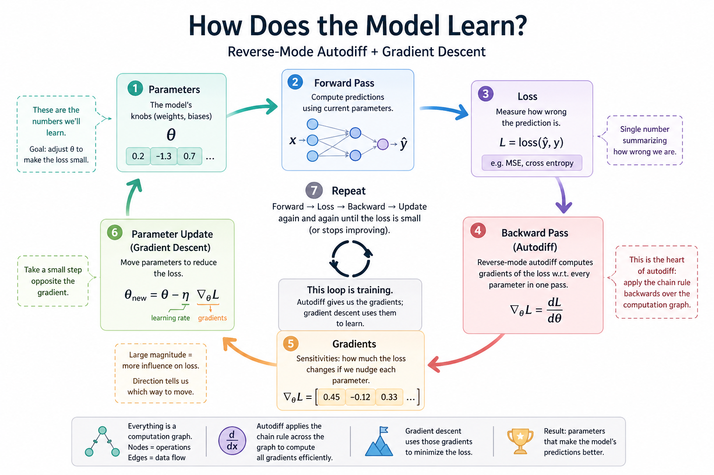
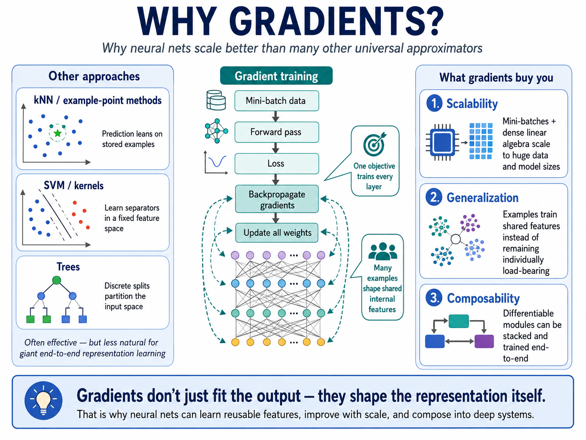

# Module 01 — Gradients

> **Question this module answers:** *How does the model learn?*



Module 01 builds the **backward pass** — the autodiff machinery that converts a forward computation into gradients with respect to every parameter. The forward pass, the loss, and the parameter update are all straightforward arithmetic; the gradient computation is the keystone, and it's what every later module's training loop will lean on.

---
## Before you start

- *Review* [00-prerequisite-review](00-prerequisite-review.md) to load the underlying math, computer science, and programming topics back into cache.
- *Review* the [Topological sort primer](../primers/topo-sort.md) before implementing `backward()` — it derives the post-order DFS this module's hardest step depends on.
- *Run* `setup.sh` if you haven't already set up the course environment. We'll use it in this module's exercises.
- Set up your favorite code editor for Python — you'll be writing, reading, and running a lot of code in `g2c`.

---
## Where this fits in

Modern AI is built on many ideas — transformers, attention, tokenization, pretraining, fine-tuning, RLHF, tool use, agents — but underneath almost all of them is the same basic engine: **gradient-based learning**. Gradients are what let a model take an error signal — “this prediction was a little wrong” — and turn it into millions or billions of tiny adjustments across its internal parameters.

**Neural networks** are the primary form of gradient-based learning. A neural net is just a circuit made up of individual differentiable functions (meaning they have a gradient). That matters because neural networks are not just fitting outputs. They are learning the internal representations that make future outputs easier to produce.

This is the reason neural networks became the dominant primitive in deep learning. Other methods can be powerful: nearest-neighbor systems lean on stored examples, support vector machines learn separators, trees split the input space, and Gaussian processes reason over functions with elegant uncertainty. But neural networks trained with gradients have a special combination of properties: they scale to huge datasets, run efficiently as dense linear algebra on modern hardware, and can be stacked into deep systems where every layer is trained by the same learning signal. A single objective can shape the whole network, from low-level features to abstract patterns.


*What makes neural nets special?*

For this course, we do not start with gradients because every student needs to become an expert in calculus or optimization. We start here because gradients explain the basic “learning motion” behind the systems students already know as ChatGPT-like models. Once you understand that a model improves by repeatedly nudging its internal representation toward better predictions, many later ideas become easier to place: pretraining is gradient learning at internet scale; fine-tuning is gradient learning on a narrower behavior; embeddings are learned representations; transformers are architectures designed to make this learning process work well over sequences. Gradients are the thread that ties the whole stack together.

This module is the analogue of NAND gates in *NAND to Tetris*. Everything else stacks on top.

## The big idea

Every computation can be drawn as a graph:

```
   a ──┐
       ├── (*) ── d ──┐
   b ──┘              ├── (+) ── e
                  c ──┘
```

Here `d = a * b` and `e = d + c`. Each node holds a value (computed forward) and a gradient (computed backward). The gradient at a node is `de/dnode` — how much the final output `e` changes per unit change in the node's value.

**Reverse-mode automatic differentiation** is the algorithm that solves this. It computes all those derivatives in one pass over a graph, in time proportional to the forward pass. Modern deep learning frameworks (PyTorch, JAX, MLX, TensorFlow) are, at their core, fast and well-engineered implementations of this single idea applied to tensors.

We start with the *scalar* version. No tensors, no broadcasting, no GPU. Just numbers and a small Python class. The reason: every confusing thing about deep learning training — gradient flow, vanishing gradients, the role of nonlinearities, why some architectures train and others don't — is easier to see when the machinery is laid bare. Once you've built this from scratch, `loss.backward()` is no longer magic. It's something you wrote.

**The forward pass** computes node values by walking the graph from inputs to outputs, applying each operation.

**The backward pass** computes gradients by walking the graph in reverse. At the output, `de/de = 1`. For each operation, you know how to push gradient from the output to the inputs using the chain rule:

- For `e = d + c`: `de/dd = 1`, `de/dc = 1`
- For `d = a * b`: `dd/da = b`, `dd/db = a`, so `de/da = de/dd · b`, `de/db = de/dd · a`

Each operation type carries a small **local rule** for how to distribute the incoming gradient to its inputs. That's it. Stack these rules across a graph of millions of nodes and you've reproduced the heart of every modern deep learning library.

Three subtleties worth highlighting:

1. **Topological order matters.** When you compute the gradient of a node, you need the gradients of all its downstream consumers to already be finalized. The standard approach is a topological sort of the graph, then iterate in reverse.

2. **Gradient accumulation.** A node can be used in multiple downstream places. Each use contributes to the node's total gradient, so backward must *add* to a node's gradient field rather than overwrite it. (Hence the `.zero_grad()` calls you'll see later.)

   The classic case is a diamond, where one node feeds two paths that later merge:

   ```
              a
             / \
            /   \
           b     c        b = a * x      c = a * y
            \   /
             \ /
              f           f = b + c

      df/da = (df/db)(db/da) + (df/dc)(dc/da)
            = the contribution along the b-path PLUS the contribution along the c-path
   ```

   If `_backward` writes `self.grad = ...` instead of `self.grad += ...`, the second path silently overwrites the first and the answer is wrong by half (or worse).

3. **The graph is implicit.** You don't build a graph object up-front. You just construct expressions, and each operation records its parents. The graph is the linked structure of `Value` objects.

## Concepts to internalize

- **Computational graph** — every expression is a DAG of operations on Values.
- **Forward pass** — compute each node's value by traversing inputs → outputs.
- **Local derivatives** — every operation type defines how its output's gradient flows back to its inputs (`+`: pass through; `*`: swap and multiply; `tanh`: `1 - tanh²`; etc.).
- **Reverse-mode autodiff** — apply the chain rule by walking the graph backwards once.
- **Topological sort** — the right order to apply backward updates so each node sees all its downstream gradients.
- **Gradient accumulation** — a node used in multiple expressions accumulates the sum of contributions.
- **Loss minimization via gradient descent** — once you have `dL/dparam` for each parameter, update `param ← param - lr · dL/dparam`.

---
## What you'll build

Package: `g2c/autodiff/`

### `value.py` — the autodiff engine

```python
class Value:
    def __init__(self, data: float, _children=(), _op=""): ...

    # primitive ops (each stores a backward closure)
    def __add__(self, other): ...
    def __mul__(self, other): ...
    def __pow__(self, exponent: float): ...
    def exp(self): ...
    def log(self): ...
    def tanh(self): ...
    def relu(self): ...

    def backward(self): ...   # topological sort + reverse-mode pass
```

Right-hand-side operators (`__radd__`, `__rmul__`, etc.) and unary/convenience ops (`__neg__`, `__sub__`, `__truediv__`) are implemented for you so that `2 * Value(3)` just works.

### `grad_check.py` — numerical gradient checker

```python
def numerical_grad(f, val: Value, h: float = 1e-5) -> float: ...
```

Estimates `df/dval` by finite differences. Use it to verify your analytic gradients.

### `nn.py` — scalar neural-network helpers

```python
def single_neuron_forward(x1, x2, w1, w2, b) -> Value: ...

class ScalarNeuron:
    def __call__(self, x) -> Value: ...

class ScalarMLP:
    def __call__(self, x) -> Value: ...

def xor_loss(model: ScalarMLP) -> Value: ...
def train_xor_step(model: ScalarMLP, lr: float) -> float: ...
```

These are the editor-backed helpers the notebook uses for the XOR exercise.
They still use only your `Value` engine; they just keep the reusable code in
`g2c/autodiff/nn.py` instead of in a fragile notebook cell.

### End-to-end usage

```python
from g2c.autodiff import Value

a = Value(2.0)
b = Value(3.0)
c = a * b + a.tanh()
c.backward()
print(a.grad, b.grad)  # dc/da, dc/db
```

Keep the implementation small — well under 100 lines. Legibility wins.

## How to run the tests

Tests are in `tests/test_autodiff.py`. Initial state: 6 passed, 48 failed. The
construction tests pass from the start; the operation, backward,
gradient-checking, and scalar-XOR helper tests turn green as you implement the
TODOs.

```bash
source .venv/bin/activate
pytest tests/test_autodiff.py            # run all autodiff tests
pytest tests/test_autodiff.py -x         # stop at first failure (recommended while working)
pytest tests/test_autodiff.py -k add     # run only tests whose name matches "add"
pytest tests/test_autodiff.py -v         # verbose: list every test
```

## Exercises

To launch the exercise notebook run:

```bash
./notebook.sh 01
```

If at any point you want to archive the work in your current notebook and restart fresh:

```bash
./notebook.sh 01 --fresh
```

The notebook carries the exact prompts; this page lists the exercise arc.

1. **Forward and backward by hand.** Trace one scalar expression end to end.
2. **Gradient checking.** Compare `.backward()` against finite differences.
3. **A neuron from scratch.** Train one `Value`-based neuron for one update step.
4. **XOR with a tiny MLP.** Use only your scalar engine to fit a nonlinear toy problem.
5. **Topology stress test.** Verify gradient accumulation when one `Value` feeds multiple paths.

## Pitfalls to expect

- **Forgetting accumulation.** If your `_backward` writes `self.grad = ...` instead of `self.grad += ...`, exercise 5 will quietly produce wrong answers. Always accumulate.
- **Topo order off-by-one.** A correct topological sort is essential. The standard pattern is post-order DFS with a visited set, then reverse the result before iterating.
- **Mutating inputs vs. returning new Values.** Each operation should return a new `Value`. Don't try to be clever about in-place updates — they make the graph confusing and break re-execution.
- **Float precision in gradient checks.** Finite differences with `h = 1e-7` can give noisy comparisons. Use `h = 1e-5` and tolerate ~1e-4 absolute error.

## M-series notes

Pure Python on a single CPU thread. Runs in seconds. No PyTorch, no MPS, no installs beyond what's already in the venv.

---
## Reading

Primary:

- **Karpathy, *micrograd* repo** — the canonical reference implementation. <https://github.com/karpathy/micrograd>
- **Karpathy, "The spelled-out intro to neural networks and backpropagation: building micrograd"** (YouTube). The single best DL pedagogy resource for this topic. ~2.5 hours; worth all of it.

Secondary:

- **Goodfellow, Bengio, Courville, *Deep Learning*, Chapter 6.5** — the textbook treatment of backprop.
- **Olah, "Calculus on Computational Graphs: Backpropagation"** (colah.github.io) — the cleanest written explanation of the chain rule on graphs.

## Deliverable checklist

- [ ] All operations from the suggested API are implemented
- [ ] `tests/test_autodiff.py` passes all tests: each operation forward and backward, gradient accumulation on shared nodes, gradient check vs. finite differences
- [ ] `notebooks/solutions/01-autodiff-xor.ipynb` trains a 2-2-1 MLP on XOR using only `Value`
- [ ] You can explain — out loud, without notes — why backward must traverse in topological order
