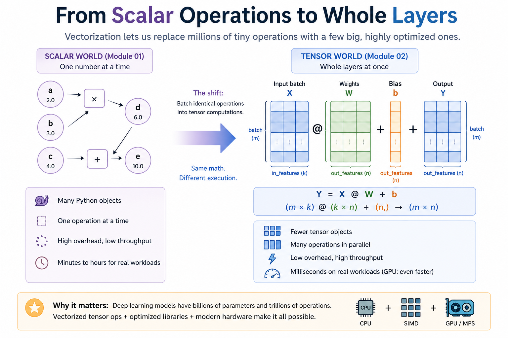
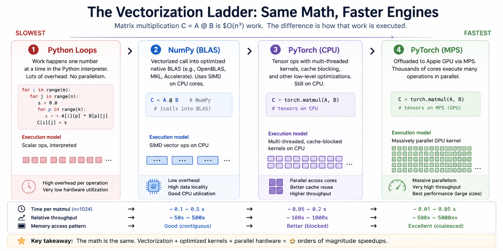

# Module 02 — Tensors and matmul

> **Question this module answers:** *How do we scale computation from single numbers to whole layers?*



In Module 01, every number was its own Python object; one operation at a time, high overhead, low throughput. In Module 02, identical operations across an entire input batch are bundled into a single tensor op that compiles to vectorized native code. Same math, very different execution — and it's the only reason real deep learning is computationally feasible.

---
## Prerequisites

The math, CS, and programming concepts this module uses. None of them require deep prior exposure — refresher pointers below if any feel rusty.
### Math

- **Matrix-vector and matrix-matrix multiplication.** You should be able to compute a small matmul (2×3 @ 3×2) by hand. Refresher: 3Blue1Brown's "Essence of Linear Algebra" chapters 3–4 (15 min).
### Computer science

- **Memory locality (loose intuition).** Why traversing memory sequentially is much faster than jumping around. This is part of why a hand-written triple loop is slow and a vendor BLAS implementation is fast.
- **The vectorization mental model.** Modern hardware does many arithmetic operations in parallel per clock cycle when fed contiguous data. 
- **Asymptotic complexity at the level of intuition.** Comfortable with "this is O(n³), this is O(n²)" and what that implies as `n` grows.
### Programming

- **NumPy basics.** `np.array`, `.shape`, `.dtype`, `@` for matmul. We use NumPy as the middle benchmark rung.
- **PyTorch tensor basics.** `torch.tensor`, `.to(device)`, `@`. Refresher: the official PyTorch "Tensors" tutorial (10 min).

---
## Why we study this

The Module 01 autodiff engine works on individual scalars wrapped in `Value` objects. That's pedagogically beautiful — every node is legible. But it's hopeless for real neural networks. A small MLP on MNIST has thousands of parameters; per-Python-object overhead would make even one forward pass take minutes. A real LLM has hundreds of billions of parameters. Per-scalar Python is not just slow — it's the wrong shape of computation entirely.

The fix is **vectorization**: stop treating each number as its own object, batch identical operations into bulk array ops, and let optimized native code (NumPy's BLAS, PyTorch's MPS kernels) execute them at near-peak hardware throughput. Modern hardware does many arithmetic operations per clock cycle when fed contiguous data. Vectorized code uses that capacity; per-scalar Python wastes it by a factor of thousands.

The dominant operation in deep learning is **matrix multiplication**. Linear layers are matmul. Attention is a sequence of matmuls. Embedding lookups are an indexing-then-matmul pattern. Convolutions can be expressed as matmuls. The reason GPUs (and Apple Silicon's MPS) matter for ML is that their architectures are specifically optimized for the bandwidth-and-throughput pattern of large matmuls. Understanding matmul — its math, its memory access pattern, the cost difference between implementations — is the single most important step in seeing why hardware matters.




*The same matmul, four engines. Each step up the ladder is roughly an order of magnitude faster than the one below it. Modern deep learning is feasible only because all four rungs exist. trying to train anything serious from rung 1 alone would take years per epoch.*

## The big idea

A **tensor** is just a multi-dimensional array of numbers. A scalar is 0-D, a vector is 1-D, a matrix is 2-D, a batch of matrices is 3-D, etc. Tensors have a `shape` (a tuple of dimension sizes) and a `dtype` (the numeric type of each element).

Two ideas dominate tensor-based numerical code:

**1. Matmul.** The matrix product `C = A @ B` where `A` has shape `(m, k)` and `B` has shape `(k, n)` produces `C` with shape `(m, n)`. Each entry `C[i, j] = sum over p of A[i, p] * B[p, j]`. Naively this is `m * n * k` multiplies and adds — a triple loop. In practice it's the most heavily optimized routine in numerical computing, with vendor-tuned implementations exploiting cache hierarchy, SIMD, and parallelism.

```
      A          B            C
   (m × k)  @  (k × n)   =  (m × n)
         ↑     ↑
         └─────┘
        inner dims must match;
        they collapse via summation.
        outer dims (m and n) survive.
```

![Matrix multiplication as a grid of dot products: each output entry C[i, j] is the dot product of row i of A with column j of B.](02-tensors/Module02-MatMul.png)

*Matmul broken down to its atoms. The triple-loop implementation in Exercise 1 just enumerates this directly. Vendor BLAS does the same operation in a fundamentally different way (cache blocking, SIMD, parallelism), but the math is identical.*

**2. Broadcasting.** When two tensors with different but compatible shapes are combined element-wise, smaller dimensions are *implicitly stretched* without copying memory. The standard rules (NumPy and PyTorch use the same):

- Right-align the two shapes; pad the shorter one on the left with `1`s.
- For each dimension, the two sizes must be equal, or one of them must be `1`. Otherwise raise an error.
- The output shape takes the larger of the two sizes in each dimension.

Examples:

```
(3,)     + (3,)     -> (3,)         # straightforward
(3, 4)   + (4,)     -> (3, 4)       # vector broadcasts down rows
(1, 4)   + (3, 1)   -> (3, 4)       # both stretch
(2, 3)   + (2, 4)   -> ValueError   # incompatible
```

Without broadcasting, "add this bias vector to every row of this matrix" requires an explicit loop. With it, you write `x + b` and it does the right thing.

The trickiest case is the two-way stretch — `(1, 3) + (2, 1)` — where neither input matches the output shape on its own:

```
    a = [10  20  30]              shape (1, 3)

    b = [1]                       shape (2, 1)
        [2]

  Both inputs are conceptually "stretched" to the output shape (2, 3):

    a → [10  20  30]              b → [1  1  1]
        [10  20  30]                  [2  2  2]

  Then add element-wise:

      [11  21  31]                 shape (2, 3)
      [12  22  32]
```

No memory is actually copied during the stretch — the size-1 dimension is just re-read at every position. This is what makes broadcasting cheap.

These two ideas — matmul and broadcasting — together cover an enormous fraction of what neural network code does. Master them and the rest of the course is mostly composition.

## Concepts to internalize

- **Tensor = shape + dtype + buffer.** A tensor is a contiguous (or strided) block of numbers, plus metadata describing its dimensions.
- **The matmul shape rule.** `(m, k) @ (k, n) = (m, n)`. The inner dimensions agree and collapse.
- **Why naive matmul is slow.** O(n³) operations × per-element Python overhead = unusable. Vectorized matmul is O(n³) operations executed near-peak on the underlying hardware.
- **Broadcasting rules.** Right-align, 1-or-equal, output is element-wise max. Unequal-and-not-1 → error.
- **Numerical stability of softmax.** `exp(x_i)` overflows for `x_i ≳ 88` in float32. Subtract the max along the softmax axis before exponentiating; the result is mathematically identical (softmax is shift-invariant) but stays in floating-point range.
- **Always know your shapes.** Annotate them in comments or docstrings, especially at function boundaries. Most deep learning bugs are silent shape bugs — code that runs and produces wrong numbers because broadcasting masked an error.

---
## What you'll build

Package: `g2c/tensors/`

### `matmul.py`

```python
matmul_loops(A: list[list[float]], B: list[list[float]]) -> list[list[float]]
matmul_numpy(A: np.ndarray, B: np.ndarray) -> np.ndarray
matmul_torch(A: torch.Tensor, B: torch.Tensor) -> torch.Tensor
```

All three implement the same operation. The first uses Python loops only. The second uses NumPy. The third uses PyTorch (and respects whatever device the input tensors are on, so it can run on MPS just by passing MPS tensors).

### `broadcasting.py`

```python
broadcast_shapes(shape_a: tuple[int, ...], shape_b: tuple[int, ...]) -> tuple[int, ...]

class TinyArray:
    data: list[float]
    shape: tuple[int, ...]
    def __add__(self, other: TinyArray) -> TinyArray
    def __mul__(self, other: TinyArray) -> TinyArray
```

A toy array class supporting NumPy-style broadcasting in element-wise add and multiply. Storage is a flat Python list; broadcasting is implemented entirely in pure Python so that the rules are visible.

### `forward.py`

```python
linear(x: torch.Tensor, W: torch.Tensor, b: torch.Tensor) -> torch.Tensor
softmax(x: torch.Tensor, dim: int = -1) -> torch.Tensor
```

A linear layer (`y = x @ W + b`) and a numerically stable softmax. Together they form the forward pass of a single-layer classifier.

## Scaffolding and how to run the tests

A pytest suite is in `tests/test_tensors.py`. Initial state: a small number of construction/repr tests pass; the rest fail informatively until you implement.

```bash
.venv/bin/python -m pytest tests/test_tensors.py             # run all module-02 tests
.venv/bin/python -m pytest tests/test_tensors.py -x          # stop at first failure
.venv/bin/python -m pytest tests/test_tensors.py -k matmul   # only matmul tests
.venv/bin/python -m pytest tests/test_tensors.py -v          # verbose
```

## Exercises

These are practice and investigation prompts. The implementation targets are the TODOs in `g2c/tensors/` and the tests above; the exercises use those pieces to build shape intuition and performance intuition.

Set up or resume the working notebook for the exercise set by running:

```bash
.venv/bin/python scripts/open_notebook.py 02
```

1. **Shape tracing.** For each expression, write the output shape or mark it invalid. For invalid expressions, name the mismatched dimensions.

   - `A @ B` where `A.shape == (2, 3)` and `B.shape == (3, 4)`
   - `B @ A` for the same `A` and `B`
   - `x @ W + b` where `x.shape == (5, 2)`, `W.shape == (2, 6)`, and `b.shape == (6,)`
   - `x @ W + b_bad` where `b_bad.shape == (5,)`

2. **Manual matmul.** Compute this product by hand, showing the dot product for each output entry. Then, after your implementations pass the matmul tests, verify the same result with `matmul_loops`, `matmul_numpy`, and `matmul_torch`.

   ```
   [[ 1, 2, 0],      [[2,  1],
    [-1, 3, 4]]  @    [0, -2],
                      [5,  3]]
   ```

3. **Benchmark and interpret matmul.** In the Module 02 notebook, time loop matmul, NumPy matmul, PyTorch CPU matmul, and PyTorch MPS matmul at increasing square sizes. Before running, write down your predicted ordering. After running, plot time vs. size on a log-log scale and answer: which implementation has the best constant factor, where does MPS start to win, and why does the Python loop become unusable so quickly?

4. **Broadcasting predictions.** Before running code, predict each output shape or mark it invalid. For valid cases, identify which dimensions stretch.

   - `(3, 4) + (4,)`
   - `(2, 1, 3) + (1, 5, 1)`
   - `(5, 1) + (1, 4)`
   - `(2, 3) + (3, 2)`
   - `() + (2, 3, 4)`

   Then verify your predictions with `broadcast_shapes` and at least two `TinyArray` examples.

5. **Softmax stability.** Explain why a naive softmax over `[1000.0, 1001.0]` overflows in float32. Then compute the stable version by subtracting the max first, and verify that adding the same constant to every logit does not change the output distribution.

6. **A tiny classifier forward pass.** In the Module 02 notebook, build a one-layer classifier on top of `linear` and `softmax`: random weights, a batch of inputs, and an output probability distribution over classes. Annotate every shape. Check that each row of probabilities sums to 1. No training in this module — we don't have tensor-shaped autograd yet.

## Pitfalls to expect

- **Off-by-one in the matmul loop.** The standard order is `for i in range(m): for j in range(n): for p in range(k): C[i][j] += A[i][p] * B[p][j]`. Mixing up the inner index breaks correctness silently — always test against NumPy.
- **Forgetting to subtract the max in softmax.** Works fine on small inputs; produces NaN on real-world logits because `exp(50.0)` overflows float32. The shift-invariance test in the suite catches this.
- **Broadcasting edge cases.** `(0,)` shapes, scalar inputs (shape `()`), single-element dims that need to align across many positions. The test suite covers the common patterns; if a test fails, the failing case is your guide.
- **Right-aligning the wrong way.** Broadcasting aligns shapes by their *last* (right-most) dimension. A common mistake is to align by the first. Pad on the *left* with 1s, not the right.
- **Forgetting to consult `.shape`.** Most "this works but the numbers are wrong" bugs are silent shape mismatches that broadcasting masked. When a test fails, print shapes first.
- **Using `torch.nn.Linear`.** Don't. The point is to write the matmul + bias yourself with explicit shape discipline.
 
## M-series notes

This is the first module that uses Apple Silicon GPU acceleration. The setup script's smoke test already verified MPS is available. For the benchmarks:

- Expect MPS matmul to be roughly an order of magnitude faster than torch CPU on large sizes (≥512), with a smaller advantage on small sizes where kernel launch overhead dominates.
- A few PyTorch ops still fall back to CPU on MPS even though MPS is selected as the device. For matmul this is not an issue, but if you experiment with other ops you may see warnings — they're informational, not errors.
- The first MPS op of a session has a one-time JIT compilation cost. Do a warm-up call before timing.

For the Python loop benchmark: stop at size 512 or 1024 unless you want to wait. The growth is genuinely cubic, and 2048³ Python operations is on the order of an hour.

---
## Reading

Primary:

- **Karpathy, "Neural Networks: Zero to Hero" lectures 2–3.** Gets you fluent with the tensor/broadcasting mental model in PyTorch.
- **PyTorch broadcasting docs.** <https://pytorch.org/docs/stable/notes/broadcasting.html> — the canonical specification of the rules you're implementing.
- **NumPy broadcasting docs.** <https://numpy.org/doc/stable/user/basics.broadcasting.html> — same rules, slightly different phrasing; useful to read both.

Secondary:

- **Parr & Howard, "The Matrix Calculus You Need For Deep Learning."** Free online. Excellent for solidifying matrix-shape intuition.
- **Smith, "From Python to NumPy."** Free online book on vectorization patterns. Especially the chapter on broadcasting examples.

Optional:

- **Goto & Van de Geijn, "Anatomy of High-Performance Matrix Multiplication."** Why a real BLAS implementation is far faster than your triple loop. Skim if curious.

## Deliverable checklist

- [ ] `g2c/tensors/matmul.py`: all three matmul functions implemented and tests passing
- [ ] `g2c/tensors/broadcasting.py`: `broadcast_shapes` + `TinyArray.__add__` + `TinyArray.__mul__` passing
- [ ] `g2c/tensors/forward.py`: `linear` and numerically stable `softmax` passing
- [ ] `notebooks/solutions/02-tensors.ipynb`: log-log timing plot across implementations and sizes, including MPS
- [ ] `notebooks/solutions/02-tensors.ipynb`: a one-layer classifier forward pass with shape annotations
- [ ] You can explain, out loud, why the Python-loop matmul falls so far behind NumPy, and what would need to change in your code to close the gap 

