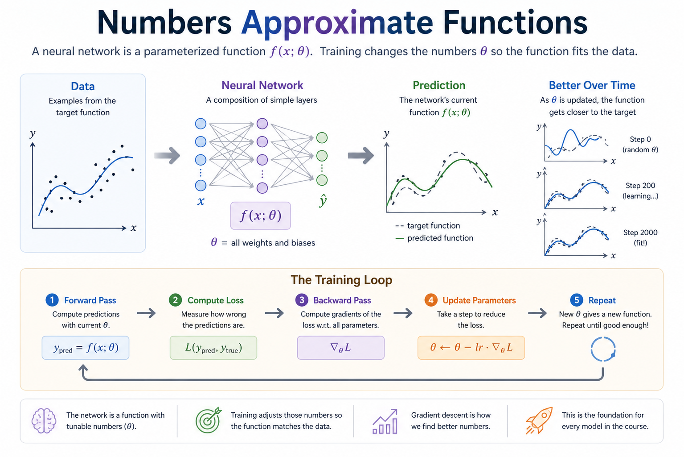
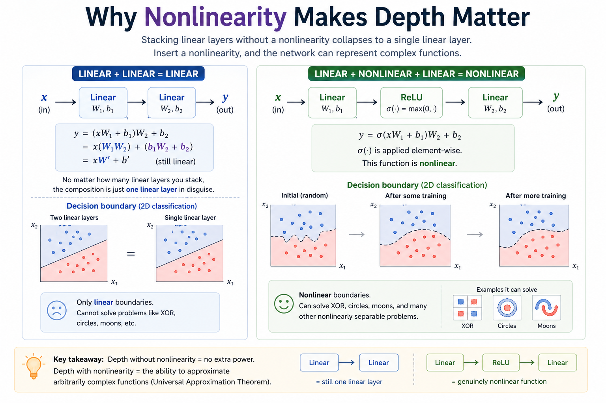

# Module 03 — A first neural network

> **Question this module answers:** *How do numbers approximate functions?*



The data, the network, the prediction, and the training loop that closes the gap. Every later module elaborates one of these boxes — attention is a fancier `f`, RLHF is a fancier `L`, optimizers are fancier `update` rules — but the skeleton stays exactly the same.

---
## Prerequisites

### Math

- **Gradient descent intuition.** "Compute gradient of loss w.r.t. each parameter; take a step downhill; repeat." If new: 3Blue1Brown's "Gradient descent, how neural networks learn" (15 min).
- **Partial derivatives via the chain rule.** Already practiced in Module 01
- **Softmax + logits refresher.** Module 02 covered. 

### Computer science

- **Object-oriented composition.** A neural network is built from objects (`Linear`, `ReLU`, etc.) that share a common interface (`Module`) and compose into bigger objects (`Sequential`). Comfortable with class inheritance and method dispatch is enough.

### Programming

- **PyTorch autograd basics.** A tensor is a "parameter". This the autograd machinery you built in Module 01, applied to tensors instead of scalars. Get familiar with `touch.no_grad()` and `tensor.data` 
---
## Introduction

Module 01 gave you autograd. Module 02 gave you fast tensor math. Neither, on its own, is a neural network — they're the substrate. Module 03 wires them together into a clean API that looks like a real ML library, and uses that API to train your first model.

The conceptual move is: **a neural network is just a parameterized function plus a way to fit it to data.** Everything else — depth, layer types, optimizers, schedulers, regularization — is variation on this theme. If you can write a 2-layer MLP that hits >95% on MNIST from scratch, you have the structural understanding required for everything else in the course. The transformer block in Module 09 is the same training loop with fancier layers in the middle.

Concretely, this module has you build:

1. A `Module` base class plus the building blocks (`Linear`, `ReLU`, `Tanh`, `Sigmoid`, `Sequential`).
2. Loss functions (`MSELoss`, `CrossEntropyLoss`) — one trivial, one with a real numerical-stability subtlety.
3. An `SGD` optimizer.

…and use them to fit `y = 3x + 2`, classify a 2D toy dataset, and finally train an MLP on MNIST.

## The big idea

A neural network is a function

```
f(x; θ) → y
```

where `x` is the input, `y` is the prediction, and `θ` is a giant bag of parameters (weights and biases). The function is built by composing simple layers — each one a piece of math you can write on a napkin — and the bag of parameters is the union of every layer's parameters.

Training is the loop:

```
for each batch (x, y_true):
    1. y_pred = f(x; θ)              # forward pass
    2. loss   = L(y_pred, y_true)    # how wrong are we?
    3. ∇θ loss                       # backward pass (autograd does this for us)
    4. θ     ← θ − lr · ∇θ loss      # parameter update (the optimizer's job)
```

Every layer of every model in this course follows this loop. The variations across the next 17 modules are: what `f` looks like, what `L` measures, and what tricks you apply to the update step.

### Why nonlinearity is essential

This is the single most important conceptual point in Module 03. Stacking two linear layers without a nonlinearity between them gives you nothing — the composition is still linear:

```
Linear(in → h) → Linear(h → out)

  y = (x W₁ + b₁) W₂ + b₂
    = x W₁ W₂ + (b₁ W₂ + b₂)
    = x W' + b'                    ← a single linear map

  No matter how many linear layers you stack,
  the composition is one linear layer in disguise.
```

Insert any nonlinearity (ReLU, tanh, sigmoid) between them and the picture changes completely — `ReLU(x W₁ + b₁) W₂ + b₂` is genuinely nonlinear and can approximate arbitrary functions to arbitrary precision (the universal approximation theorem). The whole point of "deep" learning is that nonlinearities make depth pay off.



*Left side: depth without a nonlinearity is the same as width 1 — the algebra collapses, the boundary stays a straight line, and XOR/circles/moons stay unsolvable. Right side: a single ReLU between the layers turns the same architecture into a universal approximator, and the boundary deforms to fit the data. Exercise 5 makes you do exactly this swap and watch accuracy collapse.*

## Concepts to internalize

- **`Module` as the universal interface.** Everything that processes a tensor inherits from it. `forward()` does the work; `parameters()` reports learnable tensors. Stacking and composing modules just works.
- **Linear layer:** `y = x W + b`. Parameters are `W` (shape `(in, out)`) and `b` (shape `(out,)`).
- **Activations are pointwise and parameter-free.** ReLU/Tanh/Sigmoid don't have weights — they're just element-wise functions. They contribute nothing to `parameters()`.
- **Loss = scalar.** A loss function reduces predictions and targets to a single scalar. Calling `.backward()` on that scalar populates `.grad` on every parameter that fed into it.
- **Cross-entropy is log-sum-exp, stably.** The naive softmax-then-log overflows on real-world logits; the stable formulation subtracts the max before exp. Same trick as stable softmax in Module 02.
- **Losses are for training; metrics are for evaluation.** MSE and cross-entropy are differentiable losses: they tell autograd how to change the parameters. Accuracy is a metric: compute `argmax` over logits, compare predicted class ids to targets, and average correctness. Accuracy is useful to report, but not useful as the training loss because `argmax` is not differentiable and discards confidence.
- **SGD update:** `param ← param − lr · grad`. With weight decay: `param ← param − lr · (grad + λ · param)`.
- **The update must not be tracked by autograd.** Wrap it in `torch.no_grad()`. If you forget, the next forward+backward pass tries to differentiate through your previous update, which is both wrong and slow.
- **`zero_grad` between iterations.** PyTorch's `.backward()` accumulates into `.grad` (same accumulation rule we wrote ourselves in Module 01). Without zeroing, gradients pile up across iterations.
- **Train/val split + overfitting.** Always evaluate on data the model didn't train on. Train loss going down while validation loss goes up means the model is memorizing rather than generalizing. Weight decay is the simplest counterweight.

---
## What you'll build

Package: `g2c/nn/`

### `modules.py` — the building blocks

```python
class Module:
    def __call__(self, *args, **kwargs): ...
    def forward(self, *args, **kwargs): raise NotImplementedError
    def parameters(self) -> Iterable[torch.Tensor]: return []

class Linear(Module):
    def __init__(self, in_features: int, out_features: int): ...
    def forward(self, x: torch.Tensor) -> torch.Tensor: ...

class ReLU(Module):     def forward(self, x): ...
class Tanh(Module):     def forward(self, x): ...
class Sigmoid(Module):  def forward(self, x): ...

class Sequential(Module):
    def __init__(self, *layers: Module): ...
    def forward(self, x: torch.Tensor) -> torch.Tensor: ...
```

### `loss.py` — loss functions

```python
class MSELoss(Module):           # implemented as a worked example
    def forward(self, predictions, targets): ...

class CrossEntropyLoss(Module):  # scaffolded
    def forward(self, logits, targets): ...
```

### `optim.py` — optimizers

```python
class SGD:
    def __init__(self, params, lr, weight_decay=0.0): ...
    def zero_grad(self): ...     # implemented
    def step(self): ...          # scaffolded
```

### A 2-layer MLP, end-to-end

What you'll be able to write once everything is implemented:

```
Input         Linear         ReLU         Linear         Output
(B, 784)  →  (W₁, b₁)  →  (B, 128)  →  (W₂, b₂)  →  (B, 10)
              W₁: (784, 128)              W₂: (128, 10)
              b₁: (128,)                  b₂: (10,)

  model = Sequential(
      Linear(784, 128),
      ReLU(),
      Linear(128, 10),
  )
```

Five lines, four parameter tensors, ~100k trainable numbers. Enough to crack MNIST.

## Scaffolding and how to run the tests

Tests are in `tests/test_nn.py`. Initial state: 9 passed, 21 failed.

```bash
.venv/bin/python -m pytest tests/test_nn.py             # run all module-03 tests
.venv/bin/python -m pytest tests/test_nn.py -x          # stop at first failure
.venv/bin/python -m pytest tests/test_nn.py -k linear   # only the Linear tests
.venv/bin/python -m pytest tests/test_nn.py -v          # verbose
```

## Exercises

Set up or resume the working notebook for this exercise set by running:

```bash
.venv/bin/python scripts/open_notebook.py 03
```

1. **Linear regression: fit `y = 3x + 2`.** With `Linear(1, 1)`, `MSELoss`, and `SGD`, train for a few hundred iterations on noisy data drawn from the line. Verify the trained `W` is ≈ 3 and `b` is ≈ 2. (The `test_train_linear_regression` integration test is exactly this.)

2. **Classify the moons / circles toy dataset.** In the Module 03 notebook: generate a 2D nonlinear dataset, build a small MLP using your `Sequential`, train with `CrossEntropyLoss` + `SGD`, and plot the decision boundary. Watch the boundary deform from a line into a curve as the network learns.

3. **MNIST MLP — the deliverable.** In the Module 03 notebook:
   - Load MNIST (e.g., via `torchvision.datasets.MNIST`).
   - Flatten to `(B, 784)`, normalize to ~zero mean.
   - Build a `Sequential(Linear(784, 128), ReLU(), Linear(128, 10))`.
   - Use `CrossEntropyLoss` + `SGD` with lr ≈ 0.1.
   - Train for a few epochs with mini-batching (batch size 64–128 is fine).
   - Track train and validation loss every epoch; plot both curves.
   - Achieve ≥ 95% test accuracy.

4. **Overfitting and weight decay.** Repeat exercise 3 with a much larger hidden layer (e.g., 1024 units) and train for many epochs. Observe train loss going to ~0 while validation loss rises. Then add `weight_decay=1e-4` to your SGD and retrain. Compare the val-loss curves.

5. **Strip the nonlinearity.** Take your MNIST MLP and remove the `ReLU()` between the two `Linear` layers. Train it. The accuracy should be visibly worse — and crucially, *no better than logistic regression*, because two stacked linear layers are still one linear map. This is the universal-approximation point you internalized above, made viscerally clear.

## Pitfalls to expect

- **Forgetting `torch.no_grad()` in `SGD.step`.** The update tensor op gets recorded; the next `loss.backward()` tries to differentiate through it; you get cryptic `RuntimeError: leaf variable has been moved` or just plain wrong numbers. Always wrap the update.
- **Forgetting `zero_grad`.** Gradients accumulate across iterations because PyTorch (like our Module 01 engine) sums `.grad` rather than overwriting it. Symptom: loss decreases too fast at first, then explodes.
- **Naive cross-entropy.** Computing `(logits.exp() / logits.exp().sum()).log()` overflows on real logits. Use the log-sum-exp trick described in `loss.py`.
- **Forgetting nonlinearity.** A `Sequential` of `Linear` layers with no activation in between is a single linear map dressed up. Won't beat logistic regression on anything nontrivial.
- **Using `torch.nn.Linear` etc.** Don't. The whole point of this module is to build them. The same applies to `torch.nn.functional.cross_entropy`, `torch.nn.CrossEntropyLoss`, `torch.optim.SGD`.
- **Silent shape bugs.** `(B, 10) + (10,)` broadcasts correctly; `(B, 10) + (B,)` does not. When the loss is suspiciously flat or NaN, print every tensor's shape first.
- **Learning rate too high.** Loss explodes to NaN within a few iterations. Cut by 10× and retry.
- **Learning rate too low.** Loss decreases but glacially. Multiply by 10× and retry.

## M-series notes

Everything in this module runs comfortably on a 16GB M-series machine.

- The toy datasets (linear regression, moons, circles) train in seconds on CPU.
- MNIST with a small MLP trains in ~1–2 minutes per epoch on CPU; faster on MPS once the model is moved to the device with `model_param.to("mps")` (you'll need to move your custom modules' parameters explicitly since we don't have `.to()` in our `Module` — adding it is a worthwhile mini-exercise, optional).
- The integration test in this module's suite is a 100-point regression — it runs in well under a second.

---
## Reading

Primary:

- **Karpathy, "The makemore series" lectures 2–4.** The most direct mapping to what you're building. Lecture 4 in particular walks through layer composition and a clean training loop.
- **3Blue1Brown, "Neural Networks" series, episodes 1–4.** The geometric intuition for what a neural net is doing.

Secondary:

- **Goodfellow, Bengio, Courville, *Deep Learning*, chapters 6 and 7.** Textbook treatment of feed-forward networks and regularization.
- **PyTorch tutorial: "Build the Neural Network."** Useful for seeing how `torch.nn.Module` works once you've built your own version.

Optional:

- **Hornik, Stinchcombe, White, "Multilayer feedforward networks are universal approximators" (1989).** The original universal approximation theorem. Skim — the result matters more than the proof.

## Deliverable checklist

- [ ] All non-skipped tests in `tests/test_nn.py` pass.
- [ ] `notebooks/solutions/03-nn.ipynb`: 2D dataset, decision boundary plot, working MLP.
- [ ] `notebooks/solutions/03-nn.ipynb`: ≥95% MNIST test accuracy with logged train/val curves.
- [ ] Overfitting experiment: train + val curves diverging, then re-converging once weight decay is added.
- [ ] You can explain — out loud, without notes — why depth without nonlinearity is no better than width 1.
