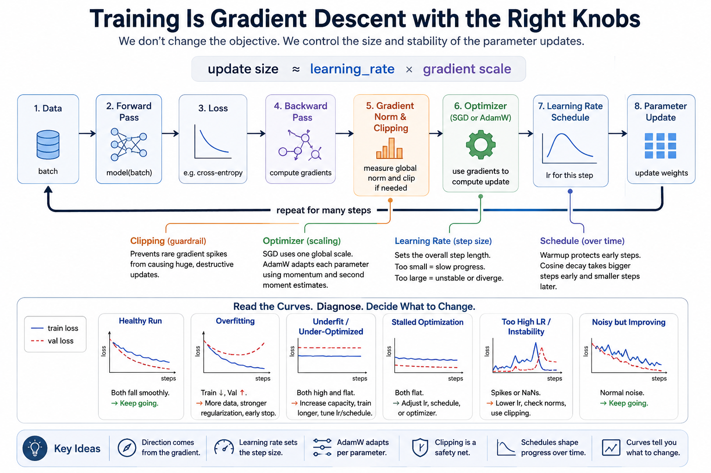
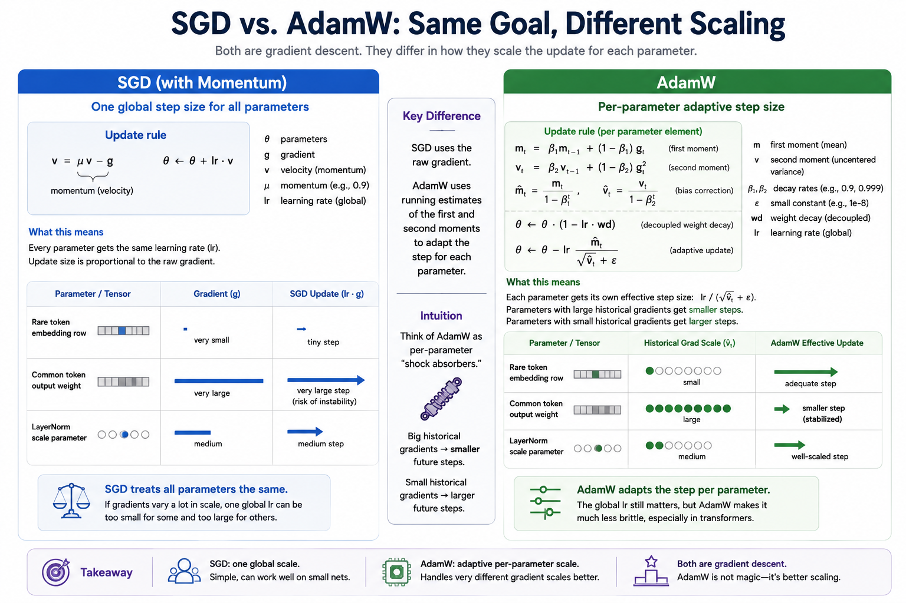
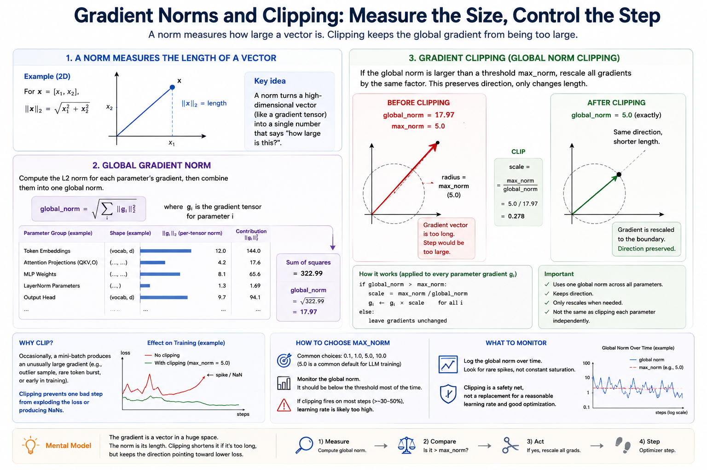

# Module 03B — Training

> **Question this module answers:** *How do we make the model learn efficiently?*



The model architecture is only half the story. The training recipe controls whether gradient descent turns that architecture into a useful function. This module names the knobs that otherwise feel like magic when they keep re-appearing in later lessons.

---
## Before you start

* *Review* [03-nn](03-nn.md) for neural net overview and [02-tensors](02-tensors.md) for tensor arithmetic.
* *Review* [PyTorch Primer](../primers/pytorch.md) if any PyTorch code feels unfamiliar or confusing.
* *Finish* the `g2c/nn` implementation from [03-nn](03-nn.md) — it's used in this section's exercises.

---
## Where this fits

Module 03 taught the basic loop:

```text
forward -> loss -> backward -> optimizer.step()
```

That loop is correct, but it does not tell you how to choose the knobs. A too-small learning rate makes a correct model crawl. A too-large learning rate can destroy a run. Vanilla SGD uses one global step size for every parameter, which often stalls on large models. Deep models occasionally produce gradient spikes, which can wreck an entire run. Long runs usually need a learning-rate schedule so early steps can move fast and late steps can settle.

The point of this module is not to turn training into a cookbook. The point is to give you a small diagnostic language:

```text
loss explodes        -> lr probably too high, or gradients spiked
loss barely moves    -> lr too low, optimizer weak, or model/data mismatch
train low, val high  -> overfitting
train and val high   -> underfit or under-optimized
train and val flat   -> stalled optimization
```

When we pretrain our course LLM in Module 10, we'll lean heavily on the ideas and techniques from this module.

## The big idea

The learning rate is not "how much the model learns." It is the scale of the parameter update:

```text
update size ~= learning_rate * gradient scale
```

That means the same `lr` can be too small for one parameter and too large for another. A neuron that's rarely activated may receive tiny gradients. A load-bearing hidden unit may receive huge gradients. In models with complex architecture, different parts of the architecture live on different gradient scales.

SGD uses one global `lr`:

```text
param <- param - lr * grad
```

AdamW keeps running statistics so each parameter gets a better-scaled update:

```text
m <- beta1 * m + (1 - beta1) * grad
v <- beta2 * v + (1 - beta2) * grad^2

m_hat <- m / (1 - beta1^step)
v_hat <- v / (1 - beta2^step)

param <- param * (1 - lr * weight_decay)
param <- param - lr * m_hat / (sqrt(v_hat) + eps)
```

The result is still gradient descent. AdamW does not change the model or the objective. It changes how the update is scaled.

### Learning Rates


*The gradient picks the direction; the learning rate picks the step length along that direction.*

The learning rate is the knob that turns gradient direction into parameter motion. In the plain SGD case, the relationship is visible:

```text
update = -lr * grad
```

If `lr` is too small, the loss may be moving in the right direction but too slowly for your compute budget. If `lr` is too large, the update jumps past useful regions of parameter space and loss can spike. "What learning rate should I use?" is really: *what update scale is reasonable for this model, optimizer, batch size, and data?*

There is no universal answer, so the practical move is a small sweep. Try a few values spaced by powers of 3 to 10, plot the curves, and keep the largest learning rate that trains smoothly. That habit matters more than memorizing one magic constant.

### AdamW's Effective Step Size


*Both optimizers are still gradient descent — they differ in how the step is scaled.*

AdamW still has a global `lr`, but the actual update is adapted per tensor element:

```text
param <- param - lr * m_hat / (sqrt(v_hat) + eps)
```

The denominator is why AdamW can tolerate transformer training better than raw SGD. If one parameter has historically large gradients, `sqrt(v_hat)` is large and the effective step for that parameter shrinks. If another parameter has small gradients, it is not forced to share the exact same raw scale. The global `lr` still matters, but AdamW makes it less brittle.

Weight decay is separate:

```text
param <- param * (1 - lr * weight_decay)
```

That direct shrink is the "W" in AdamW. Do not fold it into the gradient update.

### Norms And Scale


*A norm is just a measurement (panels 1–2), and clipping is the response when that measurement is too large (panel 3). Clipping multiplies every gradient by one shared scalar — direction is preserved, only the step length is shortened.*

A norm is a way to turn a vector into one number that says "how large is this?" The norm we use most is the L2 norm:

```text
||x||₂ = sqrt(x₁² + x₂² + ... + xₙ²)
```

For a parameter tensor, the L2 norm measures the scale of its values. For a gradient tensor, it measures the scale of the update the optimizer is about to use. When we talk about the **global gradient norm**, we flatten the idea across every parameter in the model:

```text
global_grad_norm = sqrt(sum(||p.grad||₂² for every parameter p))
```

### Gradient Clipping

Gradient clipping handles rare bad steps. First compute the global norm across every parameter gradient:

```text
total_norm = sqrt(sum(||p.grad||^2 for every parameter))
```

If `total_norm` exceeds `max_norm`, multiply every gradient by the same scalar:

```text
scale = max_norm / total_norm
p.grad <- p.grad * scale
```

This preserves the overall gradient direction and only shortens the step. It is not the same as clipping each parameter independently, and it is not a replacement for a reasonable learning rate. If clipping fires constantly, your run is telling you the requested updates are too aggressive.

### Warmup And Cosine Decay

A schedule changes the learning rate over training. The standard small-LM recipe has two phases:

```text
warmup:        lr rises linearly to max_lr
cosine decay:  lr falls smoothly from max_lr to min_lr

  lr
   ▲
   │              ╮
   │           ╱   ╰─╮
   │         ╱        ╰─╮
   │       ╱             ╰─╮
   │     ╱                  ╰─╮
   │   ╱                      ╰─╮___
   │ ╱
   └─────────────┬────────────────────► step
   0    warmup_steps               max_steps
```


Warmup protects the first steps, when the model is random and gradients can be poorly scaled. Cosine decay then lets the run take larger steps early and smaller steps late. This is not deep magic. It is arithmetic on the step counter. 

### Reading Curves

Training curves are your feedback loop:

- **Train and validation both fall smoothly.** The run is healthy.
- **Train falls, validation rises.** The model is overfitting or the validation split is too small/noisy.
- **Both stay high and flat.** The model is under-optimized, the learning rate is wrong, or the model/data pair is too weak.
- **Loss spikes or becomes `nan`.** Lower the learning rate, check gradient norms, and make sure clipping is wired before `optimizer.step`.

Curve reading is the bridge from "I know the mechanics" to "I can debug a training run."

### Regularization And Dropout

Optimization asks whether the model can lower the training loss. Regularization asks whether the model is learning something that generalizes beyond the exact examples it saw. The classic warning sign is a widening train/validation gap: train loss keeps improving while validation loss stalls or gets worse.

Regularization is a family of responses to mitigate that pattern. Dropout is a type of regularizer. During training, it randomly zeros some activations, forcing the network not to rely too heavily on any one feature path. At evaluation time, dropout is disabled so predictions are deterministic. 

We are not implementing dropout in this course path because it is not the bottleneck for the TinyLLM stack. It adds a useful but separate concept cluster: stochastic forward passes, train/eval mode, RNG control, and activation scaling. For LLM pretraining, dropout is often small or zero. Worth knowing by name, but not worth spending a build week on here.

## Concepts to internalize

- **Learning rate controls update scale.** If loss explodes, lower it. If loss crawls and gradients are finite, raise it.
- **SGD has one global scale.** Every parameter sees the same nominal `lr`.
- **AdamW momentum smooths direction.** AdamW's `m` is a moving average of gradients.
- **AdamW second moment scales the step.** AdamW's `v` tracks squared gradients; large historical gradients shrink the effective step.
- **AdamW bias correction matters early.** At step 1, `m` and `v` are biased toward zero. Dividing by `1 - beta^step` fixes that.
- **AdamW weight decay is decoupled.** Shrink the parameter directly. Do not add `weight_decay * param` to the gradient as SGD does.
- **A norm measures vector scale.** The global gradient norm is one number for the size of the whole model's proposed gradient update.
- **Gradient clipping is a guardrail.** It rescales a too-large global gradient vector; it does not replace a reasonable learning rate.
- **Schedules are part of the run.** Warmup avoids blasting random-initialized weights; cosine decay lowers the step size as the run settles.
- **Curves are diagnostics.** Train/validation loss curves are how you decide what to change next.

### What we don't cover

- Formal convergence proofs. Mathematically interesting, practically unnecessary. 
- The optimizer zoo. AdamW is more than sufficient for our goals.
- BatchNorm and advanced regularization. They matter in deep learning generally, but not for this LLM stack.
- Dropout was introduced conceptually, but you will not implement it in this module.

---
## What you'll build

Package: `g2c/training/`

### `optim.py` — optimizers

```python
class AdamW:
    def __init__(
        self,
        params: Iterable[torch.Tensor],
        lr: float,
        *,
        betas: tuple[float, float] = (0.9, 0.999),
        eps: float = 1e-8,
        weight_decay: float = 0.0,
    ): ...                                    # pre-implemented
    def zero_grad(self) -> None: ...          # pre-implemented
    def step(self) -> None: ...
```

### `clip.py` — gradient clipping

```python
def clip_grad_norm_(params: Iterable[torch.Tensor], max_norm: float) -> float: ...
```

### `schedule.py` — learning-rate schedules

```python
def cosine_with_warmup(
    step: int,
    *,
    warmup_steps: int,
    max_steps: int,
    max_lr: float,
    min_lr: float = 0.0,
) -> float: ...
```

## How to run the tests

Tests live in `tests/test_training.py`. Initial state: 7 passed, 14 failed.

```bash
source .venv/bin/activate

pytest tests/test_training.py             # run all module-03b tests
pytest tests/test_training.py -x          # stop at first failure
pytest tests/test_training.py -k adamw    # only AdamW tests
pytest tests/test_training.py -v          # verbose
```

## Exercises

To launch the exercise notebook run:

```bash
./notebook.sh 03b
```

If at any point you want to archive the work in your current notebook and restart fresh:

```bash
./notebook.sh 03b --fresh
```

The notebook contains the runnable sweeps, plots, and answer cells.

1. **Learning-rate sweep.** See crawling, learning, and divergence on the same model.
2. **AdamW by hand.** Compute the first scalar AdamW update.
3. **Implement AdamW.** Fill in `AdamW.step` and run the focused tests.
4. **SGD vs AdamW.** Compare optimizer behavior under matched conditions.
5. **Gradient clipping.** Demonstrate global-norm clipping on a tiny example.
6. **Warmup/cosine schedule.** Plot the learning-rate schedule and explain its phases.
7. **Curve diagnosis.** Match train/validation curve shapes to likely next actions.

## Pitfalls to expect

- **Confusing Adam and AdamW.** Adam's original L2 penalty adds `weight_decay * param` to the gradient. AdamW decays the parameter directly. The distinction matters.
- **Incrementing `step_count` per parameter.** The step counter advances once per optimizer step.
- **Forgetting bias correction.** Early AdamW updates become incorrectly small or oddly scaled.
- **Letting optimizer updates enter autograd.** Wrap `step()` in `torch.no_grad()`.
- **Clipping each parameter independently.** Clipping is global. Preserve the direction of the full gradient vector.
- **Treating clipping as a tuning substitute.** If clipping fires constantly, the learning rate is probably too high.
- **Reading only training loss.** A model can improve train loss while getting worse on validation data.

## M-series notes

Everything in this module should run comfortably on CPU. MPS is useful for larger notebook experiments, but the point here is diagnosis, not throughput. Keep the experiments small enough that you can rerun them many times while changing one knob at a time.

---
## Reading

Primary:

- **Kingma and Ba, "Adam: A Method for Stochastic Optimization" (2014).** The original Adam paper. Focus on the update rule and bias correction.
- **Loshchilov and Hutter, "Decoupled Weight Decay Regularization" (2017).** The AdamW paper. Focus on why weight decay should be decoupled from the adaptive gradient update.
- **Karpathy, nanoGPT `configure_optimizers` and training loop.** Read after implementing AdamW; it will look much less magical.

Secondary:

- **Goodfellow, Bengio, Courville, *Deep Learning*, optimization chapter.** Useful for vocabulary around momentum, conditioning, and learning-rate schedules.
- **Goyal et al., "Accurate, Large Minibatch SGD" (2017).** Skim for the warmup idea.

## Deliverable checklist

- [ ] `AdamW.step` passes `pytest tests/test_training.py -k adamw`.
- [ ] `clip_grad_norm_` and `cosine_with_warmup` pass `pytest tests/test_training.py`.
- [ ] The notebook includes an LR sweep plot.
- [ ] The notebook includes an SGD vs AdamW comparison on the same model.
- [ ] The notebook includes a gradient clipping demonstration.
- [ ] The notebook includes a warmup/cosine schedule plot.
- [ ] You can explain why Module 10 will use AdamW for the serious training run without changing the model architecture or loss.

