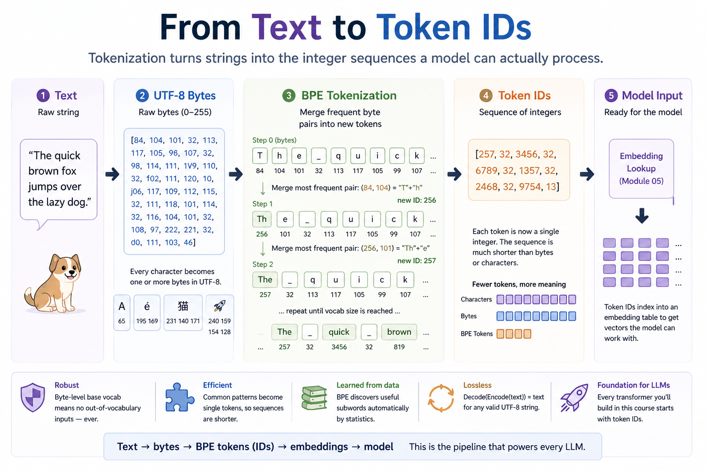
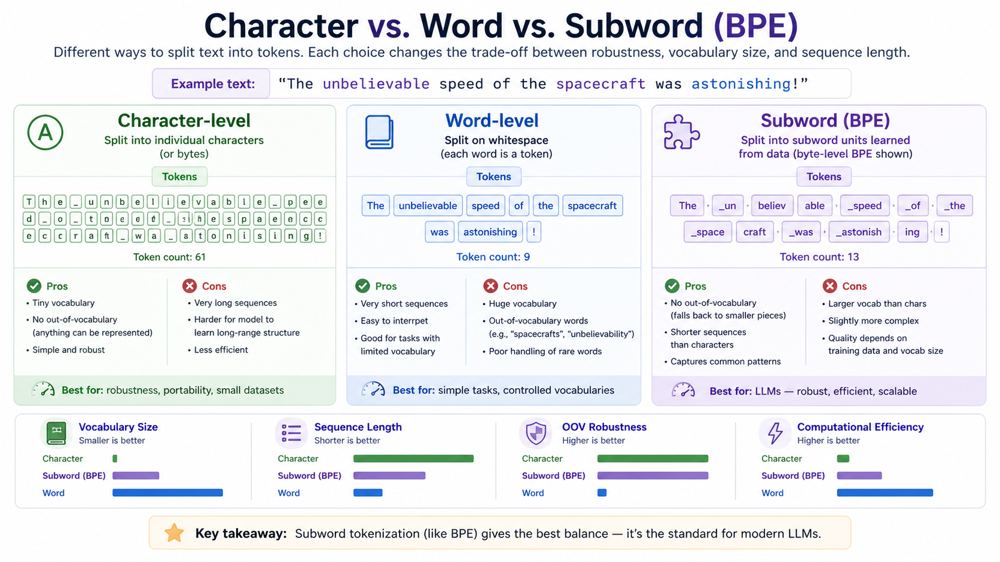
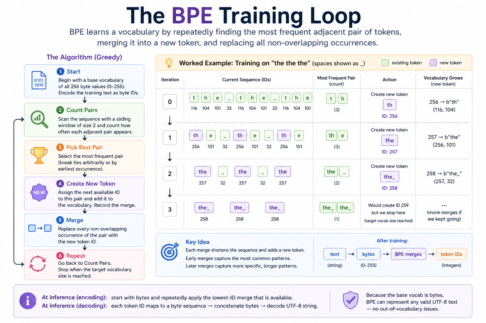

# Module 04 — Tokenization

> **Question this module answers:** *How does text become model input?*



The whole pipeline that turns `"The quick brown fox..."` into the integer list a model actually sees. Finding and merging the most frequent adjacent byte pairs is the entire BPE algorithm.

---
## Prerequisites

### Computer science

- **Frequency counting with hash maps.** Build a dict of `pair → count` in one pass over a sequence. The single most-used technique in the BPE algorithm.
- **Greedy algorithms.** Comfort with "make the locally best choice; iterate" as a strategy is enough.
- **Sliding-window scans.** Adjacent-pair counting and merge application are both window-of-2 scans over a list.

### Programming

- **Python `bytes` and UTF-8.** A `bytes` object is a sequence of integers in `[0, 256)`. UTF-8 is variable-width: ASCII is 1 byte, common European characters 2, emoji 4. `bytes.encode()` and `bytes.decode()`
- **Dict iteration order.** Since Python 3.7, dicts preserve insertion order. We rely on this for "earliest learned merge wins" priority.

---
## Where this fits

The course up to this point has worked with numbers. Real LLMs work with text. Tokenization is the bridge between the two — the function that turns `"The quick brown fox"` into `[464, 2068, 7586, 21831]` and back. Every input to every transformer in production goes through a tokenizer first; every output comes from one in reverse. It's the first thing you'd build in an LLM pipeline and the last thing in inference.

There are three genuinely different ways to do this, with very different tradeoffs:

```
                    Vocab size    Sequence length    OOV?
  ─────────────────────────────────────────────────────────
  Character-level:    tiny          long              no
  Word-level:         huge          short             yes (rare words → <UNK>)
  Subword (BPE):      tunable       medium            no
```

Character-level (or byte-level) is robust but produces sequences too long to fit in a context window. Word-level produces short sequences but explodes vocab size and silently drops out-of-vocabulary words. Subword tokenization — specifically **byte-pair encoding (BPE)** and its close cousins WordPiece and SentencePiece — splits the difference. Common substrings (`"the"`, `"ing"`, `"ation"`) become single tokens; rare or novel inputs fall back to smaller pieces; nothing is ever truly out-of-vocabulary because the base vocab covers every possible byte.



*The same sentence, three tokenizers. Character-level keeps the vocab tiny but blows out the sequence; word-level shortens the sequence but balloons the vocab and chokes on `"unbelievable"` if it wasn't seen during training; subword/BPE finds the middle by carving common substrings (`"_un"`, `"believ"`, `"_speed"`) into single tokens and falling back to pieces only for the rare bits. Every modern LLM picks the third column.*

Modern LLMs all use BPE-family tokenizers. GPT-2/3/4, Llama, Mistral, Qwen — same algorithm, different training data. Module 04 has you build it.

## The big idea

BPE training is a single greedy loop:

1. Start with a base vocabulary — every possible byte (256 entries).
2. Encode your training corpus as a list of byte IDs.
3. Find the most frequent adjacent pair of IDs.
4. Mint a new ID for that pair and replace every occurrence in the corpus.
5. Record the merge (so you can replay it later on new text).
6. Repeat until you hit the target vocab size.

Worked through on a tiny corpus:

```
Train BPE on the corpus "the the the":

Initial bytes:
  ids  =  [116, 104, 101, 32, 116, 104, 101, 32, 116, 104, 101]
           ─── ─── ─── ──── ─── ─── ─── ──── ─── ─── ───
            t   h   e  ' '  t   h   e  ' '   t   h   e

  Most common pair:  (116, 104)  =  't' + 'h'   (count 3)
  Mint new ID 256.   merges[(116, 104)] = 256.

After merge 1:
  ids  =  [256, 101, 32, 256, 101, 32, 256, 101]
           ─── ─── ───  ─── ─── ───  ─── ───
           th   e  ' '  th   e  ' '   th   e

  Most common pair:  (256, 101)  =  'th' + 'e'  (count 3)
  Mint new ID 257.

After merge 2:
  ids  =  [257, 32, 257, 32, 257]
           ───  ───  ───  ───  ───
           the  ' '  the  ' '  the

  Most common pair:  (257, 32)  =  'the' + ' '  (count 2)
  Mint new ID 258. ...
```



*The five-step greedy loop (left) and exactly the same worked example unrolled (right). At inference, encoding replays the merges in learned order; decoding is just byte concatenation. The one-merge loop body is the `train_step()` method you'll implement; scaffolded `train()` repeats it until the vocabulary reaches the target size. The picture should make the iteration order, the non-overlapping merge rule, and the "earliest merge wins" priority click before you hit the test suite.*

Every merge shortens the sequence and adds one entry to the vocabulary. The merges learned earliest (lowest IDs) capture the most common patterns; later merges capture progressively more specific patterns. The final tokenizer is just the table of merges, applied left-to-right by priority.

**Encoding** new text is the same idea in reverse: take the byte sequence, repeatedly find the lowest-ID merge that applies, and apply it. Stop when no learned merge fits any adjacent pair.

**Decoding** is trivial: every ID in the vocabulary maps to a fixed byte sequence (the base 256 IDs map to single bytes; learned IDs map to the concatenation of their parents' bytes). Concatenate, decode UTF-8, done.

The whole thing is ~50 lines of Python. The cleverness is in the choice — BPE produces a tokenization where common patterns become single tokens by virtue of statistics, no linguistic knowledge required. It's a tiny algorithm with outsized practical impact.

## Concepts to internalize

- **Tokens vs. token IDs.** A token is a byte sequence (e.g., `b'the'`). A token ID is the integer the tokenizer assigns to it (e.g., `258`). The vocab is the bidirectional map.
- **Base vocab is byte-level.** Every byte 0–255 has its own ID. This guarantees no out-of-vocabulary inputs, ever — every UTF-8 string can be encoded somehow, even if the encoding falls back to raw bytes for unfamiliar characters.
- **Merges are ordered and priority-encoded by ID.** Earlier merges have lower IDs. At encode time, lower-ID merges win — they're the most frequent patterns and should be applied first.
- **Training is one merge step repeated.** `train_step()` does the conceptual work once: count pairs, choose the most frequent pair, mint the new ID, merge the sequence, and update `merges`/`vocab`. `train()` is just the scaffolded outer loop plus progress reporting.
- **The greedy merge rule has a subtlety.** When `_merge` sees `[1, 1, 1]` and the merge target is `(1, 1)`, the result is `[99, 1]`, not `[99, 99]`. The middle `1` is consumed by the first match and isn't available for a second. Left-to-right, non-overlapping.
- **Lossless round-trip is structural.** As long as every byte ends up in the vocab and merges are concatenations of their parents, `decode(encode(text)) == text` for any UTF-8 string. This is not a property you have to test for at every input — it's guaranteed by the construction.
- **Vocab size is a tunable knob.** Bigger vocab → more compression on the training distribution → shorter sequences but more parameters in the embedding table. Real LLMs use 32k–200k range.

---
## What you'll build

Package: `g2c/tokenizer/`

```python
class BPETokenizer:
    merges: dict[tuple[int, int], int]    # learned: pair → new ID
    vocab: dict[int, bytes]                # ID → bytes representation

    def __init__(self) -> None: ...        # implemented (base vocab)
    def save(self, path: str | Path) -> None: ...         # implemented
    @classmethod
    def load(cls, path: str | Path) -> "BPETokenizer": ... # implemented
    def encode_fast(self, text: str) -> list[int]: ...     # implemented
    def train_fast(self, text: str, vocab_size: int, *, chunk_chars: int = 8_192) -> list[int]: ... # implemented

    @staticmethod
    def _get_pair_counts(ids: list[int]) -> dict[tuple[int, int], int]: ...

    @staticmethod
    def _merge(ids: list[int], pair: tuple[int, int], new_id: int) -> list[int]: ...

    def train_step(self, ids: list[int], new_id: int) -> tuple[list[int], tuple[int, int], int] | None: ...
    def train(self, text: str, vocab_size: int, *, progress_callback=None, progress_every: int = 100) -> None: ...  # implemented loop
    def encode(self, text: str) -> list[int]: ...
    def decode(self, ids: list[int]) -> str: ...
```

About 50 lines of real implementation in total. The scaffolded `train()` loop also gives notebooks and corpus-building scripts a progress hook, so students can watch long tokenizer runs without mixing callback plumbing into the BPE algorithm. `save`/`load` plus token-ID artifact persistence live in `g2c/tokenizer/persistence.py`; reusable artifact path/loading/training orchestration lives in `g2c/artifacts/`; `encode_fast`/`train_fast` live in `g2c/tokenizer/fast.py` and use a Rust-backed tokenizer library for larger artifacts. `train_fast` feeds large text to the Rust trainer in chunks, then copies the learned merges back into the same course tokenizer tables. Those helpers are functionally the same tokenizer artifact you build in `bpe.py`, but faster. The learning target is still the plain BPE algorithm.

## Scaffolding and how to run the tests

Tests live in `tests/test_tokenizer.py`. Initial state: the construction and train-validation tests pass; the BPE algorithm tests fail with `NotImplementedError` until you fill in the TODOs.

```bash
.venv/bin/python -m pytest tests/test_tokenizer.py             # run all module-04 tests
.venv/bin/python -m pytest tests/test_tokenizer.py -x          # stop at first failure
.venv/bin/python -m pytest tests/test_tokenizer.py -k pair     # only pair-count tests
.venv/bin/python -m pytest tests/test_tokenizer.py -v          # verbose
```

## Exercises

Set up or resume the working notebook for this exercise set by running:

```bash
.venv/bin/python scripts/open_notebook.py 04
```

The implementation path is the test suite above. The notebook exercises are for prediction, inspection, and explanation after you have the relevant pieces working.

1. **Pair counts and merge behavior.** Predict the adjacent-pair counts for a tiny integer sequence before running your helper. Then predict the non-overlapping merge result for `[1, 1, 1]`. This is the easiest place to catch the overlap rule before it gets buried inside full BPE training.

2. **Train BPE on a tiny corpus.** Use `"the the the"` or another very small repeated string and inspect the learned merges. The goal is to connect one `train_step()` call, then the full scaffolded `train()` loop, to concrete `merges` and `vocab` entries you can read by hand.

3. **Encode, decode, and verify round-trip.** Encode text that includes punctuation, whitespace, and multi-byte Unicode, then decode it back. Explain why byte-level BPE can handle unseen text, why earliest learned merges get priority, and what makes decoding lossless.

4. **Compare vocab size vs. compression.** Train several tokenizers at different vocab sizes and tokenize the same passage with each. Report token count and compression ratio, then explain the tradeoff: larger vocabularies shorten sequences but make the embedding table larger.

5. **Inspect learned tokens.** Print early and late learned vocab entries. Early IDs above 255 should usually be short, frequent patterns; later IDs should often be longer or more corpus-specific. Pick a few and explain why they make sense for your training text.

6. **Optional: pre-tokenization.** Try a GPT-2-style pre-split before BPE so merges do not freely cross every boundary. Compare the learned vocab before and after. The useful question is not "which one is correct?" but "what kinds of tokens does each procedure encourage?"

The notebook ends with a **Mini Milestone** section that turns your tokenizer into reusable artifacts. It uses `g2c.artifacts` to train or load configured tokenizers with progress updates, save each tokenizer plus a small encoded inspection sample under `artifacts/tokenizers/`, and keep path/loading logic reusable outside the notebook. Full pre-tokenized corpora are separate later artifacts; the durable thing here is the learned tokenizer table. The notebook then prints inspection views: a pseudo-random text window tokenized as strings, frequent final tokens after encoding, frequent learned final tokens after encoding, greedy longest learned tokens that skip substring duplicates, and a frequency plot. `ShakespeareTokenizer` is enabled by default. `StoryTokenizer` and `G2CTokenizer` are configured but disabled until you choose to run the larger dataset path.

## Pitfalls to expect

- **Off-by-one in pair counting.** A list of length `n` has `n - 1` adjacent pairs, not `n`. `range(len(ids) - 1)` or a `zip(ids, ids[1:])` style is the cleanest.
- **The overlap trap in `_merge`.** Naively iterating with `for i in range(len(ids))` and matching at every position will double-consume the middle element of `[1, 1, 1]`. Use a `while` loop with explicit index advancement, or a `for` loop with a `skip-next` flag, but make sure you only consume each element once.
- **Mutable state across training steps.** `train_step` should add one entry to `self.merges` and one entry to `self.vocab`, not replace either dictionary. (The tests assume you start from a fresh tokenizer per test, so this is more of a real-world concern.)
- **`encode` infinite loop.** If your encode logic finds a merge to apply but doesn't actually shorten the list, you'll loop forever. Always verify the new list is shorter than the old.
- **UTF-8 decode of partial sequences.** If you ever construct an ID list that doesn't correspond to a valid UTF-8 byte stream, `bytes.decode("utf-8")` raises. Use `errors="replace"` for robustness — but a correct `encode/decode` round-trip should never trigger this.
- **Performance on big corpora.** A naive implementation re-counts all pairs on the full sequence every iteration: O(n) per merge × thousands of merges = slow on real corpora. For training on TinyShakespeare it's fine; if you wanted to train on Wikipedia you'd need to keep counts incrementally. For this course's scope, the naive version is the right call.

## M-series notes

This module is pure CPU. No GPU, no MPS — every operation is pointer chasing through Python data structures.

- Training on TinyShakespeare (~1MB, ~1M characters) at `vocab_size=8192` takes 1–5 minutes on a typical M-series machine. Most of the time is spent recounting all pairs after each merge — that's where the naive implementation pays its O(n²) cost.
- Training on a much smaller corpus (a few KB) finishes in seconds.
- If you want to scale to 100MB+ corpora, you'd want incremental pair counting; but for the course's scope, the naive version is plenty.

---
## Reading

Primary:

- **Karpathy, "Let's build the GPT Tokenizer"** (YouTube, ~2h). The single best resource on this topic. Builds essentially this same tokenizer, then extends it to the GPT-2 regex-split version.
- **Karpathy, `minbpe` repo** (<https://github.com/karpathy/minbpe>). The reference implementation. Worth reading after you've finished your own.

Secondary:

- **Sennrich, Haddow, Birch, "Neural Machine Translation of Rare Words with Subword Units" (2016).** The original BPE paper. Short and readable.
- **Radford et al., "Language Models are Unsupervised Multitask Learners" (GPT-2 paper), §2.2.** Where byte-level BPE for LMs was introduced.

Optional:

- **Kudo & Richardson, "SentencePiece" (2018).** A different subword tokenizer used by Llama and others. The differences from BPE are small but pedagogically interesting.

## Deliverable checklist

- [ ] All tests in `tests/test_tokenizer.py` pass.
- [ ] `notebooks/solutions/04-tokenizer.ipynb`: trained on a real corpus at three vocab sizes; token count + compression ratio table; printed top-20 / bottom-20 of learned vocab at the largest size.
- [ ] `artifacts/tokenizers/ShakespeareTokenizer/`: saved `tokenizer.json`, sample `ids.uint32`, and `manifest.json`.
- [ ] Optional: after running `./datasets.sh --small` or `./datasets.sh tinystories`, enabled and saved `StoryTokenizer` and/or `G2CTokenizer`. The logical `g2c` source prefers the full corpus when present and falls back to the small corpus.
- [ ] You've inspected the learned vocabulary and can point to a few subword tokens that are obviously frequent patterns (`"the"`, `"ing"`, `" of"`, etc.) and a few that are more specific to your corpus.
- [ ] You can explain — out loud, without notes — why `[1, 1, 1]` merging `(1, 1)` produces `[99, 1]`, not `[99, 99]`.
