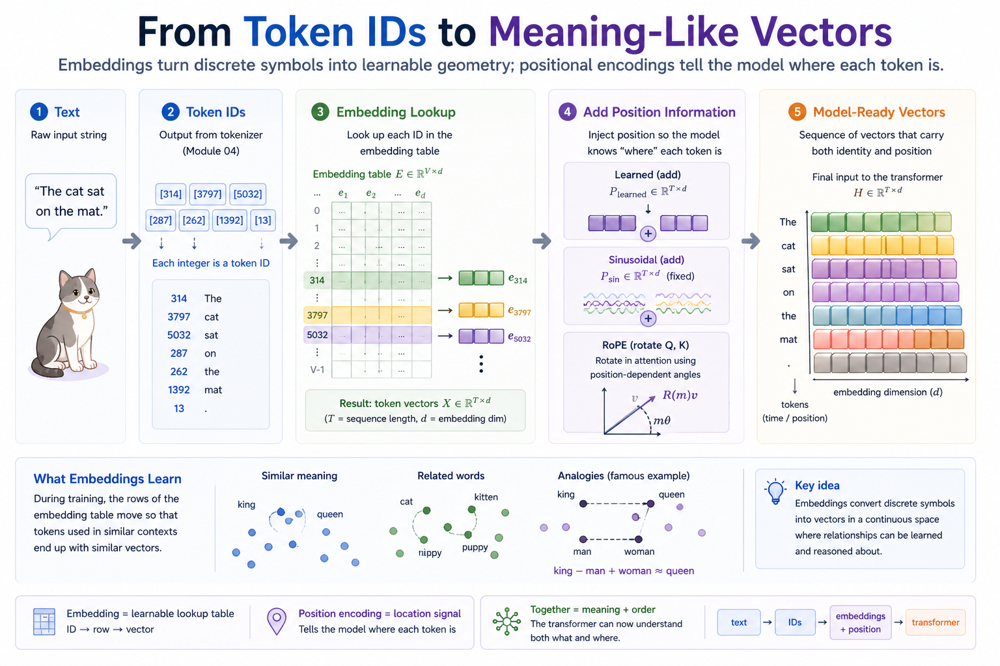
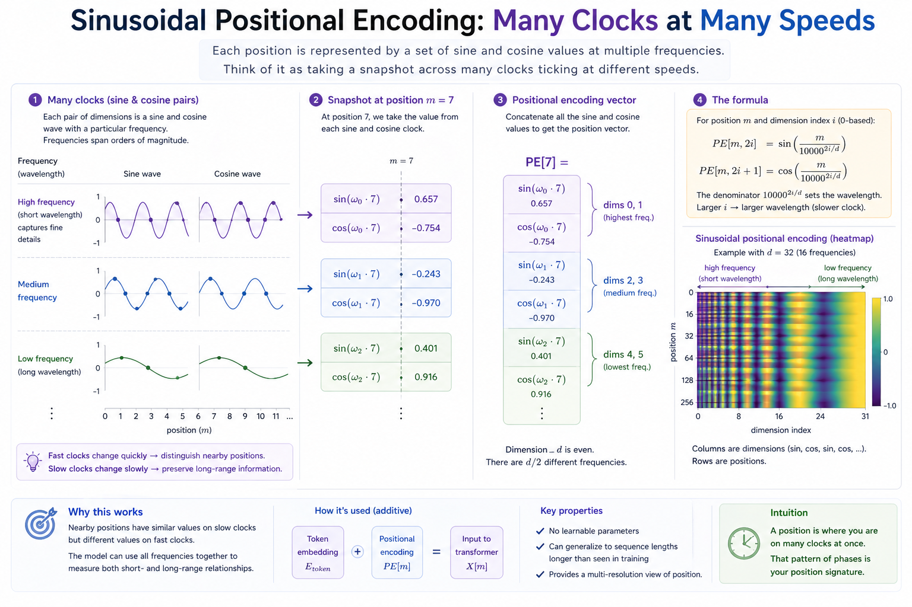

# Module 05 — Embeddings and positions

> **Question this module answers:** *How do discrete symbols become meaning-like vectors?*



The last module handed us integer IDs. This module turns them into vectors. The embedding lookup itself is a one-line table indexing — the lesson is what the table learns and which of the three positional schemes you use to break the bag-of-tokens symmetry.

---
## Before you start

* *Review* high-school trig (sin/cos basics, multiple frequencies — nothing exotic)
* *Review* [[PyTorch Primer]] if any PyTorch code looks unfamiliar or confusing
* *Finish* the `g2c/nn` package implementation from [[03-nn]] — this module relies on it
* *Run* `./datasets.sh glove` if you want the optional pretrained GloVe vector exercise

---
## Where this fits in

After Module 04 you can turn text into a sequence of integer token IDs. After this module you can turn that sequence into a sequence of vectors that a neural network can actually use.

Two things have to happen:

1. **Each token gets a vector.** The same trick we used for biases and weights in earlier modules, just bigger and indexed by token ID.
2. **Each position gets distinguishable.** Without position info, a transformer is order-blind: `dog bites man` and `man bites dog` produce identical attention patterns because they're the same multiset of tokens. We need to inject "I am at position m" into each input.

## The big idea

A token embedding is one of the simplest ideas in deep learning:

```
  Embedding table   weight: (vocab_size, embedding_dim)

  ID      Vector
   0   →  [ 0.12, -0.44,  0.91, ... ,  0.05 ]
   1   →  [-0.33,  0.18,  0.62, ... ,  0.71 ]
   2   →  [ 0.55, -0.22, -0.18, ... ,  0.40 ]
   ...
   V-1 →  [-0.07,  0.65,  0.32, ... , -0.13 ]

  Forward:   ids   = [3, 1, 7]
             output = (3, embedding_dim) tensor — rows 3, 1, 7 of weight
```

That's it. The vector for each token is a learnable parameter — initialized random, updated by gradient descent like any other parameter. The forward pass is `weight[ids]`.

What makes this work is what gets *learned*. After training on enough text, the rows of `weight` arrange themselves into a geometry that reflects how tokens are used. Tokens that occur in similar contexts end up with similar vectors. Famously: word2vec's `king − man + woman ≈ queen`. The model never told that king is to man as queen is to woman; the geometry just emerged from co-occurrence statistics.


*Why we care about the embedding table beyond "it's a lookup." After training, semantically related tokens end up near each other (the clusters), and meaningful relationships line up as vector offsets (the analogies). Nothing in the training told the model to do this — it falls out of co-occurrence statistics.*

LLM tokenizers have vocab sizes of 32k–200k and embedding dimensions of hundreds to thousands. The embedding table is one of the largest single parameter tensors in the model.

### Why positions need explicit encoding

A transformer's attention layer is symmetric in its inputs — it computes `softmax(QKᵀ/√d)V` and the only way order enters is through the position-dependent contents of Q, K, V themselves. If those contents have no position information baked in, the model literally cannot tell `dog bites man` from `man bites dog`. Both are evaluated as the same bag of three vectors.


*The failure mode that motivates everything. Without position information, attention only sees an unordered bag of tokens. Position is what lets word order become visible to the model.*

So we encode position into the token vectors themselves before they reach attention. There are two design choices: ADD a positional vector (Learned, Sinusoidal) or ROTATE the vectors (RoPE).

```
                Learned       Sinusoidal      Rotary (RoPE)
              ──────────────────────────────────────────────
Parameters?    yes            no              no

Extrapolates   no             yes (formula)   yes (formula)
beyond max?

Mechanism      ADD to         ADD to          ROTATE Q, K
               token emb      token emb       inside attention
               
Used in        BERT,          original        Llama, Mistral,
               GPT-2          Transformer     Qwen, modern LLMs
```

Modern LLMs all use RoPE. Older ones used learned or sinusoidal. The reason RoPE won is the relative-position property — explained in detail below.

### The sinusoidal trick

Vaswani et al. proposed encoding position with a fixed table of sines and cosines at exponentially decaying frequencies:

```
  PE[pos, 2i]   = sin( pos / 10000^(2i/d) )
  PE[pos, 2i+1] = cos( pos / 10000^(2i/d) )
```

Each pair of dimensions is `(sin, cos)` at a particular frequency. Low `i` → fast oscillation (small wavelength); high `i` → slow oscillation. The model gets a multi-resolution view of position: nearby positions look similar in the slow dimensions but differ in the fast ones; far-apart positions differ in both.


*The mental image to keep. Each pair of dimensions is one (sin, cos) clock; low-`i` pairs tick fast (resolve nearby positions); high-`i` pairs tick slow (resolve coarse position over the whole sequence).*

This scheme has zero learnable parameters (the table is determined by the formula) and can be evaluated at any position, including beyond the longest sequence ever trained. The 2017 transformer paper used this; many models since have used learned positional embeddings instead, on the theory that learning is rarely worse than fixing.

### Rotary positional embeddings (RoPE)

The most important development in positional encoding since 2017. We'll cover attention in Module 7, but for now all you need to know is attention models care about token pair comparisons. For an ordered token pair (i, j), token i supplies the **query vector**, and token j supplies the **key vector**, and the dot product tells us how much token i pays attention to token j.

Instead of adding a position vector to the embedding vector, RoPE *rotates* the query and key vectors by an angle proportional to their position before the attention dot product. The key property is mechanical:

```
Without RoPE — positions are added vectors:
    q' = q + p_m            (p_m is the position embedding for position m)
    k' = k + p_n            (p_n likewise for n)
    q' · k' = q·k  +  q·p_n  +  p_m·k  +  p_m·p_n
                       ↑────── depends on absolute m, n ──────↑

With RoPE — positions are rotations:
    q' = R(m) · q           (R is a rotation matrix; angle ∝ m)
    k' = R(n) · k
    q' · k' = (R(m)q)ᵀ (R(n)k)
            = qᵀ R(m)ᵀ R(n) k
            = qᵀ R(n − m) k     ← only the RELATIVE offset (n − m) matters
```

The dot product of two RoPE'd vectors depends only on `(n − m)`. Token-pair attention scores are naturally functions of relative position, which is what we usually want — what matters in language is "this token is two words after that one", not "this token is at absolute position 437."

This is implemented as a per-position-pair 2D rotation, applied across all dimensions. The split-halves variant (Llama and friends): split the last dimension in half, treat dim `i` and dim `d/2 + i` as a 2-vector, rotate each pair by `m · θ_i` where `θ_i = 1/10000^(2i/d)`. The cos/sin tables are precomputed; the forward pass is `x · cos + rotate_half(x) · sin` — three tensor ops.


*The dot product of the rotated vectors depends only on the relative offset. The lower panels connect that algebra to the implementation: many rotation frequencies, paired dimensions, and the `x * cos + rotate_half(x) * sin` recipe.*

## Concepts to internalize

- **Embedding table = learnable lookup.** Forward is integer indexing; backward routes gradients only to the rows that were touched. Autograd gives us this for free.
- **The bag-of-tokens problem.** Without explicit position information, a transformer can't distinguish word orderings. Position must be injected somehow before attention.
- **Three positional schemes, three tradeoffs.** Learned (max_seq_len cap, more parameters), sinusoidal (no params, extrapolates by formula), rotary (no params, encodes relative position by construction).
- **Multi-frequency sinusoids.** The decaying-frequency table is what gives sinusoidal positional encodings their multi-scale resolution. Each pair of dimensions is one (sin, cos) frequency.
- **`R(m)ᵀ R(n) = R(n − m)`.** Rotations form a group; their composition adds angles. This is the algebraic identity that makes RoPE work.
- **`_rotate_half` is a notational trick.** The 2D rotation `(a, b) → (a cos θ − b sin θ, a sin θ + b cos θ)` can be written as `(a, b) ⊙ cos θ + (−b, a) ⊙ sin θ`. The `(−b, a)`.
- **Position 0 is the identity rotation.** `cos(0) = 1, sin(0) = 0`, so `RoPE(x, position=0) = x`. 

---
## What you'll build

Package: `g2c/embeddings/`

```python
class TokenEmbedding(Module):
    def __init__(self, vocab_size: int, embedding_dim: int): ...    # implemented
    def forward(self, ids: torch.Tensor) -> torch.Tensor: ...

class LearnedPositionalEmbedding(Module):
    def __init__(self, max_seq_len: int, embedding_dim: int): ...   # implemented
    def forward(self, seq_len: int) -> torch.Tensor: ...

class SinusoidalPositionalEmbedding(Module):
    def __init__(self, max_seq_len: int, embedding_dim: int): ...   # scaffolded (table)
    def forward(self, seq_len: int) -> torch.Tensor: ...

class RotaryEmbedding(Module):
    def __init__(self, max_seq_len: int, embedding_dim: int): ...   # scaffolded (cos/sin)
    def forward(self, x: torch.Tensor) -> torch.Tensor: ...

def make_skipgram_pairs(ids: list[int], window: int = 2): ...

class SkipGramEmbeddingModel:
    def __call__(self, center_ids: torch.Tensor) -> torch.Tensor: ...

def train_skipgram(model, center_ids, context_ids, ...): ...
def nearest_by_cosine(query, vectors, top_k=5): ...
def analogy(a, b, c, vectors, top_k=5): ...
```

A typical use looks like this (built fully in Module 07, sketched here):

```
  ids: (batch, seq_len)
  ↓ TokenEmbedding(vocab_size, dim)
  tok_emb: (batch, seq_len, dim)
  +
  ↓ SinusoidalPositionalEmbedding(max_seq_len, dim)
  pos_emb: (seq_len, dim)              ← broadcasts across batch
  =
  x: (batch, seq_len, dim)             ← input to first transformer block
```

For RoPE, the addition is replaced by `RotaryEmbedding` applied inside attention to Q and K — that's a Module 07 concern.

The skip-gram and cosine-similarity helpers support the notebook experiments.
They are intentionally small, but the idea comes back later: Module 17 retrieval
also ranks text chunks by vector similarity.

## How to run the tests

Tests live in `tests/test_embeddings.py`. Construction tests pass from the
start; lookup forwards, positional tables, RoPE, skip-gram pairing, and vector
similarity turn green as you implement the TODOs.

```bash
source .venv/bin/activate

pytest tests/test_embeddings.py             # run all module-05 tests
pytest tests/test_embeddings.py -x          # stop at first failure (recommended)
pytest tests/test_embeddings.py -k rotary   # only the RoPE tests
pytest tests/test_embeddings.py -v          # verbose
```

Open the working notebook copy with:

```bash
.venv/bin/python scripts/open_notebook.py 05
```

The clean scaffold lives at `notebooks/clean/05-embeddings.ipynb`; do your work in the generated `notebooks/solutions/05-embeddings.ipynb` copy.

Exercise 6 uses pretrained GloVe vectors. They are optional and larger than the normal setup assets:

```bash
./datasets.sh glove
```

The notebook skips the pretrained analogy section if `data/embeddings/glove.6B.50d.txt` is missing.

## Exercises

Open or resume the working notebook with `./notebook.sh 05` (or `./notebook.sh 05 --fresh` to reset from the clean scaffold). The notebook contains the exact prompts, plots, and answer cells; implementation work lives in `g2c/embeddings/`.

1. **Token and position lookups.** Trace embedding and positional table shapes.
2. **Sinusoidal positions.** Inspect the fixed table and its multi-frequency pattern.
3. **RoPE table construction.** Verify the split-halves cos/sin convention.
4. **RoPE relative positions.** Check that equal offsets produce equal rotated dot products.
5. **Tiny co-occurrence embeddings.** Train a small skip-gram model on TinyShakespeare, then inspect nearest learned tokens and a 2D projection. If the reusable `ShakespeareTokenizer` artifact exists, the notebook uses its full 4096-token vocabulary and the full corpus; otherwise it falls back to a smaller in-notebook tokenizer and corpus slice.
6. **Pretrained vector analogies.** Compare tiny embeddings with GloVe-scale structure.
7. **Positional schemes side by side.** Compare learned, sinusoidal, and RoPE heatmaps.

## Pitfalls to expect

- **Wrong axis when slicing sin/cos in sinusoidal.** Even dimensions should get sines; odd should get cosines. `weight[:, 0::2] = sin(angles)` and `weight[:, 1::2] = cos(angles)`. Mixing these up gives a tensor that's not a valid sinusoidal encoding.
- **`embedding_dim` odd.** Sinusoidal and RoPE both require an even dim. The `__init__`s raise a `ValueError`; if you instantiate at the wrong size, the error tells you what's wrong.
- **Forgetting `.requires_grad_(False)` on fixed tables.** The sinusoidal weight and the RoPE cos/sin tables are *not* parameters — they should not appear in `parameters()` and should not be updated by the optimizer.
- **`outer` vs. element-wise multiply.** Building the angles table requires `torch.outer(positions, inv_freq)` (or `positions[:, None] * inv_freq[None, :]`), not just `positions * inv_freq` (which would be element-wise on mismatched-shape tensors).
- **Wrong half-split convention for RoPE.** We use the *split-halves* variant: pair dim `i` with dim `d/2 + i`. The original RoPE paper paired dim `2i` with dim `2i+1` (interleaved). Both are valid rotations and produce the same end-to-end behavior in attention, but they're not interchangeable — `_rotate_half` is specifically the split-halves version.

## M-series notes

This module is light on compute.

- A 32k × 256 token-embedding table is ~8M parameters, ~32MB. Fits anywhere.
- Sinusoidal and RoPE tables for `max_seq_len = 4096, dim = 512` are around 8MB each. Trivial.
- The exercises that move some compute (training a tiny embedding model, projecting the result) all fit comfortably on CPU; MPS isn't necessary. With the reusable `ShakespeareTokenizer` artifact, the TinyShakespeare skip-gram exercise uses the full local corpus; without it, the notebook falls back to a smaller slice.

---
## Reading

Primary:

- **Mikolov et al., "Efficient Estimation of Word Representations in Vector Space" (2013).** The word2vec paper. Establishes that learned embeddings encode semantic structure.
- **Vaswani et al., "Attention is All You Need" (2017), §3.5.** The original sinusoidal positional encoding.
- **Su et al., "RoFormer: Enhanced Transformer with Rotary Position Embedding" (2021).** The RoPE paper. Skim — the math is heavy; the conceptual picture in this lesson is enough to use it.

Secondary:

- **Karpathy, "Neural Networks: Zero to Hero" lecture 2 ("makemore part 1").** Walks through token embeddings end to end on a tiny model.
- **Jay Alammar, "The Illustrated Word2vec."** Best visual intuition for how learned embeddings get their structure.
- **Eleuther blog posts on RoPE.** Several practical writeups on RoPE in production transformers.

## Deliverable checklist

- [ ] All tests in `tests/test_embeddings.py` pass.
- [ ] `notebooks/solutions/05-embeddings.ipynb`: tiny embedding model trained on TinyShakespeare, nearest-token inspection and 2D visualization included.
- [ ] `notebooks/solutions/05-embeddings.ipynb`: `king − man + woman ≈ queen` reproduced on pretrained vectors; honest assessment of whether your tiny model reproduces any analogies.
- [ ] You can explain — out loud, without notes — why RoPE'd attention scores depend only on the relative position offset.
