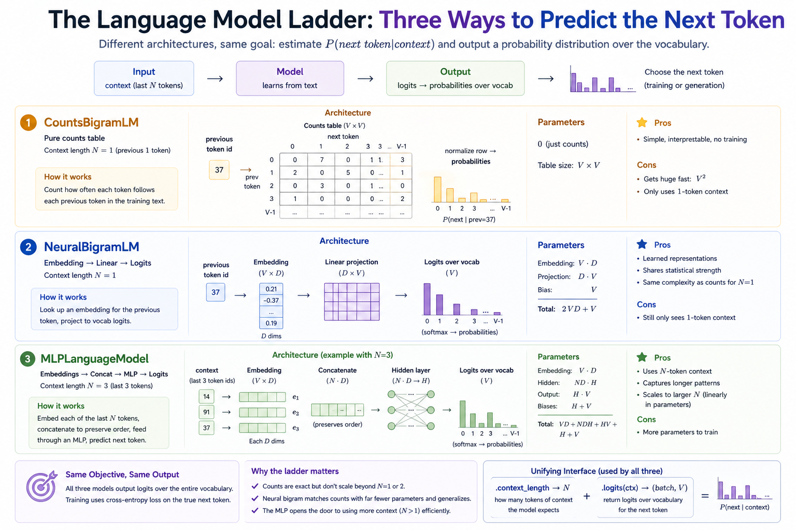
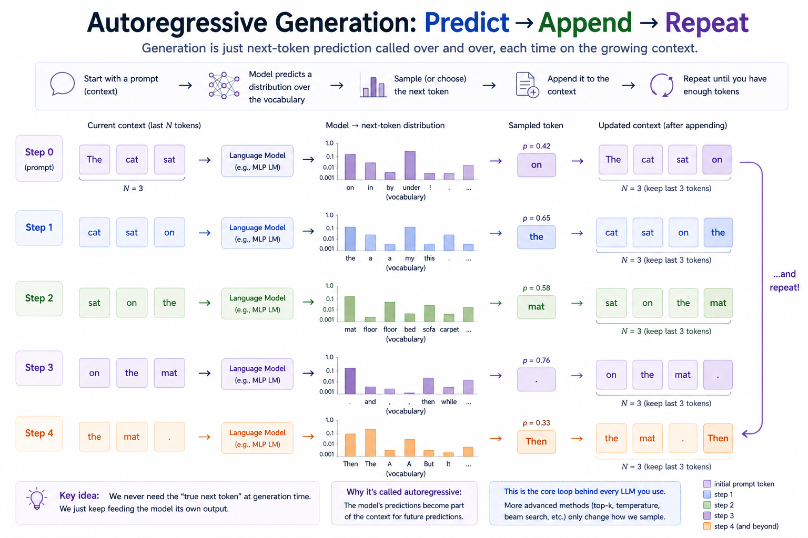

# Module 06 — Next-token prediction

> **Question this module answers:** *What is the actual training objective of a language model?*


The training-time path (panels 1–3) and the inference-time path (panel 4) use the same model with the same forward pass — the only difference is whether the next token comes from the corpus (training) or from sampling the model's own output (generation). Internalizing that those are the same loop, run with different inputs, is the conceptual breakthrough this module is built around.

## Prerequisites

### Math

- **Conditional probability and the chain rule of probability.** Factorize conditional probability `P(x_1, x_2, ..., x_T) = ∏_t P(x_t | x_{<t})`.
- **Cross-entropy.** `H(p, q) = -∑ p(x) log q(x)`. When `p` is a one-hot of the true next token, this collapses to `-log q(true_token)`
- **Exponents** Perplexity is `exp(mean cross-entropy)`.
- **Random sampling**

### Computer science

- **Sliding windows over a sequence.** `get_batch` picks random length-`N` windows from a long token stream. The same idea recurs in every transformer trainer you'll ever write.

### Programming

- **You'll be reusing your earlier modules.** `g2c.embeddings.TokenEmbedding`, `g2c.nn.Linear`, `g2c.nn.CrossEntropyLoss`, `g2c.nn.SGD`. Module 06 is the first one that depends on most of what came before. If those are still scaffolded, fill them in first — the test suite for this module presupposes they work.

## Where this fits in

Modules 04 and 05 gave us the input pipeline — text becomes integer IDs becomes vectors. Module 03 gave us a way to train an MLP on labeled data. What we don't yet have is a way to train on TEXT.

The breakthrough — and it really is the conceptual breakthrough that makes LLMs work — is to recast "model the language" as "predict the next token." Given the text so far, what comes next? That's a classification problem with `vocab_size` classes. Every method we built in Module 03 (cross-entropy loss, SGD, Linear, ReLU) drops in directly. The only differences are:

1. **The label is just the next token in the corpus.** We don't need human-labeled data — we just slide a window forward, and the next token is the target. This is "self-supervision," and it's why LLMs can be trained on the entire internet.
2. **Inference is autoregressive.** To generate text, we predict the next token, append it to the context, predict again, and so on. The generation process IS the prediction process, called repeatedly.

This module's deliverable is three language models, increasing in sophistication, all sharing the same training objective:

```
                    Architecture                  Context     Parameters
  ─────────────────────────────────────────────────────────────────────────
  CountsBigramLM    pure counts table             1 token     0 (counts only)
  NeuralBigramLM    embed → linear → logits       1 token     V·D + D·V + V
  MLPLanguageModel  embed → concat → MLP → logits N tokens    V·D + N·D·H + H·V + ...
```



*Same input (context tokens), same output (a probability distribution over the vocabulary), three increasingly expressive ways to compute it. Each row previews exactly what you'll implement: a counts table, an embedding-then-projection neural bigram, and a Bengio-style concat-MLP. Comparing all three on the same corpus is exercise 5 — and the visual companion to that comparison is the perplexity plot near the end of this page.*

By comparing them on the same corpus, you'll see exactly what each layer of machinery buys you — and where each one runs out of road.

## The big idea

Next-token prediction is just classification. Take any string, tokenize it. Slide a window of length `N` (the context length) across the resulting ID sequence. For each window, the input is the window itself and the target is the very next token:

```
  Token IDs:   [4, 7, 1, 3, 9, 2, 6, ...]

  context_length = 2:
    window [4, 7]  → target 1
    window [7, 1]  → target 3
    window [1, 3]  → target 9
    window [3, 9]  → target 2
    ...
```

Now the problem looks identical to MNIST: the model gets a fixed-size input (a context window) and produces a probability distribution over `vocab_size` classes (the next token). Cross-entropy loss. SGD. The whole Module 03 setup, unchanged.

The only conceptual addition is what to do at inference time. There's no "true next token" to compare against — we want the model to *generate*. So we run the model on the prompt, sample one token from the output distribution, append it, run again on the new context, sample again, and so on:

```
  Autoregressive sampling (context_length = 2):

    prompt = [4, 7]
    step 1: model([4, 7])    → distribution over V tokens; sample → 1
            now have [4, 7, 1]
    step 2: model([7, 1])    → ... sample → 3
            now have [4, 7, 1, 3]
    step 3: model([1, 3])    → ... sample → 9
            ...
```

That loop IS the inference path of every LLM you've ever talked to. Everything else — top-k sampling, beam search, temperature controls, RAG, tools — is decoration around this exact loop.



*The same loop drawn frame by frame. Each step asks the model for a next-token distribution given the current context, samples one token, appends it, and slides the context window forward. It's the same model used during training, just called repeatedly with its own outputs as input. The `sample()` helper in `train.py` is exactly this loop in code.*

### Counts vs. neural: same model, two implementations

For a bigram model — context length 1, predicting `P(next | prev)` — there are two ways to learn the conditional distribution.

**Counts.** Walk the corpus once. For each adjacent pair `(a, b)`, increment `counts[a, b]`. Done. The conditional distribution at inference is row `a` of the table, normalized to sum to 1. With `vocab_size = V`, this is a `(V, V)` table — for a small vocab this is genuinely the right tool. No hyperparameters, no training, no neural network at all.

```
  Bigram counts table after a tiny corpus:

                  next token
                  0    1    2    3
  prev  0  [    0    7    0    1  ]
        1  [    2    0    5    0  ]
        2  [    0    3    0    1  ]
        3  [    1    0    0    0  ]

  Row 0 normalized:  [0.000, 0.875, 0.000, 0.125]
  →  P(next=1 | prev=0) = 0.875
```

**Neural.** Same target distribution, parameterized as `softmax(embed(a) · W)` where `embed` is a `(V, D)` lookup table and `W` is a `(D, V)` projection. Train with cross-entropy and SGD. With sufficient `D` this can match the counts model exactly. With smaller `D` it can't quite — but it learns to share statistical strength across similar tokens, which the counts model fundamentally cannot do.

Both perform similarly on a simple corpus. The point of building both is to internalize that the neural one is *the same model* — just expressed in a form that scales to larger contexts and stacks of layers, which the counts table does not. Counts hits a wall at `context_length = 2` (table size `V³`); at `context_length = 3` it's `V⁴`; by realistic context lengths the table doesn't fit anywhere. The neural form's parameter count grows linearly in `D` and `H`, not exponentially in `N`.

### From bigram to MLP: more context

A bigram model only sees the previous token. That ceiling is real and quickly hit. The fix is the **Bengio-style MLP language model** (Bengio et al. 2003):

```
  Context window: [a, b]  (context_length = 2)

       a ─→ embed ─→ e_a (D dims)
                                ┐
                                │── concat ─→ [e_a, e_b]   (2·D dims)
       b ─→ embed ─→ e_b (D dims)
                                                 │
                                                 ↓
                                              hidden Linear (2·D → H)
                                                 │
                                                 ↓
                                                tanh
                                                 │
                                                 ↓
                                            output Linear (H → V)
                                                 │
                                                 ↓
                                              logits over V tokens
```

That's it. A trigram model (`context_length = 2`, predicting the third token from the previous two) is just this with `N = 2`. A four-gram is `N = 3`. There's no upper limit other than parameter count.

**Why concatenation, not summing or averaging?** Concatenation preserves position. After concat, `[e_a, e_b]` and `[e_b, e_a]` are different vectors; after summing, they're the same. The model that sums embeddings of context tokens cannot tell `dog bites` from `bites dog` — exactly the bag-of-tokens failure mode that motivated positional embeddings in Module 05. The MLP's concatenation is a brute-force-but-correct way to inject position; in Module 09 the transformer block uses a more elegant scheme.

The Bengio architecture is the direct ancestor of the transformer. Most of what makes transformers work is replacing the fixed-size context window and its concatenated embeddings with a variable-size context window and *attention*-mixed embeddings. The next-token-prediction objective, the cross-entropy loss, the embedding table, the output projection — those all stay.

### Perplexity: how surprised is the model

The headline metric for any LM. Perplexity is `exp(mean cross-entropy per token)` on a held-out corpus. Intuitively:

> The model behaves, on average, as uncertain as if it were uniformly choosing from `perplexity` tokens.

```
  Sanity values for a vocab of size V:

  Uniform model (all tokens equally likely):  perplexity = V
  Perfect model (always puts mass 1 on the right token): perplexity = 1
  Bigram on English (~50k vocab):             ~100s
  Small neural LM:                            ~tens
  Modern frontier LMs:                        single digits
```

Two reasons to use perplexity over raw cross-entropy:

1. **It's interpretable as a branching factor.** "Perplexity 50" tells you the model is acting as if it's picking from a uniform distribution over 50 tokens. Cross-entropy in nats doesn't have that interpretation directly.
2. **It's invariant to vocab encoding choices.** A model trained at vocab size 1k vs 8k has very different cross-entropy values, but their perplexities are still comparable as long as you evaluate on the same token stream.

When you train a neural LM, you watch `train loss` (training cross-entropy) go down step-by-step and `val perplexity` (held-out perplexity) go down checkpoint-by-checkpoint. They tell the same story in different units.


*The kind of plot exercise 7 has you produce. The uniform baseline at perplexity = vocab_size is where any untrained model starts. The counts bigram and neural bigram converge to roughly the same floor (same model, two parameterizations). The MLP, with N-token context, drops past that floor — that gap is exactly what extra context buys you, and it's the visual punchline of the whole module.*

## Concepts to internalize

- **Self-supervision is the trick.** The "label" is just the next token in the corpus. No human labelers needed. This is what unlocks training on internet-scale text and is the single most important practical idea behind modern LMs.
- **Inference is autoregressive.** Generation = repeated next-token prediction with the previous output appended to context. The same model architecture serves both roles — there's no separate "generator."
- **Counts and neural bigrams represent the same distribution.** The choice is parameterization, not capacity. Neural is preferred not because it fits better on small vocab, but because it scales — to more context, to deeper stacks, to shared parameters across similar tokens.
- **Concatenation preserves position.** Inside the MLP language model, flattening the context-window embeddings is what tells the model whether token `a` came before or after token `b`. Sum or average would lose this.
- **Perplexity is `exp(cross-entropy)`.** Same number, different units. Perplexity is the more interpretable one: it's the effective branching factor at each step.
- **All three models share the same evaluation interface.** Each exposes `.context_length` and `.logits(ctx) → (batch, vocab_size)`. That's why `perplexity()` and `sample()` work on all of them with no model-specific code paths — and why the transformer (Module 09) will drop in too.

---
## What you'll build

Package: `g2c/lm/`

```python
class CountsBigramLM:
    counts: torch.Tensor               # (V, V) integer table
    smoothing: float                   # add-one Laplace smoothing
    context_length: int = 1

    def __init__(self, vocab_size, smoothing=1.0): ...     # implemented
    def fit(self, ids: torch.Tensor) -> None: ...
    def logits(self, ctx_ids) -> torch.Tensor: ...

class NeuralBigramLM(Module):
    embed: TokenEmbedding              # (V, D)
    proj: Linear                       # (D, V)
    context_length: int = 1

    def __init__(self, vocab_size, embedding_dim): ...     # implemented
    def forward(self, ctx_ids) -> torch.Tensor: ...

class MLPLanguageModel(Module):
    embed: TokenEmbedding              # (V, D)
    hidden: Linear                     # (N·D, H)
    output: Linear                     # (H, V)
    context_length: int                # = N

    def __init__(self, vocab_size, context_length, embedding_dim, hidden_dim): ...
    def forward(self, ctx_ids) -> torch.Tensor: ...

# Helpers in train.py — model-agnostic, use only `.context_length` and `.logits()`
def get_batch(ids, context_length, batch_size): ...        # implemented
def perplexity(model, ids, *, batch_size=256) -> float: ...
def sample(model, prompt_ids, num_tokens, *, temperature=1.0) -> torch.Tensor: ...
def train_lm(model, train_ids, *, val_ids=None, ...) -> dict: ...
```

A typical training-and-evaluation flow looks like this (will land in your notebook):

```python
# Counts baseline — no SGD.
counts = CountsBigramLM(vocab_size=V)
counts.fit(train_ids)
print("counts perplexity:", perplexity(counts, val_ids))

# Neural bigram — trained with SGD.
neural = NeuralBigramLM(vocab_size=V, embedding_dim=64)
train_lm(neural, train_ids, val_ids=val_ids, num_steps=2000)
print("neural bigram perplexity:", perplexity(neural, val_ids))

# Bengio-style MLP — more context.
mlp = MLPLanguageModel(vocab_size=V, context_length=3, embedding_dim=64, hidden_dim=128)
train_lm(mlp, train_ids, val_ids=val_ids, num_steps=2000)
print("MLP perplexity:", perplexity(mlp, val_ids))

# Generate from each.
for name, m in [("counts", counts), ("neural", neural), ("mlp", mlp)]:
    out = sample(m, prompt_ids=val_ids[:m.context_length], num_tokens=200)
    print(f"\n--- {name} ---")
    print(tokenizer.decode(out.tolist()))
```
## How to run the tests

Tests live in `tests/test_lm.py`. Initial state: 13 passed, 35 failed.

```bash
source .venv/bin/activate

pytest tests/test_lm.py             # run all module-06 tests
pytest tests/test_lm.py -x          # stop at first failure (recommended)
pytest tests/test_lm.py -k counts   # only the counts-model tests
pytest tests/test_lm.py -k mlp      # only the MLP tests
pytest tests/test_lm.py -v          # verbose
```

## Scaffolding and how to run the tests

Tests live in `tests/test_lm.py`. Initial state: 13 passed, 35 failed.

```bash
.venv/bin/python -m pytest tests/test_lm.py             # run all module-06 tests
.venv/bin/python -m pytest tests/test_lm.py -x          # stop at first failure (recommended)
.venv/bin/python -m pytest tests/test_lm.py -k counts   # only the counts-model tests
.venv/bin/python -m pytest tests/test_lm.py -k mlp      # only the MLP tests
.venv/bin/python -m pytest tests/test_lm.py -v          # verbose
```

Open the working notebook copy with:

```bash
.venv/bin/python scripts/open_notebook.py 06
```

The clean scaffold lives at `notebooks/clean/06-language-models.ipynb`; do your work in the generated `notebooks/solutions/06-language-models.ipynb` copy.

## Exercises

The implementation path is the test suite above. The notebook starts with an executable test gate, then uses the implemented pieces for prediction, inspection, generation, and comparison.

1. **Context windows and targets.** Turn one token stream into supervised `(context, target)` examples. Predict the windows by hand for a tiny sequence, then inspect what `get_batch` returns.

2. **Counts bigram model.** Fit a counts table on a tiny stream, print the raw counts, then inspect the smoothed next-token probabilities row by row.

3. **Neural bigram and MLP shapes.** Verify that both neural models return `(batch, vocab_size)` logits. Compare `[a, b]` vs. `[b, a]` through the MLP to see why concatenation preserves order.

4. **Perplexity and autoregressive sampling.** Check the two sanity cases: a uniform model has perplexity `vocab_size`, and a perfect deterministic model has perplexity 1. Then sample from the deterministic model to make the predict-append-repeat loop visible.

5. **Train all three on the same tokenized corpus and compare.** Use the notebook's built-in tiny corpus or add `data/tinyshakespeare.txt` for a larger run. Fit the counts model, train the neural bigram and MLP, and report validation perplexity in one table.

6. **Sample from each model and read the text.** Generate from the counts bigram, neural bigram, and MLP. Compare their failure modes: repeated fragments, locally plausible pairs, and the limits of a fixed small context.

7. **Plot training curves.** Plot training cross-entropy and validation perplexity for the neural bigram and MLP. Use the counts bigram perplexity as a horizontal baseline.

## Pitfalls to expect

- **`fit` not accumulating.** Calling `fit` twice should add to the existing table, not replace it. Reset the counts in `__init__`, not in `fit`.
- **Smoothing zero by accident.** Without smoothing (or with `smoothing=0`), any unseen bigram pair has probability zero, which makes `log(0) = -inf`, which propagates through perplexity as `inf`. The default `smoothing=1.0` fixes this; if a user explicitly sets `smoothing=0`, expect `-inf` in log-probs and accept it.
- **Forgetting to squeeze a `(batch, 1)` context.** `NeuralBigramLM.forward` receives `(batch, 1)` inputs from `get_batch` (because `context_length=1` produces a length-1 context window). Without a squeeze, `embed` returns `(batch, 1, D)` and the projected logits are `(batch, 1, V)`, breaking every downstream shape assumption.
- **MLP using sum/mean instead of concat.** The MLP's flatten step is `e.view(B, -1)`, which preserves order. `e.mean(dim=1)` would silently collapse `[a, b]` and `[b, a]` to the same vector. The `test_mlp_forward_position_sensitive` test exists to catch exactly this.
- **`train_lm` not zeroing grads.** Standard PyTorch trap. Without `optimizer.zero_grad()` between steps, gradients accumulate across iterations and SGD walks in roughly random directions. The training-loss curve will look haywire.
- **Sampling without `torch.no_grad()`.** Not a correctness bug — but every sampling step builds an autograd graph that's never used, wasting memory and time. Wrap the `sample` loop body in `with torch.no_grad():` for free speedup. Same goes for the inner loop of `perplexity`.
- **Perplexity blowing up on a tiny held-out set.** If `val_ids` is shorter than `context_length`, perplexity is undefined (no windows to score). The test for this throws `ValueError` from `get_batch`; for `perplexity` itself, guarantee `len(val_ids) > context_length` in the calling code.
- **Comparing perplexities across vocab sizes.** A bigger vocab makes every individual prediction harder; perplexities aren't directly comparable across tokenizers. For exercise 5, train all three models on the *same* tokenized stream so the comparison is fair.

## Reading

Primary:

- **Karpathy, "Building makemore"** — the YouTube series. Parts 1–3 cover exactly the three models in this module: counts bigram, neural bigram, and the Bengio MLP. Single best resource on the topic.
- **Bengio et al., "A Neural Probabilistic Language Model" (2003).** The paper that introduced the architecture you're building in `mlp.py`. A surprisingly short read; the conceptual machinery is small. The "look up embeddings, concatenate, MLP, softmax" recipe is right there.

Secondary:

- **Jurafsky & Martin, *Speech and Language Processing* (3rd ed.), ch. 3.** Classical-NLP treatment of n-gram language models, smoothing, and perplexity. Free PDF online. Read the perplexity section if you want a deeper account of why this is the canonical metric.
- **Mikolov et al. (2010), "Recurrent Neural Network Language Model."** The first big jump past Bengio's MLP. We don't implement RNNs in this course (we go straight to attention), but the paper is a useful waypoint for understanding what attention later replaces.

## Deliverable checklist

- [ ] All tests in `tests/test_lm.py` pass.
- [ ] `notebooks/solutions/06-language-models.ipynb`: counts, neural bigram, MLP all trained and evaluated on the same token stream; perplexity comparison table; sampled text from each.
- [ ] `notebooks/solutions/06-language-models.ipynb`: training-loss and validation-perplexity plots for the neural bigram and the MLP.
- [ ] You can explain — out loud, without notes — why a counts model can represent the same distribution as a neural bigram, but does not scale to context length 3 the way the MLP does.

## M-series notes

This module is light on compute.

- The counts table for `vocab_size = 1024` is 4MB (int64, `1024 × 1024`). At `vocab_size = 8192` it's 256MB — fine on a 16GB machine, getting heavy. This is a glimpse of why counts models don't scale.
- The neural bigram and MLP at the sizes used in exercise 5 (`embedding_dim=64`, `hidden_dim=128`, `vocab_size=1024`) have well under 1M parameters — a few seconds per training step on CPU, fractions of a second on MPS.
- Training all three for the recommended 2000 steps takes 2–5 minutes total. Sampling 500 tokens from each takes seconds. There is no need to think about MPS for this module — CPU is fast enough — but using MPS works and is a fine warm-up for Module 10.
