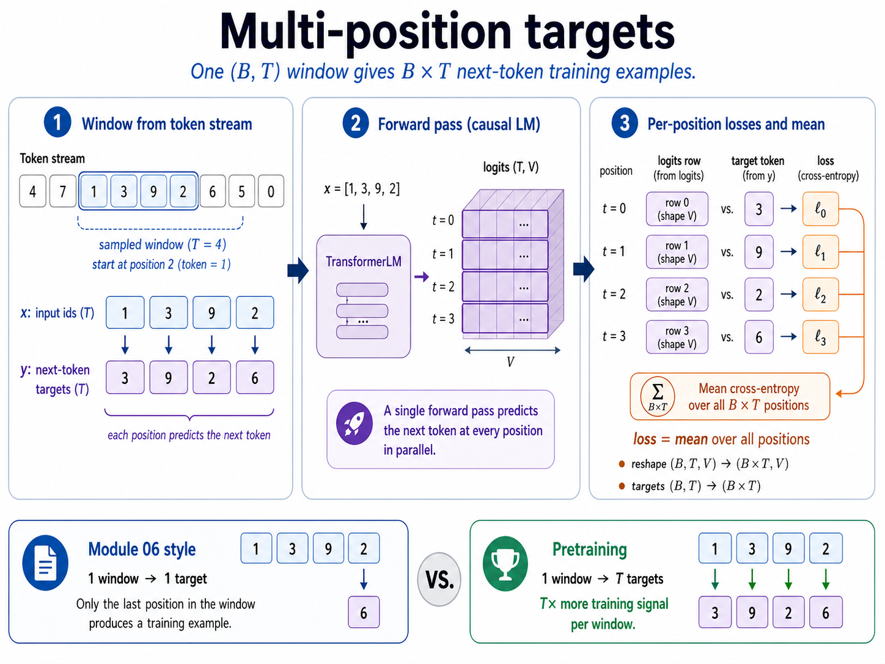

# Module 09B — Pretraining

> **Question this module answers:** *How do we learn from text?*


Last week we built the transformer; a language model composed of stacked attention and neural networks. In terms of language model architecture, the transformer is the "final form". Every single major LLM in use today is built on top of the transformer. It will be the model we use for the remainder of the course.

The next step is turning the core architecture into an actual trained model. Training language models to even basic levels of competency requires vast scales of data and compute. There is no room for inefficiency in the process. This lesson will be about how to build an efficient and effective self-supervised learning pipeline on top of the transformer. 

---
## Before you start

* *Review* Module 03 cross-entropy and the `(B, T, V)` logits shape from [[09-transformer-block]] — this module sits between them
* *Finish* `g2c/transformer` (Module 09) and `CrossEntropyLoss` in `g2c/nn` (Module 03) — `lm_cross_entropy` calls into both
* *Finish* `g2c/training` from [[03b-training]] — the `Trainer` you'll build here imports `AdamW`, `clip_grad_norm_`, and `cosine_with_warmup` from it

---
## Where this fits in

At the end of Module 09, `TransformerLM.forward()` returns logits shaped `(B, T, V)`. That output is not useful until you can answer two questions:

1. What exactly are the `(B, T)` inputs and `(B, T)` targets?
2. How do those `(B, T, V)` logits become one scalar loss?

Module 06 used a fixed context and one target:

```text
context: [the, king, said]  -> target: [hello]
```

A causal transformer gives you more signal. For one window of length `T`, it produces `T` next-token predictions in parallel:

```text
ids: [4, 7, 1, 3, 9, 2, 6, 5]

x:   [1, 3, 9, 2]
     |  |  |  |
     v  v  v  v
y:   [3, 9, 2, 6]
```

Every position in `x` has a target in `y`. The causal mask makes this legal: when the model predicts `y[t]`, it can see `x[:t+1]` but not the future token itself.

## The big idea

Any corpus can be turned into a token stream. Start with text, tokenize it, and store a single 1-D token stream:

```python
ids = torch.tensor(tokenizer.encode(text), dtype=torch.long)
```

Then split it contiguously:

```python
train_ids, val_ids = split_token_stream(ids, train_fraction=0.9)
```

Do not shuffle the individual token IDs. Shuffling would destroy the adjacency relation that next-token prediction depends on. The training stream and validation stream can each be sampled randomly by window, but each sampled window must preserve local order.

### Batch sampling creates shifted windows

`get_lm_batch` samples `B` starting positions from a 1-D stream. Each start needs `T + 1` contiguous tokens:

```text
start = s

x = ids[s     : s + T    ]   # length T
y = ids[s + 1 : s + T + 1]   # length T, shifted left by one
```

Stacking many windows gives:

```text
x: (B, T)
y: (B, T)
```

The headline contract is simple:

```text
y[b, t] is the token immediately after x[b, t] in the corpus.
```


*One contiguous stream sample becomes many supervised examples: every position predicts the token immediately after it. The causal mask is what makes this parallel training legal, because each position can use only its past and present inputs.*

### The loss flattens positions

`TransformerLM(x)` returns:

```text
logits: (B, T, V)
targets: (B, T)
```

Your `CrossEntropyLoss` from Module 03 expects one row per classification example:

```text
logits:  (N, V)
targets: (N,)
```

So `lm_cross_entropy` treats every `(b, t)` position as one example:

```python
B, T, V = logits.shape
flat_logits = logits.reshape(B * T, V)
flat_targets = targets.reshape(B * T)
loss = CrossEntropyLoss()(flat_logits, flat_targets)
```

That is the pretraining objective in its smallest useful form: average next-token cross-entropy over every position in every sampled window.

### `log(V)` is the sanity baseline

If all logits are zero, softmax is uniform over the vocabulary. Cross-entropy against a uniform distribution is:

```text
loss = log(V)
perplexity = exp(loss) = V
```

At initialization, a random model's loss should usually start near `log(V)`. If it starts far below `log(V)`, suspect a bug: wrong targets, wrong reshape, repeated trivial data, or loading a trained checkpoint by accident. If it starts near `log(V)` and then drops, the model is learning.

### Corpus selection is model behavior selection

The corpus is not just fuel for the optimizer. It is the behavior distribution the model is asked to imitate. TinyShakespeare teaches character names, stage directions, and Elizabethan fragments. TinyStories teaches simple narrative structure. A course corpus mixed with educational prose and code teaches a different shape again. Same architecture, same loss, different data: different model.

At small scale, corpus choice is especially visible because the model cannot average over the internet. A narrow corpus can produce more coherent samples inside its domain, but it will be brittle outside it. A broader corpus gives the model more surface area, but each pattern gets fewer repetitions for a fixed training budget. That is why Module 10 uses named tracks: ShakespeareLM for a tiny smoke run, StoryLM for coherent small-model text, and TinyLLM for broader assistant-shaped experiments.

Document boundaries also matter. If you concatenate stories or articles without a separator, the model sees the last sentence of one document followed by the first sentence of the next as an ordinary next-token event. The course tokenizer reserves `<|endoftext|>` so document boundaries can be represented explicitly. Sampling code should avoid crossing documents when possible; when it does not, the separator at least gives the model a visible boundary token.

The practical rule for this course: choose the corpus that matches the artifact you want to produce, keep a held-out validation split from the same distribution, and write down the corpus size/mix in the manifest so later results are interpretable.

## Concepts to internalize

- **A token stream is supervised data once you shift it by one.**
- **Document separators are training data.** `<|endoftext|>` tells the model one document ended before another begins.
- **Causal masking makes multi-position training valid.** Every position predicts the next token without seeing it.
- **One `(B, T)` batch contains `B * T` classification examples.**
- **Language-model cross-entropy is ordinary cross-entropy after a reshape.**
- **`log(V)` is not transformer-specific.** It is the uniform baseline for any language model with vocabulary size `V`.
- **Corpus choice shapes model behavior.** Data distribution matters as much as architecture at this scale.

### What we don't cover

* **Distributed training.** Used to scale large-scale training beyond a single machine. Lots of devops considerations, but conceptually just an extension of gradient batching.
* **Mixed precision.** Speeds up training by using lower precision floats for most operations and selectively keeping high precision for load bearing weights. 
* **Packed datasets.** Combines multiple short training sequences into a single long sequence. Reduces wasting compute on padding.

---
## What you'll build

Package: `g2c/pretraining/`

```python
def split_token_stream(
    ids: torch.Tensor,
    train_fraction: float = 0.9,
) -> tuple[torch.Tensor, torch.Tensor]:                 # implemented

def get_lm_batch(
    ids: torch.Tensor,
    batch_size: int,
    context_length: int,
    *,
    generator: torch.Generator | None = None,
) -> tuple[torch.Tensor, torch.Tensor]:                 # implemented

def lm_cross_entropy(
    logits: torch.Tensor,
    targets: torch.Tensor,
) -> torch.Tensor:                                      # SCAFFOLDED
```

`split_token_stream` and `get_lm_batch` are implemented for you. `lm_cross_entropy` is the one scaffolded function — it reshapes `(B, T, V)` logits and `(B, T)` targets, then calls your Module 03 `CrossEntropyLoss`.

## How to run the tests

Tests live in `tests/test_pretraining_setup.py`. The `data.py` tests pass from the start; `lm_cross_entropy` tests fail until you implement the reshape.

```bash
pytest tests/test_pretraining_setup.py -x
pytest tests/test_pretraining_setup.py -v
```

## Exercises

Open the working notebook with `.venv/bin/python scripts/open_notebook.py 09b`. Each exercise has `Question:` / `Answer:` cells inside the notebook. If you'd like a hint instead of a grade, write the request in the answer string and ask a coding agent for help. Blank answers are skipped rather than counted wrong.

1. **Shift a toy stream by hand.** Given `ids = [10, 11, 12, 13, 14, 15]`, `start = 1`, and `T = 3`, write `x` and `y`. Explain why `y[t]` is the target for `x[t]`.

2. **Explain why the causal mask matters.** In one paragraph, explain why multi-position training would be invalid without a causal mask.

3. **Inspect `get_lm_batch`.** Run the notebook cell that samples from `torch.arange(30)`. Verify that every target is input plus one. Then explain why this toy stream makes the shift easy to see.

4. **Implement `lm_cross_entropy`.** Fill in the scaffold in `g2c/pretraining/loss.py`, then run `pytest tests/test_pretraining_setup.py -k lm_cross_entropy -x`.

5. **Flatten shapes explicitly.** For `B = 2`, `T = 4`, `V = 7`, write the shapes of `logits`, `targets`, `flat_logits`, and `flat_targets`. State how many classification examples the batch contains.

6. **Compute the baseline.** For `V = 256`, `V = 512`, and `V = 1024`, compute `log(V)` and `exp(log(V))`. Explain why larger vocabularies have larger initial loss but not necessarily worse models.

7. **Random model sanity check.** Instantiate a tiny `TransformerLM`, sample one batch, compute `lm_cross_entropy`, and compare it to `log(V)`. If the two values differ a lot, write down two possible explanations.

## Pitfalls to expect

- **Off-by-one targets.** `y` starts one token after `x`. If `y == x`, the model is learning to copy the current token, not predict the next one.
- **Sampling past the end.** Each window needs `T + 1` tokens, not just `T`.
- **Shuffling tokens.** Shuffle windows if you want randomness, not individual token IDs.
- **Flattening one tensor differently than the other.** `logits.reshape(B * T, V)` and `targets.reshape(B * T)` must preserve the same `(B, T)` order.
- **Reading `log(V)` as failure.** At step 0, `log(V)` is the expected baseline. The interesting question is whether the curve drops below it.

## M-series notes

This module is CPU-light. The tensors are tiny, and no serious training run happens yet. MPS matters again in Module 10, where the same helpers sit inside thousands of optimizer steps.

---
## Reading

- Karpathy, *nanoGPT*, especially the `get_batch` and loss computation.
- Karpathy, "Let's reproduce GPT-2 (124M)", the data-loader and training-loop sections.
- Vaswani et al., "Attention Is All You Need", causal masking and parallel sequence training context.

## Deliverable checklist

- [ ] `pytest tests/test_pretraining_setup.py` passes.
- [ ] Notebook: `notebooks/clean/09b-pretraining.ipynb`.
- [ ] You can explain why one `(B, T)` batch contains `B * T` next-token prediction examples.
- [ ] You can implement `lm_cross_entropy` from the shape contract alone.
- [ ] You can use `log(V)` as a step-0 sanity check before a Module 10 training run.
