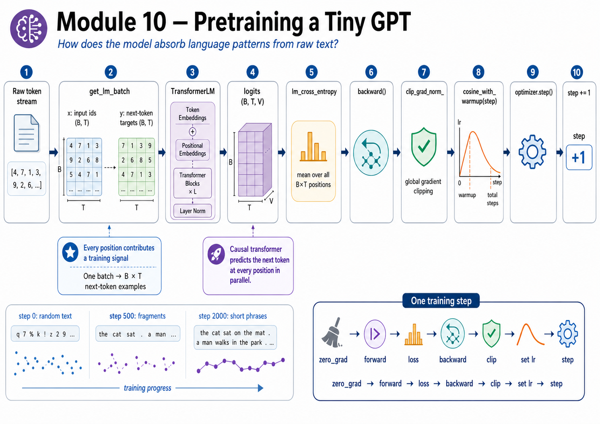
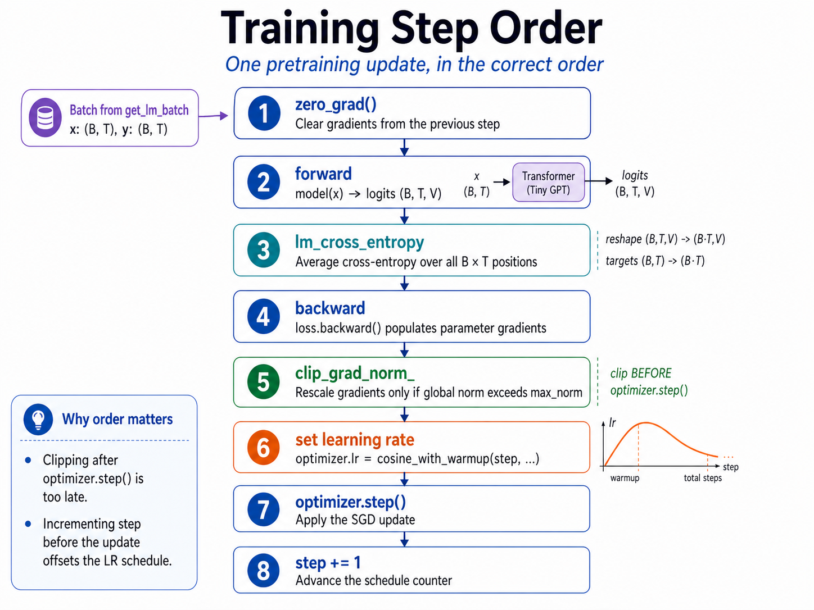

# Module 10 — Milestone: TinyLLM

> **Question this module answers:** *Can I build a language model using the tools we learned?*



This is the payoff week for Phase III. Module 09 built the architecture. Module 09B turned a token stream into a supervised objective. Module 03B made the training controls legible. Module 10 wires those pieces together and produces the first trained checkpoint.

---
## Before you start

* *Review* 
	* [03b-training](03b-training.md) (AdamW, clipping, lr schedule)
	* [09b-pretraining](09b-pretraining.md) (batching, cross-entropy)
* *Finish* 
	* `g2c/transformer-block` from [09-transformer-block](09-transformer-block.md)
	* `g2c/pretraining` from  [09b-pretraining](09b-pretraining.md)
	* `g2c/training` from [03b-training](03b-training.md). 
	* The trained tokenizers from [04-tokenizer](04-tokenizer.md) notebook (optional; `datasets.sh` will generate if missing)
* *Run* `./datasets.sh` to pre-generate the datasets used for the large training runs.

---
## Where this fits in

The transformer is finally complete, but an untrained transformer is just a random function. Module 10 makes it a language model by repeating one training step thousands of times:

```text
train_ids
  -> get_lm_batch              # Module 09B
  -> model(x)                  # Module 09
  -> lm_cross_entropy          # Module 09B
  -> backward                  # PyTorch autograd over your modules
  -> clip_grad_norm_           # Module 03B
  -> cosine_with_warmup        # Module 03B
  -> optimizer.step            # Module 03 or 03B
  -> history + validation
```

The new concept is not a new layer. It is orchestration. The course stack now has enough pieces that the core engineering problem is putting them in the right order, tracking the run, and using the resulting curve and samples to decide whether training is healthy.

## The big idea

### The trainer is glue, but load-bearing glue

`Trainer.train_step` is short, but the order is part of the contract:

1. `optimizer.zero_grad()`
2. sample `(x, y)` with `get_lm_batch`
3. move `x` and `y` to the trainer device
4. `logits = model(x)`
5. `loss = lm_cross_entropy(logits, y)`
6. `loss.backward()`
7. clip gradients if requested
8. set the scheduled learning rate
9. `optimizer.step()`
10. increment `self.step`

Two lines are easy to swap accidentally:

```text
WRONG: optimizer.step() before clipping
WRONG: incrementing self.step before computing/logging the lr for this step
```

Those bugs often produce a run that still appears to train. The tests pin down the step counter, learning-rate assignment, clipping behavior, evaluation mode, and end-to-end loss decrease.


*The order is the lesson. Most miswirings produce normal-looking Python and sometimes even a falling loss curve. The trainer tests are designed to catch the quiet versions of those mistakes.*

### The artifact matters

Module 10 should feel different from earlier modules because it produces something you can inspect qualitatively:

- a checkpoint,
- a training history,
- a validation curve,
- and sampled text from the model.

The first samples will be rough. That is expected. The milestone is not "a useful assistant." The milestone is "a model with a visible learning curve and output that moved from random tokens toward language-like structure because of code you wrote."

### Validation is part of the loop

Training loss alone can lie. The trainer periodically evaluates on held-out `val_ids`:

```text
train loss down, val loss down     -> healthy
train loss down, val loss flat/up  -> memorization or data mismatch
both flat near log(V)              -> training is not really moving
loss spikes / NaNs                 -> lr too high, clipping missing, bug
```

The Module 03B curve-reading habits now apply to a real transformer.

## Concepts to internalize

- **Pretraining is repeated next-token prediction over a corpus.**
- **The trainer composes earlier modules.** It should feel like assembly, not new math.
- **Ordering matters.** The training step has a contract.
- **Validation loss is the primary health metric.** Samples are useful, but noisy.
- **`log(V)` is a step-0 sanity check, not a goal.** The run needs to fall below it.
- **Tiny models learn form before meaning.** Punctuation, word fragments, and local phrase shape appear before global coherence.

---
## What you'll build

Package: `g2c/pretraining/`

```python
class Trainer:
    def __init__(
        self,
        model,
        *,
        batch_size: int,
        context_length: int,
        max_steps: int,
        max_lr: float,
        min_lr: float = 0.0,
        warmup_steps: int = 0,
        weight_decay: float = 0.0,
        grad_clip: float | None = None,
        eval_every: int = 100,
        eval_iters: int = 20,
        log_every: int = 10,
        generator: torch.Generator | None = None,
        device: str | torch.device = "auto",
        optimizer: str = "sgd",
    ): ...                                                       # implemented

    def lr(self, step: int | None = None) -> float: ...          # implemented
    def train_step(self, train_ids: torch.Tensor) -> dict: ...   # SCAFFOLDED
    def evaluate(self, eval_ids: torch.Tensor) -> float: ...     # implemented
    def train(self, train_ids, val_ids=None) -> dict: ...        # implemented
```

`Trainer.train_step` is the one scaffolded method. Construction, `lr`, `evaluate`, and `train` are implemented so the student can focus on the one load-bearing step. The trainer pulls in `g2c/pretraining/data.py` and `loss.py` (Module 09B), `g2c/training/` (Module 03B), and `g2c.transformer.TransformerLM` (Module 09).

## How to run the tests

Tests live in `tests/test_pretraining.py`. Initial state: 9 passed, 19 failed.

When debugging, run prerequisite tests first to localize failures:

```bash
source .venv/bin/activate
pytest tests/test_training.py -x
pytest tests/test_pretraining_setup.py -x
pytest tests/test_transformer.py -x
```

Then run Module 10:

```bash
pytest tests/test_pretraining.py -x
pytest tests/test_pretraining.py -k trainer -v
```

## Exercises

To launch the exercise notebook run:

```bash
./notebook.sh 10
```

If at any point you want to archive the work in your current notebook and restart fresh:

```bash
./notebook.sh 10 --fresh
```

Each exercise has `Question:` / `Answer:` cells inside the notebook. If you'd like a hint instead of a grade, write the request in the answer string and ask a coding agent for help. Blank answers are skipped rather than counted wrong.

1. **Implement the trainer step.** Fill in `Trainer.train_step` and run the focused tests.
2. **Prepare the first corpus.** Load tokenizer/data artifacts, split tokens, and inspect batch shapes.
3. **Train ShakespeareLM.** Run the small transformer baseline and plot train/validation loss.
4. **Sample from milestones.** Compare text before and after training.
5. **Run StoryLM scale-ups.** Try the checkpointed TinyStories paths your machine can handle.
6. **Diagnose the run.** Record loss, perplexity, sample quality, and the next experiment.

## Pitfalls to expect

- **Forgetting `zero_grad`.** PyTorch accumulates gradients. Without clearing them, training quickly becomes unstable.
- **Clipping after `optimizer.step`.** The optimizer already consumed the unclipped gradients.
- **Not moving batches to the model device.** The corpus can stay on CPU, but sampled `x` and `y` must be on the same device as the model.
- **Evaluation with grads enabled.** It wastes memory and can make long validation passes fail.
- **Treating samples as the only metric.** Samples are high-variance. Use validation loss to judge training health.
- **Scaling too many knobs at once.** If a larger run improves or regresses, you need to know which change caused it.

## M-series notes

This is the first module where MPS should be the default. Use CPU only for debugging tiny tests.

Practical starting points:

- **1M params, 2000 steps, TinyShakespeare:** minutes on MPS. Memory usage minimal.
- **5M params on TinyStories:** hours depending on data slice, context length, and Mac.
- **30M params on TinyStories:** a longer experiment; overnight to a couple of days for the full run. But the notebook lets you stop early, inspect performance, and save the model if it looks good enough.
- **30M params on g2c:** same story as 30M TinyStories. The full run is longer, but tokens/s should be about the same. Stop early when performance is acceptable.
- **If memory fails:** halve `batch_size` first, then `context_length`. The `(B, T, V)` logits tensor is often the largest activation.
- **macOS Activity Monitor.** GPU usage should stay close to 100% and memory pressure green or yellow.
- **Avoid running on battery**. macOS heavily throttles long-running GPU processes on battery.

---
## Reading

Primary:

- Karpathy, *nanoGPT*, especially the `Trainer`-equivalent training loop.
- Karpathy, "Let's reproduce GPT-2 (124M)", the end-to-end pretraining sections.

Secondary:

- Kaplan et al., "Scaling Laws for Neural Language Models" (2020).
- Hoffmann et al., "Training Compute-Optimal Large Language Models" (2022).

## Deliverable checklist

- [ ] All tests in `tests/test_pretraining.py` pass.
- [ ] Notebook: `notebooks/clean/10-tinyllm.ipynb`.
- [ ] A tiny trained checkpoint is saved locally.
- [ ] StoryLM scale-up checkpoints can be interrupted, sampled, and resumed.
- [ ] Training history includes train loss, validation loss, learning rate, and gradient norm.
- [ ] You can explain the full trainer step order without notes.
- [ ] You can compare the initial sample and trained sample and identify what improved.
