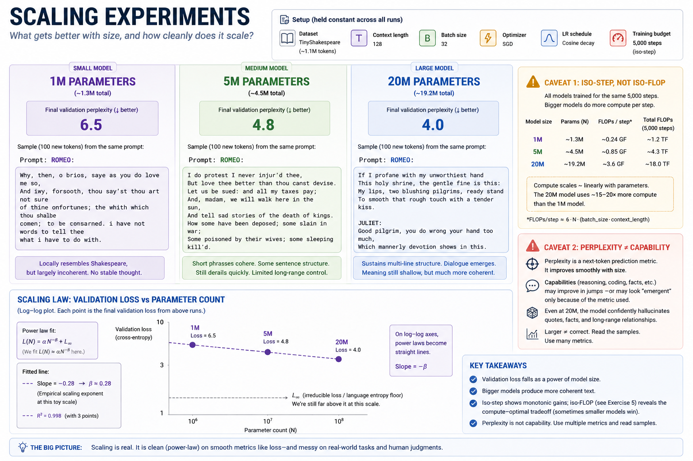
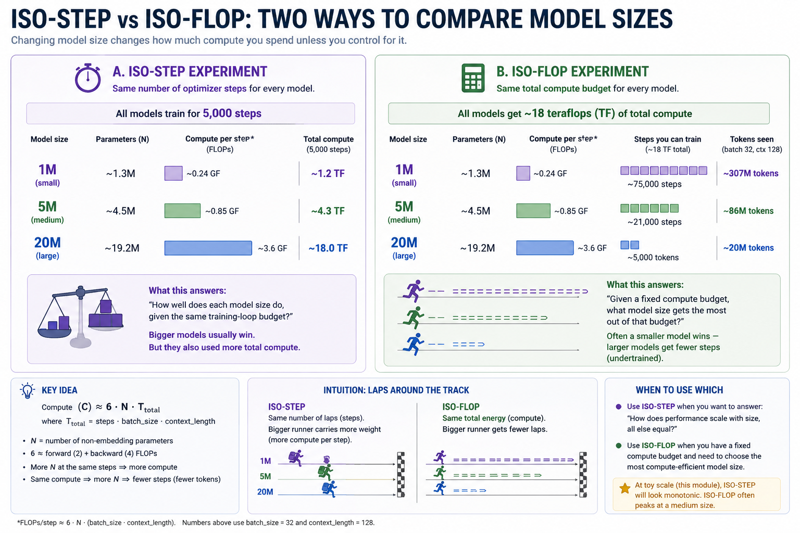
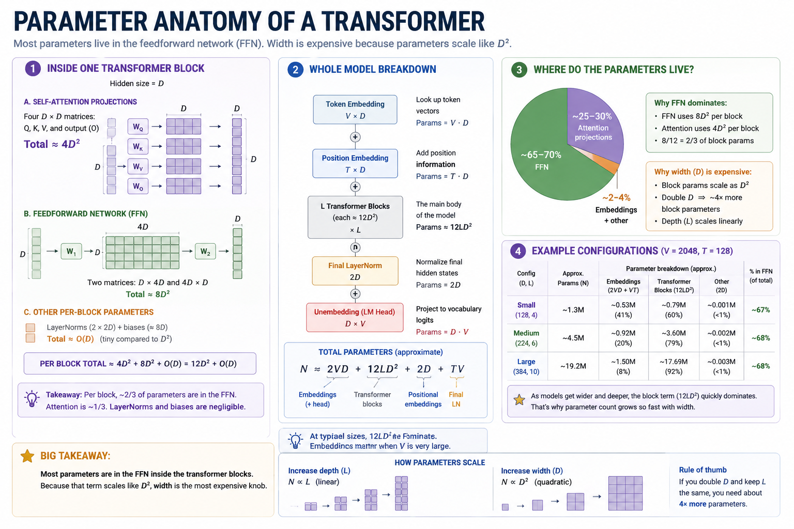
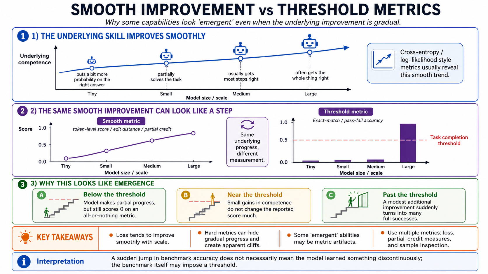

# Module 12 — Scaling experiments

> **Question this module answers:** *What gets better with size, and how cleanly does it scale?*



Scaling laws tell us how model quality varies with model size. We frame scaling and model size through the lens of parameter count, total compute, and training data size. The rest of this lesson explores that relationship quantitatively and behaviorally. This is a lab week: no new package code, just careful comparisons.

---
## Before you start

* *Review* power laws on log-log axes — `y = A · x^α` plots as a straight line with slope `α`
* *Review* FLOPs as a unit of compute — used here to standardize comparisons across model sizes and training runs
* *Finish* Modules 10–11 — especially the `StoryLM-5M-base` and `StoryLM-30M-base` artifacts from the Module 10 notebook
* *Run* `.venv/bin/python scripts/artifact_status.py --module 12` to see which saved model artifacts are available
* *Run* `./datasets.sh --tiny` or `./datasets.sh --small` if the TinyStories corpus or `StoryTokenizer` artifact is missing

---
## Where this fits in

In Module 10 you trained a tiny LLM, and in Module 11 you generated text from it. Both modules let you study one model — but the *interesting* questions about LLMs are inherently comparative. Why is GPT-4 dramatically better than GPT-2? Is it just more parameters? Is it more parameters spent in a particular way? Is there a regime where adding parameters stops helping?

The honest answer to these questions is empirical: people trained models at many sizes, plotted the result, and found a remarkably clean pattern. Loss falls as a power function of parameter count. It also falls as a power function of dataset size. And, surprisingly, it falls as a power function of *compute* (as long as you intelligently trade off model size against dataset size).

```
   Validation loss
        ▲
        │  ●  (StoryLM-1M)
        │
        │      ●  (StoryLM-5M)
        │
        │           ●  (StoryLM-30M)
        │
        │
        │
        └──────────────────────────► params
        (log scale)

   On log-log axes, the three dots ought to fall close to a straight
   line with negative slope. The slope IS the scaling exponent.
```

The Kaplan paper (2020) made this concrete. The Chinchilla paper (2022) corrected an important methodological flaw in Kaplan's setup and produced a now-famous rule of thumb for compute-optimal pretraining: train roughly 20 tokens for every parameter. 

You won't reproduce these exponents at MacBook scale, but you will see *the same shape*. You'll most likely see a slightly different exponent because (a) the optimizer is different, (b) the dataset is tiny, (c) you only have a few points. The lesson isn't "I matched Chinchilla's slope." The lesson is "scaling has a shape, and that shape is not subjective."

The clean experiment in this module stays inside TinyStories: `StoryLM-1M-base`, `StoryLM-5M-base`, and `StoryLM-30M-base`. Same tokenizer, same corpus family, same objective. That restriction matters. `ShakespeareLM`, `StoryLM`, and `TinyLLM` are all useful artifacts, but mixing them in one scaling curve confounds model size with corpus and tokenizer changes.

The other empirical observation is harder to capture in a quantitative law: some capabilities show up *suddenly* with size. The 1M StoryLM is often locally plausible but unstable; the 5M model can form simple story beats; the 30M model is more likely to preserve a situation across several sentences. The qualitative gap between sample texts at different sizes is the headline observation of the module — and the part you have to *read*, not just plot.

## The big idea

Model capabilities follow a power law. Validation loss `L(N)` falls as a power of parameter count `N`, with a non-zero floor:

```
   L(N)  =  α · N^(−β)  +  L∞
```

`α` is a constant, `β` is the scaling exponent, and `L∞` is the irreducible loss (even perfect models can't predict language with 100% accuracy). Kaplan reported `β ≈ 0.076` for transformer LMs. Chinchilla, using a different methodology, argued the exponent depends on whether you're varying `N` at fixed dataset size, fixed compute, or fixed token count.

Three things to internalize about this curve:

```
   loss
    ▲
    │ ●
    │  \
    │   ● ●
    │       \●●
    │           ●●●●● ──── L∞ ── (irreducible loss; language entropy)
    │
    └──────────────────────────────► params (log scale)

      tiny       small      medium      large

   Big jumps early (going 1M → 10M is huge), diminishing returns
   later (going 100B → 1T is barely visible), but the curve has
   no obvious "wall" — adding parameters keeps helping until you
   hit L∞.
```

  * **The shape is universal across architectures.** RNNs, transformers, MoE — they all show power-law loss in `N`, with somewhat different exponents and intercepts. This is not a transformer-specific fact.
  * **Diminishing returns are real, but slow.** Going from 100B to 1T parameters has visibly less effect on benchmark performance than going from 1B to 10B. But "less effect" is not "no effect" — you're still climbing the curve.
  * **The floor `L∞` is set by the data.** Every fixed dataset has an irreducible per-token entropy below which no model — of any size — can go without overfitting. The interesting question for any deployment is "how close to `L∞` are we, and is that close enough?"

### Iso-step versus iso-FLOP

Two ways to compare three models, and they give different answers:

```
                  ┌─────────────────────────────────────┐
                  │  Two equal-effort budgets, two      │
                  │  different stories                  │
                  └─────────────────────────────────────┘

   ISO-STEP                          ISO-FLOP
   (every model trains              (every model trains until
    for 5000 steps)                  it has used 6·N·T_total
                                     ≈ same FLOPs)

      1M:  5000 steps                  1M:  25,000 steps
      5M:  5000 steps                   5M:   5,000 steps
     30M:  5000 steps                  30M:     900 steps

   What you measure:                What you measure:
   "How well does this size         "What size of model gets
    do, given an equal              the most out of this much
    training-loop budget?"          compute?"

   Larger model wins (more          Often a SMALLER model wins
   capacity, same dataset           — Chinchilla's finding —
   passes).                         because larger models with
                                    too few tokens are
                                    under-trained.
```

The two comparisons answer different questions. **Iso-step** answers "more parameters = better, all else equal?" — the answer is yes, monotonically. **Iso-FLOP** answers "if I have a fixed compute budget, what size should I train?" — the answer at large scale is "a smaller model than you'd think, trained for longer."


*Both comparisons appear in this module. Reading the same checkpoints under both lenses is the cleanest way to internalize that "scaling laws" is not one curve — it's at least two, and which one matters depends on whether your real-world constraint is data or compute.*

### Counting parameters and FLOPs

You'll need rough parameter and FLOP counts to plan runs. The exact formulas:

```
  Per transformer block:

      attention projections (Q, K, V, output):  4 · D²
      FFN (D → 4D → D):                         8 · D²
      LayerNorm (×2):                           4 · D    (small)
      ──────────────────────────────────
      block total:                              ≈ 12 · D²


  Whole model:

      token embeddings:        V · D
      positional embeddings:   max_seq_len · D
      L blocks:                L · 12 · D²
      final LayerNorm:         2 · D
      output bias:             V
      ──────────────────────────────────
      total:                   ≈ V · D  +  max_seq_len · D  +  L · 12 · D²


  Reference points (V = 4096, max_seq_len = 256):

      D = 128, L = 4    →   StoryLM-1M   ≈    1.35M
      D = 256, L = 6    →   StoryLM-5M   ≈    5.86M
      D = 512, L = 9    →   StoryLM-30M  ≈   30.60M
```

Our `TransformerLM` uses tied embeddings: the output projection reuses the input token embedding matrix. That saves one full `D · V` table compared with an untied model, so the formula above has `V · D`, not `2 · V · D`.


*The headline takeaway: parameters mostly live in the FFN.*

For FLOPs:

```
  FLOPs per training step ≈ 6 · N · T_step
                              where T_step = batch_size · context_length

  Total FLOPs ≈ 6 · N · steps · batch_size · context_length
```

The factor 6 covers forward (≈ 2·N·T_step matmul flops) plus backward (≈ 4·N·T_step). It's a standard approximation that ignores attention's `T²` term (small at our context lengths) and a few smaller matmuls; expect it to be accurate within ~10–20%.

### Emergent capabilities and the BIG-bench debate

Some capabilities show up *suddenly* as a model scales: at one size the model gets ~0% on a task, then at the next size it gets ~30%. This was the claim of Wei et al. (2022, "Emergent Abilities of Large Language Models"). The list included three-digit arithmetic, multi-step word problems, instruction following.

Schaeffer et al. (2023, "Are Emergent Abilities of Large Language Models a Mirage?") replied that most published "emergence" plots were artifacts of the *metric*, not the model: tasks were scored exact-match (0 or 1) on outputs that the smaller model also gradually learned but never quite finished. Switch the metric to a continuous one (token-level edit distance, partial-credit on multi-step problems) and the curves smooth out into the same power-law shape as loss.

The honest summary as of 2026: both papers are correct about different things. Many "emergent" tasks are smooth under better metrics. But some capabilities, like in-context learning of arbitrary new patterns, really do appear to show genuine threshold behavior with sharp transitions at scale. The community moved on to "what fraction of progress is smooth, and how should we measure each task?"


*The core of the Schaeffer-vs-Wei debate. Both authors are looking at the same underlying training dynamics; the disagreement is at the metric layer, not the model layer.*

### Evaluation matters

The other Schaeffer-style observation, applicable at every scale:

  * **Cross-entropy is *the* smooth metric.** Validation loss falls as a power of `N` because cross-entropy is a soft, log-likelihood-based quantity that improves continuously as the model puts more probability mass on the correct token.
  * **Most downstream metrics are not smooth.** Exact-match accuracy on multiple choice, BLEU on translation, pass-rate on a gated coding task — these have "thresholds" baked in. A model that's 60% sure of the right answer scores zero; the same model that's 51% sure scores zero too.
  * **Sample quality is the most-honest qualitative metric.** Read the output. Decide whether it's better. If the larger model's samples make obvious step-function jumps in coherence (sentence-level → paragraph-level → multi-paragraph), report that — even if your perplexity plot is smooth.

## Concepts to internalize

- **Loss falls as a power of size.** Not exponentially, not linearly — power-law. On log-log axes the curve is roughly straight.
- **There's an irreducible floor.** No matter how big the model, validation loss can't fall below the per-token entropy of the data. (Practically: you'll never reach it at our scale; published models are still many percent above their estimated `L∞`.)
- **Iso-step ≠ iso-FLOP.** Equal step counts give the larger model more total compute. Equal compute gives the smaller model more passes over the data. Both comparisons are valid.
- **Parameters live in the FFN (mostly).** A transformer's FFN is `~⅔` of its parameter count; attention is `~⅓`. Doubling depth grows them linearly, doubling width grows them quadratically.
- **Emergent ≠ magic.** "Capability X appears at size Y" is mostly a metric artifact at small scale. It may or may not be a real threshold at large scale.

### What we don't cover

- **Mixed precision (fp16, bf16) on MPS.** Changes loss curves enough to confuse a scaling experiment. Stay in fp32 for this module. Module 16 revisits precision.
- **Theoretical derivations of the scaling exponents.** The Kaplan paper has them; Hoffmann's Chinchilla paper revisits them with cleaner methodology. They're worth reading, but the exponent itself is not a deep theoretical object — it's an empirical fit.
- **Inverse scaling (`Inverse Scaling Prize`, McKenzie et al.).** A small but real set of tasks where larger models do *worse*. Genuinely interesting, but our smallest model is too small for this to manifest. Skim later if curious.

---
## What you'll build

This module has **no new package code**. The deliverable is a notebook that compares three TinyStories models at different sizes:

- `StoryLM-1M-base`: trained in this notebook if missing
- `StoryLM-5M-base`: saved from Module 10
- `StoryLM-30M-base`: saved from Module 10

The restriction to TinyStories is intentional. It gives you one clean scaling comparison before you start mixing in broader corpora, instruction tuning, and assistant behavior.

### How long these runs take

Rough M-series budget:

```
   ┌────────────┬──────────────────────────────────────────────┐
   │ artifact   │ role in Module 12                            │
   ├────────────┼──────────────────────────────────────────────┤
   │ StoryLM-1M-base │ train here if missing; short local run  │
   │ StoryLM-5M-base │ reuse Module 10 artifact                │
   │ StoryLM-30M-base│ reuse Module 10 artifact                │
   └────────────┴──────────────────────────────────────────────┘
```

The `StoryLM-1M-base` run is deliberately small. On most M-series machines it should be a coffee-break run, not a monster training session. If you do not have the `StoryLM-5M-base` or `StoryLM-30M-base` artifacts yet, go back to Module 10 rather than trying to recreate the whole ladder here.

## Exercises

To launch the exercise notebook run:

```bash
./notebook.sh 12
```

If at any point you want to archive the work in your current notebook and restart fresh:

```bash
./notebook.sh 12 --fresh
```

These are scaling experiments built on the Module 10 training workflow. Keep the notebook/config details close to the run; this page lists the experiment menu.

1. **Train the low-end anchor.** Create `StoryLM-1M` if it is missing.
2. **Load the StoryLM ladder.** Compare `StoryLM-1M`, `StoryLM-5M`, and `StoryLM-30M`.
3. **Plot loss vs size.** Plot validation loss and perplexity against parameter count.
4. **Read the samples.** Compare qualitative improvement across model sizes.
5. **Inspect next-token distributions.** Probe whether larger models put probability mass on more plausible continuations.
6. **Compare iso-step and iso-FLOP.** Use the artifact metadata to estimate how much compute each run consumed.
7. **Optional larger point.** Add another TinyStories model if your machine and time allow.
8. **Optional vocab sweep.** Compare vocab sizes using bits-per-character, not raw perplexity.

## Pitfalls to expect

- **Changing more than one variable.** A clean scaling comparison fixes seed, batch size, context length, tokenizer, data, optimizer, and schedule. Vary one architecture knob at a time.
- **Single-seed conclusions.** Tiny runs have visible variance. If one result contradicts the trend, rerun before treating it as evidence.
- **Learning rate too high for larger models.** Larger models often need a smaller max LR at the same schedule. Spiky loss or worse-than-smaller validation loss is a sign to back off.
- **Context-length mismatch.** `Trainer.context_length` must be `<= model.max_seq_len`; otherwise you are not measuring the architecture you think you are.
- **Cross-vocab perplexity comparisons.** Raw per-token perplexity is not comparable across vocabularies. Use one tokenizer for the main comparison, or switch to bits-per-character.
- **Calling an undertrained run "converged."** A larger model can still be improving at the end of a fixed step budget. Report the budget and the curve shape, not just the final number.

## M-series notes

This is a compute-aware week, but it should not be another monster run if Module 10 artifacts already exist.

- **Plan around artifact reuse.** `StoryLM-5M-base` and `StoryLM-30M-base` come from Module 10. Module 12 should usually train only `StoryLM-1M-base`.

- **MPS vs CPU.** The 1M StoryLM trains comfortably on MPS and can run on CPU if needed. `Trainer(..., device="auto")` is the default path; print `trainer.device` at the start of a run so you know whether you are actually on MPS.

- **Memory headroom.** The 1M run is small — maybe 2GB of memory usage. The notebook may load `StoryLM-5M-base` and `StoryLM-30M-base` for sampling, but that is inference, not backprop. If memory pressure turns yellow or red, restart the kernel and load only the model you are inspecting.

- **Long runs and laptop sleep.** If you choose to add an optional larger TinyStories point, plug in. macOS aggressively sleeps the GPU when the laptop is on battery.

- **Storage.** `StoryLM-1M` adds only a small checkpoint and artifact. The larger storage cost is the TinyStories corpus/tokenized cache already prepared for Module 10.

---
## Reading

Primary:

- **Kaplan, Henighan, Brown et al., "Scaling Laws for Neural Language Models" (2020).** The original empirical scaling-laws paper. §3 has the power-law fits; §6 has the compute-optimal claim that Chinchilla later corrected. Read sections 1–3 carefully; skim the rest.
- **Hoffmann, Borgeaud, Mensch et al., "Training Compute-Optimal Large Language Models" (2022, "Chinchilla").** The follow-up to Kaplan with a different methodology and the "20 tokens per parameter" finding. The plots in §3 are the most-cited part of the paper. Read once start to finish — it's short.
- **Wei, Tay, Bommasani et al., "Emergent Abilities of Large Language Models" (2022).** The emergence paper. The figures showing "near-zero, near-zero, then 30%" curves on multiple tasks are the visual centerpiece of the discussion.
- **Schaeffer, Miranda, Koyejo, "Are Emergent Abilities of Large Language Models a Mirage?" (2023).** The metric-artifact response. §3 reanalyzes the same tasks under continuous scoring rules and shows the curves smooth out.

Secondary:

- **Bahri, Dyer, Kaplan, Lee, Sharma, "Explaining Neural Scaling Laws" (2024).** A theoretical paper on why scaling laws have the form they do. Hard but worth knowing about — it argues power-law decay is structural, not coincidental.
- **Hestness et al., "Deep Learning Scaling is Predictable, Empirically" (2017).** Pre-Kaplan scaling-laws work, mostly from Baidu Research. Same shape; pre-transformer.
- **Henighan et al., "Scaling Laws for Autoregressive Generative Modeling" (2020).** Extends Kaplan to images, video, math. Same shape across modalities.

Optional:

- **The "BIG-bench" paper (Srivastava et al., 2022).** Source dataset for the emergence figures in Wei et al. Mostly useful as a list of tasks where "more parameters" maps to specific capability changes.
- **McKenzie et al., "Inverse Scaling Prize" (2023).** A small set of tasks where larger models do *worse*. Out of scope here, but conceptually important — scaling is not purely monotonic at the level of individual tasks.

## Deliverable checklist

- [ ] Working copy of `12-scaling.ipynb` completed (open it from the clean scaffold with `./notebook.sh 12`).
- [ ] `StoryLM-1M-base`, `StoryLM-5M-base`, and `StoryLM-30M-base` loaded or clearly marked missing.
- [ ] A table showing exact parameter count, vocab size, step count, tokens seen, final validation loss, and perplexity for each available StoryLM artifact.
- [ ] A loss/perplexity-vs-parameter-count plot for the StoryLM ladder.
- [ ] Three sample texts from the same TinyStories prompt, one per available StoryLM size.
- [ ] One-paragraph writeup of a qualitative capability difference between two sizes.
- [ ] You can explain — out loud, without notes — what the difference between iso-step and iso-FLOP is, and why they answer different questions.
- [ ] You can explain — out loud, without notes — why "loss falls as a power of N" is a *different* claim from "capability X emerges at N", and which of the two you can or can't see at MacBook scale.
- [ ] You can explain — out loud, without notes — what the irreducible loss `L∞` is and why no model — of any size — can fall below it.
