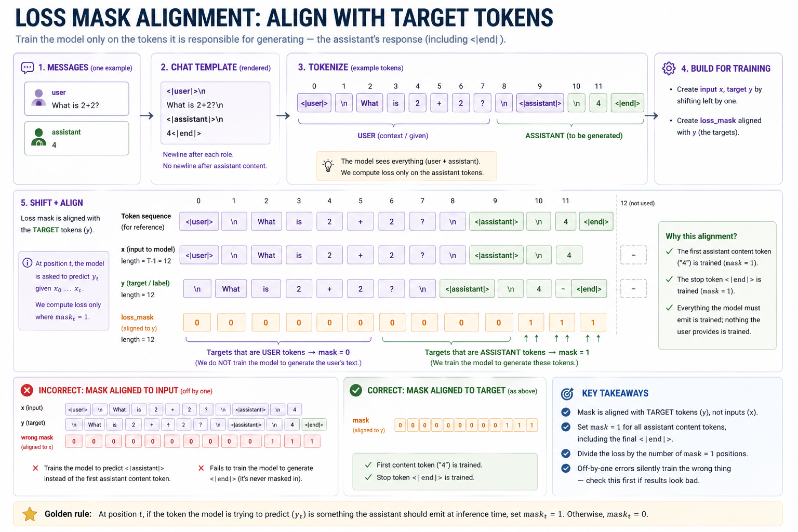

# Module 13 — Instruction tuning (SFT)

> **Question this module answers:** *How do we make the model follow requests?*

![Module 13 on one page: the TinyShakespeare-pretrained TransformerLM from Modules 10/12 confronted with an instruction-style prompt before and after SFT. Top half: the BASE model's continuation of "What is the capital of France?" — it ignores the question entirely and produces "What is the capital of France? And the noble Duke of Norfolk hath sworn..." (the question is just text to continue). Bottom half: the SFT'd version of the same model on the same prompt, formatted with the chat template "<|user|>\\nWhat is the capital of France?\\n<|assistant|>\\n" — it now produces "Paris.<|end|>" and stops. A central panel shows the SFT data flow: 50 hand-authored (instruction, response) pairs → render through chat template → tokenize + build label mask (only assistant tokens get loss=1; user tokens get loss=0) → fine-tune the base model for ~500 steps at 10× lower LR → SFT'd checkpoint. A right-edge panel highlights the three behavioral shifts: (1) the model now respects turn boundaries, (2) the assistant turn is short and stops on <|end|>, (3) the model still hallucinates confidently — alignment teaches FORMAT, not TRUTH (the truth/calibration question waits for Modules 14–15). A bottom strip captions the headline: "SFT changes behavior, not knowledge — the base model already had to know what 'capital of France' means; SFT just taught it to answer rather than to continue."](13-sft/Module13-Hero.png)

This week is about how to shape model **behavior**. The mechanics are minimal but the qualitative effect is the largest single change in this course. The model goes from "autocompletes prose" to "answers questions like an assistant." The entire data set is 50 directed examples. Everything else is plumbing.

---
## Before you start

* *Review*
	* [[10-tinyllm]] for the training-loop contract 
	* [[PyTorch Primer]] if any PyTorch code is unfamiliar or confusing
* *Finish*
	* `g2c/nn` from [[03-nn]]
	* `g2c/training` from [[03b-training]]
	* `g2c/tokenizer` from [[04-tokenizer]]
	* At least one trained model from [[10-tinyllm]] notebook (`ShakespeareLM`, `StoryLM`, or `TinyLLM`)
	* Trained tokenizer from [[04-tokenizer]] (alternatively run `./datasets.sh --tiny` or `./datasets.sh --small` to preload tokenizer artifacts)
* *Run* `.venv/bin/python scripts/artifact_status.py --module 13` to see whether you should use a self-trained model or the BaseLM path.

---
## Where this fits in

After Module 10 you should have at least one model that's completed pretraining. This is a **base model** — its training objective was "predict the next token in corpus-style prose." If you give it the prompt:

```
What is the capital of France?
```

…the 5M StoryLM model produces something like:

```
What is the capital of France? 
Once upon a time there was a girl nemed Lily who loved to pick flowers...
```

It doesn't matter how big you make it — at any size, a base model trained on prose continues prose. This is *correct behavior under the training objective*. The model isn't broken. It's just not an assistant.

The journey from prose autocomplete to helpful assistant can be broken down into two components: one is *style* and the other is *capabilities*. The techniques covered this week will focus on the former — tuning the model to generate assistant like responses (that are still frequently confidently wrong). The latter will be addressed in later modules. 

## The big idea

Going from "continues text" to "answers questions in a turn-shaped format" can be achieved with supervised fine-tuning (SFT) does.  The recipe:

1. Collect or hand-author a few hundred (instruction, response) pairs.
2. Wrap each pair in a *chat template* — a literal-text format with role markers.
3. Tokenize, with a label mask that says "compute loss on the assistant tokens, not the user tokens."
4. Fine-tune the base model on these examples for a small number of steps at a small learning rate.

That's the whole pipeline. There is no new architecture, no new optimizer, no new loss class — just the same `TransformerLM` and the same `Trainer` you've already built, with a different data source and a masked variant of cross-entropy. The interesting content is in (a) what the chat template looks like; (b) what the mask looks like; and (c) what kinds of behavior change you expect.

A SFT'd model stops continuing the user's text and starts producing an assistant turn. Often short, often plausible-sounding, often wrong on facts (that's a Module 15 problem). The model has not learned new facts. It has learned a new *format*.

![SFT changes behavior, not knowledge: a one-page summary of the module. The base model produced by Module 12 trains on next-token prediction over TinyShakespeare prose and continues a question prompt as if it were more prose. After SFT on 50 hand-authored (instruction, response) pairs — rendered through a chat template, tokenized with a loss mask that zeroes out user tokens, fine-tuned for ~500 steps at 10× lower LR — the same model recognizes the assistant turn marker, produces a single short response, and stops on `<|end|>`. A "what improves, what doesn't" panel pins the central distinction: format compliance, turn boundaries, and concision are taught; factual knowledge is unchanged from the base model. A "key insight" callout closes with: pretraining gives the model a world model; SFT gives it a job description.](13-sft/Module13-Behavior.png)
*SFT is about shaping assistant shaped text. Not teaching new abilities*

The "knowledge stays the same" claim is empirically robust: SFT'd models, probed for factual recall, score within a few percent of their base versions on factual benchmarks. What changes dramatically is *response style* — short vs long, format-compliant vs free-form, refusal-aware vs refusal-naive. 

### Chat templates as a learned format

A chat template is a deterministic encoder from a list of role-tagged messages to a single string. The string contains *role markers* — short fixed sequences that delimit turns — and the model learns to recognize and emit them.

Among the many different conventions used in production:

  * **ChatML** (OpenAI). Markers `<|im_start|>role` / `<|im_end|>`. Each marker is a single reserved token in the tokenizer.
  * **Llama 3 chat**. Markers `<|start_header_id|>role<|end_header_id|>` plus `<|eot_id|>` — Reserved tokens, like ChatML.
  * **Alpaca** (Stanford). `### Instruction:` / `### Response:` markers. Pure ASCII, no special tokens; a good fallback when the tokenizer has no reserved chat tokens.

We'll use a **ChatML-lite** template — the spirit of ChatML, but with the course-native special tokens reserved.

```
<|user|>
{user_content}
<|assistant|>
{assistant_content}<|end|>
```

Unlike a plain BPE string, each marker here is **atomic**: `<|user|>`, `<|assistant|>`, and `<|end|>` each encode to one reserved token ID. That only works because the tokenizer used for the reusable model artifacts reserved those course special tokens before pretraining.

Every downstream system must use the same chat template: same role tokens, same `<|end|>` convention, and same newline layout. If inference uses even slightly different markers, the model sees an unfamiliar prompt shape and regresses.

```
   ┌────────────────────────────────────────────────────────────────┐
   │   ChatML-lite template, special-token aware                    │
   ├────────────────────────────────────────────────────────────────┤
   │                                                                │
   │   <|user|>\n                                                   │
   │   {content}\n                                                  │
   │   <|assistant|>\n                                              │
   │   {content}<|end|>                                             │
   │                                                                │
   │   - Newline after the role marker.                             │
   │   - Newline AFTER user content (separator to next role).        │
   │   - NO newline after assistant content — <|end|> is glued.     │
   │   - <|end|> ONLY closes the assistant turn.                    │
   │     User turns end at the trailing \n.                         │
   │                                                                │
   └────────────────────────────────────────────────────────────────┘
```

The termination asymmetry — newline-terminated user turns vs `<|end|>`-terminated assistant turns — is intentional. At inference time the model emits assistant text, and we want a single distinctive stop token. The user's turn text always comes from outside the model. So it doesn't need a special end marker;.

Why does the model learn this? Because every SFT example trains it to associate the prefix `<|assistant|>\n` with "now produce concise content followed by `<|end|>`." The marker tokens are arbitrary. What matters is that they appear consistently in the same positions across every training example. After ~100 examples the model will essentially memorize this format.

### Data quality versus data quantity

The headline empirical finding from the LIMA paper: *Less Is More for Alignment*. They showed that **1000 carefully-curated SFT examples** produce a chat model nearly indistinguishable from one trained on tens of thousands of crowd-sourced examples. The active ingredient is *consistency*: every example follows the same format, every assistant response is well-structured, and the dataset lacks the noise floor that comes from heterogeneous crowd labelers.

At toy scale this is even more pronounced. With 50 hand-authored examples:

  * If 48 are clean and 2 are off-pattern (e.g. assistant says "Sure, let me…" while the rest are direct), the model occasionally apes the off-pattern phrasing.
  * If 30 are factual Q&A and 20 are creative writing, the model behaves bimodally — switching styles based on subtle cues — and is worse at both than a model trained on either alone.
  * If every example ends with exactly one sentence, the model learns *exactly one sentence* as the assistant turn, regardless of what was asked.

At small scale, the model overfits to your dataset's surface regularities. This is both a feature (50 examples are enough) and a bug (you have to be very consistent). The exercises ask you to author the dataset yourself because the experience of writing 50 consistent examples is the fastest way to internalize what "consistency" means.

## SFT Training

SFT is the same basic gradient descent loop as pretraining. The difference is the data. Instead of training on raw text, we train on curated examples of desired behavior.

SFT usually requires orders of magnitude less training than pretraining because we are not trying to teach the model language from scratch. We are mostly teaching it how to respond: the assistant format, the tone, the structure of answers, and the behavior we want after a user instruction.

The below hyperparameters are not universal rules. They are a practical starting points for small models. As always, try sweeping at different settings and compare results.

- **50–500 examples.** Quality matters much more than quantity. Counterintuitively larger models need *less* examples (but higher quality) since they tend to have more abilities.
- **100–1,000 optimizer steps.** The main danger is overfitting or making the model memorize a tiny dataset. Watch samples and validation loss closely for early stopping
- **Learning rate 5–20% of pretraining.** Larger models more sensitive to regression from aggressive SFT, and should start lower.

```
   ┌────────────────────────────────────────────────────────────────────┐
   │                                                                     │
   │    BASE model  (Module 10 checkpoint)                            │
   │       trained on:  next-token prediction over prose                 │
   │       behavior:    continues any text in the style of training data │
   │       knowledge:   whatever the corpus contained                    │
   │                                                                     │
   │       ┌──────────────────┐                                          │
   │       │    SFT            │   ── 50–500 (instruction, response)     │
   │       │  fine-tuning      │      pairs                              │
   │       └────────┬─────────┘      ── 100–1000 fine-tuning steps       │
   │                │                ── lr ≈ 0.1 × pretraining lr        │
   │                ▼                                                     │
   │                                                                     │
   │    INSTRUCTION model                                                 │
   │       trained on:  pretraining objective + SFT pairs                │
   │       behavior:    answers in turn-shaped format on prompt          │
   │       knowledge:   ALMOST IDENTICAL to base — SFT moves behavior,    │
   │                    not facts                                        │
   │                                                                     │
   └────────────────────────────────────────────────────────────────────┘
```

### Loss masking

In pretraining, every token in the window is a training target. The model learns to predict tokens uniformly across the corpus. In SFT, the model should *not* learn to predict user tokens. Those tokens come from the user at inference time, and training to predict them actively damages behavior.

The fix is the **loss mask**: a `(T-1,)` boolean tensor that's `1` at positions where loss should be applied and `0` elsewhere.


*The shift-by-one between `mask` and `y` is the bug-prone seam — get it right once and the rest of the SFT pipeline follows.*

The response is every token the assistant is responsbile for emitting, *including* the closing `<|end|>`. The loss mask is `1` exactly on those positions. The masked-loss formula is:

```
   per_pos_loss   = CE(logits, y, reduction='none')   # (B, T-1)
   masked_total   = (per_pos_loss * loss_mask).sum()  # scalar
   masked_count   = loss_mask.sum()                   # scalar
   loss           = masked_total / masked_count       # scalar
```

### Format collapse and other failure modes

The visible failure modes of toy-scale SFT, in roughly the order you'll encounter them:

```
   ┌───────────────────────────────────────────────────────────────┐
   │   FORMAT COLLAPSE                                              │
   │   The model produces the right format on every prompt — even   │
   │   prompts where the format is wrong. Asked to continue a       │
   │   poem, it answers in a single sentence. Symptom: model is     │
   │   always assistant-shaped.                                     │
   │   Fix: usually nothing — at this scale, format collapse is    │
   │   inherent. At larger scale, mix in pretraining data.          │
   └───────────────────────────────────────────────────────────────┘

   ┌───────────────────────────────────────────────────────────────┐
   │   ROLE LEAKAGE                                                 │
   │   The model emits "<|user|>" mid-response and pretends to be  │
   │   the user. Symptom: a third turn appears unprompted.          │
   │   Fix: ensure every training example ends cleanly with         │
   │   <|end|>; check the loss mask actually covers <|end|>.        │
   └───────────────────────────────────────────────────────────────┘

   ┌───────────────────────────────────────────────────────────────┐
   │   FORMAT FORGETTING                                            │
   │   After SFT, the model cannot complete a prose passage.        │
   │   "To be, or not to be, ..." gets answered with a definition   │
   │   instead of continued. Symptom: the base behavior is gone.    │
   │   Fix: reduce SFT step count, lower lr, mix in pretraining.    │
   │   At our scale, accept some forgetting.                        │
   └───────────────────────────────────────────────────────────────┘

   ┌───────────────────────────────────────────────────────────────┐
   │   CATASTROPHIC FORGETTING                                      │
   │   Model degrades at SFT objective AND base objective. Loss     │
   │   curve looks fine; outputs are gibberish. Symptom: too many   │
   │   SFT steps at too high lr. Fix: lower both; we recommend      │
   │   500–1000 steps at 3e-4.                                       │
   └───────────────────────────────────────────────────────────────┘

   ┌───────────────────────────────────────────────────────────────┐
   │   REPETITION / LOOPING                                         │
   │   The assistant never emits <|end|> and keeps going.           │
   │   Symptom: response runs to max_new_tokens. Fix: re-check      │
   │   the loss mask covers <|end|>; add a few examples with        │
   │   short responses to teach early stopping; sample with a       │
   │   small repetition_penalty (Module 11).                         │
   └───────────────────────────────────────────────────────────────┘

   ┌───────────────────────────────────────────────────────────────┐
   │   CONFIDENT HALLUCINATION                                      │
   │   The format is perfect; the content is invented. The 20M      │
   │   model "knows" the capital of France is "Lyon." Symptom:      │
   │   fluent-sounding wrong answers. Fix: cannot — this is a       │
   │   capability problem, not a format problem. Module 15 returns  │
   │   to it as the headline failure mode of toy-scale models.      │
   └───────────────────────────────────────────────────────────────┘
```

The top three are *training* problems — fixable by adjusting data or hyperparameters. The bottom three are deeper. Catastrophic forgetting is fixable by stopping earlier. Repetition is fixable by checking your loss mask. Confident hallucination is *not fixable by SFT*. 

## Concepts to internalize

- **SFT changes behavior, not knowledge.** A 20M model that didn't know X before SFT doesn't know X after SFT either. What changed is *response style*.
- **The chat template is part of the model.** Every system that calls the SFT'd model must use the same role/end tokens and newline layout the model was trained on. A typo in `<|user|>` no longer hits the reserved token ID, so it is enough to revert behavior toward base-model output.
- **Loss masking is the critical implementation trick.** Without it, the model also learns to predict user text, which is wrong. With it, the model only learns to generate assistant text, which is right. 
- **50–500 examples.** Not 5; not 5000. The dataset is small enough to read end-to-end and audit; large enough to teach a stable convention.
- **Data quality dominates data quantity.** Inconsistent examples teach inconsistent format. Spend the curation effort.
- **The model may answer perfectly and still be wrong.** Format compliance is not truth. A SFT'd toy model is the best demonstration of this distinction in the course — it answers questions confidently in well-formatted prose, and almost everything it says is invented.

### What we don't cover

- **System prompts.** A leading `<|system|>You are a helpful assistant.<|end|>` turn is the third role real systems support. We omit it: at toy scale.
- **PEFT prompt tuning, prefix tuning, P-tuning.** Pre-LoRA parameter-efficient methods that train a small set of "soft prompt" tokens. Largely superseded by LoRA. Skim once; don't implement.
- **Continual / online SFT.** Updating the model as new examples arrive. Production concern with its own catastrophic-forgetting issues; out of scope.

---
## What you'll build

Package: `g2c/sft/`

```python
class ChatTemplate:
    USER:      str = "<|user|>"
    ASSISTANT: str = "<|assistant|>"
    END:       str = "<|end|>"

    def render(self, messages: list[dict]) -> str:           # SCAFFOLDED

    def render_with_mask(
        self,
        messages: list[dict],
        tokenizer,
    ) -> SFTExample:                                          # SCAFFOLDED


class SFTExample(NamedTuple):
    ids:  list[int]                                           # implemented
    mask: list[int]                                           # implemented


def pad_and_collate(
    examples: list[SFTExample],
    *,
    max_seq_len: int,
    pad_id: int,
) -> tuple[Tensor, Tensor, Tensor]:                           # SCAFFOLDED


def masked_cross_entropy(
    logits: Tensor,           # (B, T, V)
    targets: Tensor,          # (B, T)
    mask: Tensor,             # (B, T) — 1 where loss applies, 0 elsewhere
) -> Tensor:                                                  # SCAFFOLDED


class SFTTrainer:
    def lr(self, step: int | None = None) -> float:          # implemented

    def train_step(self) -> dict[str, float]:                 # SCAFFOLDED

    def evaluate(self, eval_examples) -> float:               # implemented

    def train(self, eval_examples=None) -> dict[str, list]:   # implemented
```

Total scaffolded code: roughly 50 lines across five locations.

## How to run the tests

Tests live in `tests/test_sft.py`. 

```bash
pytest tests/test_sft.py                       # all module-13 tests
pytest tests/test_sft.py -x                    # stop at first failure
pytest tests/test_sft.py -k chat_template      # template tests only
pytest tests/test_sft.py -k pad_and_collate    # collator tests only
pytest tests/test_sft.py -k masked_cross       # loss tests only
pytest tests/test_sft.py -k trainer            # trainer tests only
pytest tests/test_sft.py -v                    # verbose
```

## Exercises

1. **Hand-author a tiny instruction dataset.** Write 50 single-turn `(user, assistant)` pairs by hand. Suggested mix:

     - 25 short factual Q&A (`"What is the capital of France?"` → `"Paris."`)
     - 15 short instructions (`"Translate 'hello' to French."` → `"bonjour"`)
     - 10 short creative tasks (`"Write a one-line haiku about a cat."` → some appropriate one-liner)

   Save them as JSON. Constraints:

     - Every assistant response is **one sentence**, ten words or fewer.
     - Every prompt is **one sentence**, twenty words or fewer.
     - Use the **same style** in every assistant response — no "Sure!", no "Of course,", no preamble. The first word of the response is content.

   The consistency rules are doing real work: they bias the SFT signal toward a clean format. The exercises later test what happens when you violate them.

2. **Run SFT and compare base vs SFT outputs.** Load your Module 10 checkpoint. Wrap your 50 examples in `SFTTrainer` and train for **500 steps** at `max_lr=3e-4`, `batch_size=4`, `warmup_steps=20`, `grad_clip=1.0`, `max_seq_len=128`. Save the SFT'd checkpoint.

   Now generate from both — same prompt, same seed, same sampling settings (`temperature=0.7, top_p=0.9`). Print all comparisons side by side. Test at least prompts 5 in-distribution, and 5 out-of-distribution. Report:
   
     - For the in-distribution prompts: does the SFT model produce the right format (assistant turn, single sentence, ends with `<|end|>` or stops early)? How often does the SFT model emit a valid (perhaps wrong) answer? How often is it actually right?
     - For the OOD prompts: how does the SFT model behave? Does it still answer with a single sentence? Has it forgotten how to continue prose?
     - One paragraph: what was the most surprising sample, and why?

3. **Loss-masking ablation.** Replicate exercise 2 with a modified `masked_cross_entropy` that **doesn't mask** (i.e. uses the full sequence as targets, like pretraining). Observe:

     - Does the model still learn to answer questions?
     - Does it learn faster or slower?
     - Most importantly: at inference time, given the prompt `<|user|>\nWhat is 2+2?\n<|assistant|>\n`, does the model continue with the assistant's response, or does it sometimes "complete" the user's text first (i.e. emit more user-style tokens before an `<|assistant|>` marker)?


4. **Format-collapse exploration.** Use exercise 2's SFT'd model and feed it the prompt:

   ```
   <|user|>
   Continue this poem:
   <|assistant|>
   The stars above shine bright at night,
   ```

   I.e., prefill the assistant's turn with a partial response and let the model continue. Observe what the model does at the end of the line. Two failure modes you should look for:

     - **It emits `<|end|>` immediately** because every training example was one sentence — the model has learned "after one sentence, stop." This is **format collapse**. Document the output.
     - **It emits something completely off-topic** — perhaps a factual answer, perhaps a translation. The training distribution had no examples of multi-sentence creative writing. Document one example.

   Now retrain with **5 multi-sentence creative examples added** to the dataset (the rest unchanged). Repeat the same prompt. Does the model now extend the response into a second line? At toy scale you may see partial improvement; document what changed. The point is: *the SFT distribution is the ceiling.* The model can't be coaxed into behavior the dataset doesn't represent.

5. **Data-size sweep.** Train three SFT models from the same Module 12 checkpoint with **10 / 50 / 200 examples** (subsample your dataset for the smaller two, or hand-author more for 200). Same hyperparameters everywhere. Compare on the same five in-distribution prompts. Report:

     - Format-compliance rate on the 5 prompts (0–5 valid responses per model).
     - One sample per model where the difference is visible.
     - One sentence on whether the data-quality intuition transfers — do you think 200 messy examples would be worse than 50 clean ones?

6. **Pretraining-style perplexity loss after SFT.** Take a held-out passage of TinyShakespeare (the same eval split you used in Module 10/12). Compute the *base* model's per-token cross-entropy on that passage. Then compute the *SFT'd* model's per-token cross-entropy on the same passage.

7. **Optional: LR sweep.** Train at `max_lr ∈ {1e-4, 3e-4, 1e-3, 3e-3}` (i.e. four runs). Plot final SFT loss and one sample per run. The expected pattern:

     - `1e-4`: under-trained. Model is still mostly base-shaped after 500 steps.
     - `3e-4`: the sweet spot. Format learned cleanly.
     - `1e-3`: overshoots. Format learned but base capacity damaged.
     - `3e-3`: catastrophic. Loss curve looks fine; outputs are gibberish.

   The headline observation: SFT lr is ~10× lower than pretraining lr, and the *qualitative gap* between `3e-4` and `3e-3` is much wider than the loss-curve gap. Quantitative metrics under-state how much forgetting `3e-3` is doing.

8. **Optional: inject a deliberate inconsistency.** Take your 50 examples and add 5 examples where the assistant uses a markedly different style (e.g. starts every response with "Indeed,"). Retrain. Test on prompts not in the inconsistent set. Does the "Indeed," style appear? At what rate? This is a tiny experiment in *style contamination*: at small scale, even 10% inconsistency in the training set is visible in the output distribution. The rate at which it appears is a measure of how unreliable SFT-on-noisy-data is.

## Pitfalls to expect

- **Loss mask off-by-one.** The most common bug. The mask is aligned with `y = ids[1:]`, not with `ids` directly. A mask aligned with `ids` (forgot to shift) trains the model to predict each *prompt* token from its prefix.

- **Marker drift between training and inference.** SFT trains the model on `<|user|>\nFoo\n<|assistant|>\nBar<|end|>`, where each marker is an atomic reserved token. If your inference-time prompt assembly uses `<|USER|>`, omits `<|end|>`, or skips a newline, the model sees an unfamiliar prefix and reverts toward base behavior.
  
- **Dividing loss by full token acount** The denominator is the count of masked tokens only. If you accidentally divide by `B·(T-1)` (the full batch shape), the gradient magnitude will be mismatched.

- **Forgetting `<|end|>` in the loss mask.** If `<|end|>` is in the assistant content but the mask is `0` at its position, the model never learns to emit `<|end|>`.

- **Pad tokens included in the loss.** When you pad short examples to a common length, the padded positions must be masked OUT of the loss. 

- **LR too high.** `max_lr=3e-3` (the pretraining default) at SFT step counts of 500–1000 produces visibly damaged models — the loss curve looks fine but generation is gibberish. 

- **Step count too high.** Even at correct lr, training too long memorizes individual examples 500–1000 steps over 50–500 examples is the right scale.

- **Examples too long.** A single SFT example whose user turn is 2000 characters consumes most of one batch's compute on prompt tokens that contribute zero gradient (mask is `0`). Long prompts are wasteful. Cap your examples at `max_seq_len=128` of total tokens; trim or split anything longer.

- **Inconsistent style.** Inconsistency in the assistant's response style (sometimes terse, sometimes preamble; sometimes JSON, sometimes prose) propagates directly to the model's output distribution. 

- **Catastrophic forgetting.** With high lr, long training, or both, the SFT'd model can lose all its base capacity — coherent prose generation, tokenization-level patterns, even basic English. The loss curve does NOT show this clearly; it's a behavioral failure visible only on out-of-distribution prompts. 

- **Format collapse.** The model produces the assistant format on every prompt, including ones where the format is wrong. There is no clean fix at toy scale — at production scale, you'd mix pretraining batches into the SFT corpus to prevent it. Accept it as a property of toy SFT and include OOD prompts in your eval to characterize how bad it is.

## M-series notes

SFT is much less compute-hungry than pretraining — typically minutes, not hours. If you can train the model from scratch, you can SFT it.

- **Total wall-clock estimates** at `max_steps=500`, on a Module-10-pretrained checkpoint:

  ```
     ┌────────┬────────────┬────────────┬────────────┐
     │ size   │ M1/M2 8GB  │ M2 Pro 32GB│ M3 Max 64GB│
     ├────────┼────────────┼────────────┼────────────┤
     │  1M    │   ~2 min   │   ~1 min   │   <1 min   │
     │  5M    │   ~5 min   │   ~3 min   │   ~2 min   │
     │  20M   │  ~15 min   │   ~7 min   │   ~5 min   │
     └────────┴────────────┴────────────┴────────────┘
  ```

  The 20M model's SFT comfortably fits in a coffee-break window. Run it on the largest checkpoint you have — quality scales with base-model size, and SFT is cheap enough that there's no reason to start small.

- **Memory.** SFT memory cost is the same as pretraining training at the same `(B, T)`. No new tensors of meaningful size.

---
## Reading

Primary:

- **Ouyang, Wu, Jiang et al., "Training language models to follow instructions with human feedback" (InstructGPT, 2022).** The paper that put SFT on the map. §3.4 has the SFT step. The paper bundles SFT with reward modeling and RLHF, but the SFT step alone produces 80% of the qualitative behavior change — a fact that the Alpaca paper made everyone realize.
- **Stanford Alpaca blog post / repo (2023).** The first popular small-scale SFT recipe — 52K self-instruct examples on Llama 7B, trained in three hours. The critical insight: SFT works at small scale and small budget. Read the blog; skim the repo.
- **Zhou, Liu, Xu et al., "LIMA: Less Is More for Alignment" (2023).** The data-quality paper. 1000 carefully-curated examples beat 52K crowd-sourced ones. The implication: SFT is teaching format, not facts; format can be taught from very few examples *if those examples are consistent*.

Secondary:

- **Wang, Kordi, Mishra et al., "Self-Instruct" (2022).** The synthetic-data pipeline that produced Alpaca's 52K examples — generate instructions and responses with a stronger model, filter for quality, train on the result. Mostly relevant when you want to scale SFT data without hand-authoring.
- **Taori, Gulrajani, Zhang et al., "Stanford Alpaca: An Instruction-following LLaMA Model" (2023).** The Alpaca paper's longer technical writeup, with the prompt template, training hyperparameters, and an ablation on dataset size.
- **Chung, Hou, Longpre et al., "Scaling Instruction-Finetuned Language Models" (Flan-T5, 2022).** The instruction-tuning scaling-laws paper. Relevant for "what happens at much larger scale than ours."
- **OpenChat, Vicuna, WizardLM** technical reports. Each presents a slightly different take on the SFT recipe; the diversity of approaches at the 7B-class scale is itself instructive.

Optional:

- **Hu, Shen, Wallis et al., "LoRA: Low-Rank Adaptation of Large Language Models" (2021).** The most-used parameter-efficient alternative to full SFT. Out of scope for this module; relevant whenever full fine-tuning isn't feasible.
- **Dettmers, Pagnoni, Holtzman, Zettlemoyer, "QLoRA" (2023).** LoRA on a 4-bit quantized base model — the recipe everyone uses for hobbyist-scale fine-tuning of 7B+ models in 2024–2025.
- **The original ChatML spec** (OpenAI's tokenizer documentation). The exact byte sequences for `<|im_start|>`, `<|im_end|>`, etc., and the rationale for vocab-extension over text markers.

## Deliverable checklist

- [ ] All tests in `tests/test_sft.py` pass.
- [ ] Hand-authored dataset of 50+ instruction-response pairs in `data/sft/instructions.json` (or similar).
- [ ] SFT'd checkpoint saved to disk, separate from the base checkpoint. The base checkpoint is preserved for re-runs and ablations.
- [ ] One paragraph on what the SFT'd model *can* do and what it *can't*.
- [ ] You can explain — out loud, without notes — what the chat template's role markers are, and what the asymmetry between user-turn-ends and assistant-turn-ends is.
- [ ] You can explain — out loud, without notes — why "data quality dominates data quantity" applies more strongly at toy scale than at production scale.
- [ ] You can explain — out loud, without notes — why an SFT'd model that confidently invents factual answers is not a *training* failure — it's a *capability* limit, and SFT alone can't fix it.
