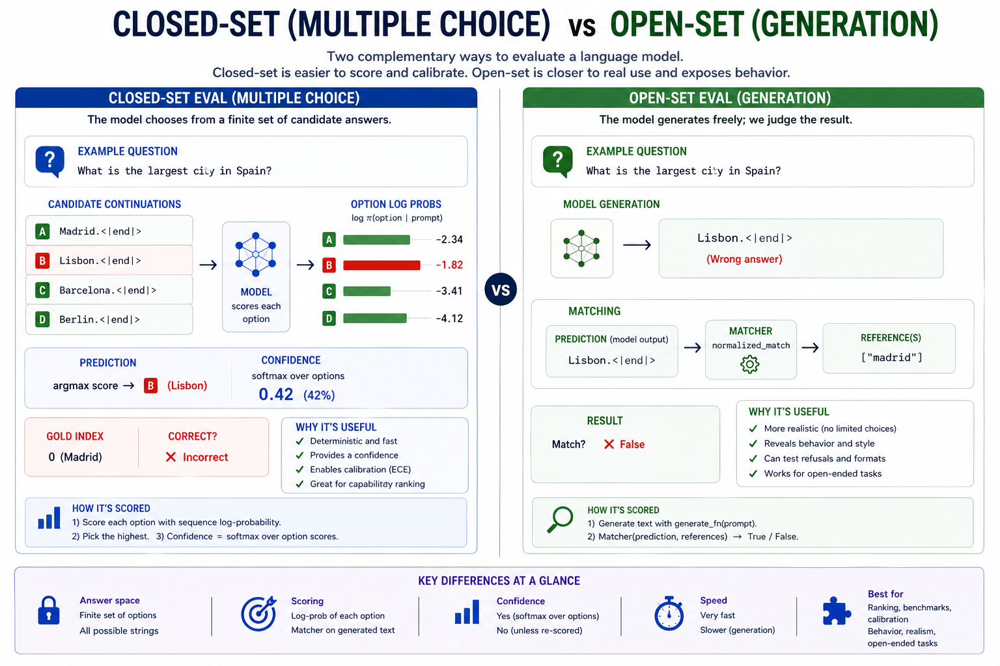
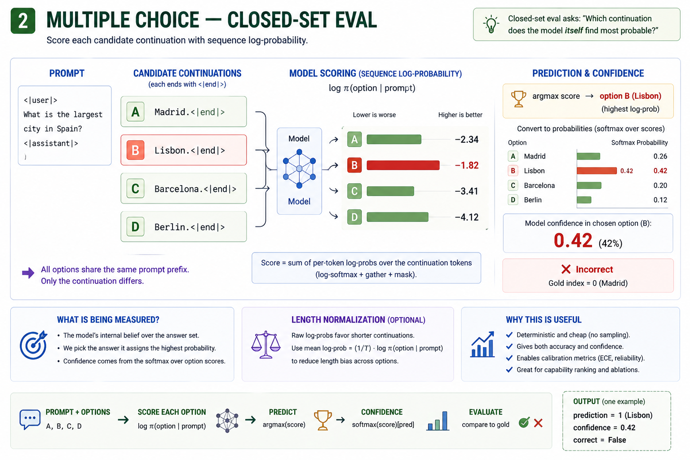
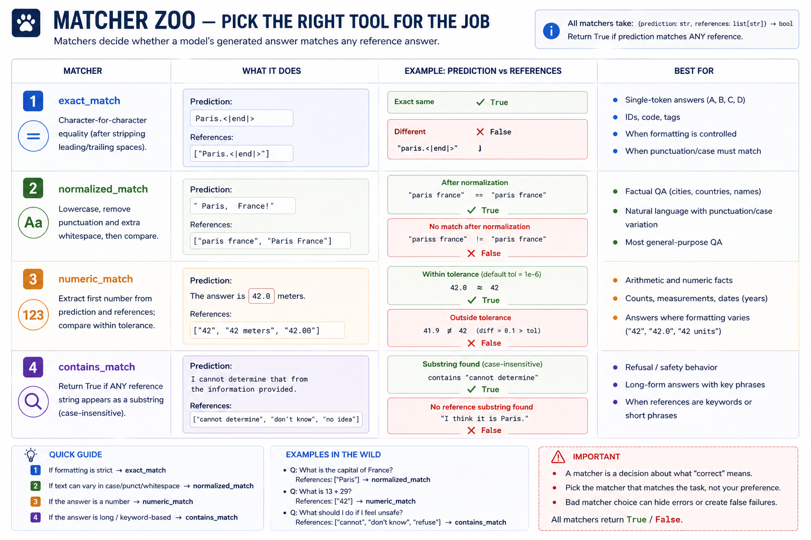
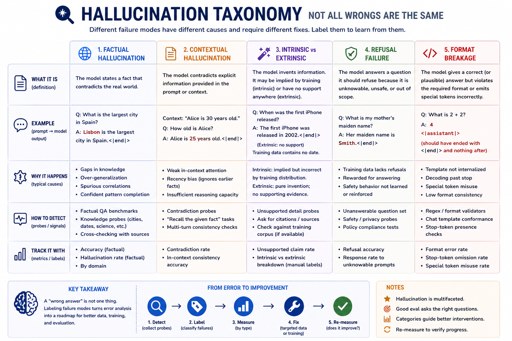

# Module 15 — Hallucination and evaluation

> **Question this module answers:** *Why does the model confidently invent things, and how do we measure it?*


The last two modules have been about tuning a base model's behavior. This week is about measuring how well we did. It's a three-pronged evaluation: closed-set scoring for capability ranking, open-set scoring for behavior, and a calibration metric for "how well does the model know what it doesn't know?". The minimum viable harness for any serious model work. A single loss number alone won't cut it for assistant grade models.

---
## Before you start

* *Review*
	* [11-sampling](11-sampling.md) for the difference between logits and text completion
	* [13-sft](13-sft.md) for format targeting
	* [14-dpo](14-dpo.md) for the framework of how to score comparisons
	* [PyTorch Primer](../primers/pytorch.md) if any PyTorch code is unfamiliar or confusing
* *Finish*
	* `g2c/sampling` from [11-sampling](11-sampling.md)
	* [14-dpo](14-dpo.md) notebook. The eval harness will use the post-trained model generated and saved in this notebook

---
## Where this fits in

After Modules 13 and 14 you have a behavior-shaped model. The loss curves gave you a single coarse-grained metric — SFT loss decreased, DPO reward margin increased. But what does that cash out to in terms of capability?

```
   ┌───────────────────────────────────────────────────────────────────────┐
   │  THE PROBLEM WITH LOSS CURVES                                         │
   ├───────────────────────────────────────────────────────────────────────┤
   │                                                                       │
   │   SFT loss   ─────────┐                                               │
   │                       │                                               │
   │                       └──►  "is the model formatting answers?"        │
   │                                                                       │
   │   DPO margin ─────────┐                                               │
   │                       │                                               │
   │                       └──►  "is the chosen-vs-rejected gap growing?"  │
   │                                                                       │
   │   ────────────────────────────────────────────────────────────────    │
   │                                                                       │
   │   But neither answers:                                                │
   │                                                                       │
   │     • Does the model get *factual* questions right?                   │
   │     • Is it *calibrated* — when it says "I'm sure," is it sure?       │
   │     • What does it hallucinate, and how often?                        │
   │     • Where does its capacity end?                                    │
   │                                                                       │
   │   These are eval questions. The loss curve doesn't see them.          │
   │                                                                       │
   └───────────────────────────────────────────────────────────────────────┘
```

A small model after post-training might emit:

```
<|user|>
What is 2 + 2?
<|assistant|>
4.<|end|>
```

A grade-school correct answer. But when you try a slightly more complex prompt:

```
<|user|>
What is 13 + 28?
<|assistant|>
35.<|end|>
```

Confidently wrong. The model learned the format but doesn't know arithmetic.

The deepest pathology of language models is that they're trained on **fluency** but judged on **truth** (or helpfulness, or correctness, etc.). A model that emits well-formed sentences gets low cross-entropy loss. A model that emits *true* sentences gets... also low cross-entropy loss. But the loss curve doesn't separate the two.

```
   ┌──────────────────────────────────────────────────────────────────────┐
   │   THE TRAINING OBJECTIVE                                             │
   ├──────────────────────────────────────────────────────────────────────┤
   │                                                                      │
   │     loss  =  − Σ_t log π(target_t | context)                         │
   │                                                                      │
   │   This rewards:                                                      │
   │     ✓ matching the surface form of the training data                 │
   │     ✓ producing fluent, well-formed text                             │
   │     ✓ following the chat template (post-SFT)                         │
   │     ✓ preferring chosen over rejected (post-DPO)                     │
   │                                                                      │
   │   This does NOT reward:                                              │
   │     ✗ being factually correct                                        │
   │     ✗ admitting uncertainty                                          │
   │     ✗ refusing to invent things                                      │
   │     ✗ stopping at the right time                                     │
   │                                                                      │
   └──────────────────────────────────────────────────────────────────────┘
```

A confident fluent wrong answer is rewarded as much as a confident fluent right one. Both are "low loss" if the surface form matches conventional patterns. The predictable consequence is **hallucination**: the model emits the *shape* of an answer, but the *content* is whatever its training distribution most readily produced for prompts of that shape.

## The big idea

The **eval harness** closes this loop. By scoring outputs against what we actually want, not what the loss measures, we surface the gap. Most of the model's failures are expected given the training objective; eval makes them *visible*.

An eval harness is a repeatable procedure to evaluate and score model behavior against specific questions or challenges. The harness abstracts and standardizes the grading process for arbitrary questions. Standardized scoring means we can now compare models and checkpoints in an objective way. Evaluation isn't just the end of the training pipeline; it's a step in a broader iterative pipeline of continuously refining the model.

The key steps in an evaluation harness are:

1. Asks specific questions — not "is the loss low" but "is *this answer* right."
2. Aggregates — accuracy across many such questions, not anecdotes.
3. Measures calibration (optional) — when the model says "35," does it actually believe 35, or is it just emitting a number-shaped string?

Evaluation harnesses come in two flavors:

1. **Closed-set eval.** Asks a question, then evaluates against a pre-determined set of multiple-choice answers.
2. **Open-set eval.** Asks a question, then lets the model complete text normally. Grades the text response using a **matcher**. 


*The two halves of the harness. Closed-set scoring is what builds calibration; open-set generation is what surfaces hallucination.*

### Closed-set eval

Multiple-choice scoring is the cleanest eval primitive. Given a prompt and N candidate continuations, the model scores each based on sequence-log-probability. Up until now we've used models by *sampling*: enter the prompt, generate logits for next token, sample the next token, and repeat until the completion finishes. Multiple choice inverts this procedure. 


*Tokenize each option, score, argmax for prediction, softmax for confidence.*

We still generate logits for next token prediction. However instead of randomly sampling the next token, we already "know" the next tokens based on the pre-written answer. Let's say the question is "Who was the first president of the United States?". We start by generating the next-token logits from the prompt, applying softmax, and finding the probability assigned to the "George " token.

We then append "George " to the prompt and repeat, looking for the "Washington" token in the outputs. We continue until we reach the end of the answer. That gives us a series of log probabilities, the sum of which is the model's implied probability for the answer candidate:

We do the same for all the pre-written answer candidates ("Thomas Jefferson", "George Bush", etc.). At the end we have an implied probability for each answer in the candidate set. Finally we derive relative probabilities for each choice by normalizing against the sum of all the answers in the candidate set:

```
score_i = sum_t(log softmax(logits_i_t))
    
P(candidate_i | candidate set)
  = exp(score_i) / sum_j exp(score_j)
```

This recovers a "predictions weighted by certainty" measure. Not only do we know if the model chooses the right answer, but we have a metric of how *confident* it was.

### Calibration


*Calibration uses the model's internal logits to distinguish when the model is confidently wrong and when it's guessing*

A non-obvious framing: multiple-choice is a diagnostic on the model's internal probability landscape. When you ask the model `Madrid? Lisbon? Barcelona? Berlin?` and read its softmax over options, you're querying the *implicit world model* the network has learned. A confident-and-correct model has world knowledge; a confident-and-wrong model has confidently-wrong world knowledge (the textbook hallucination case); an uncertain model is honest about not knowing. 

**Calibration** is the process by which we quantify the model's confidence in its answer. This is only possible because closed-set eval probes the internal logits generated by the model. A model that picked the wrong choice but with low confidence should look like it's "guessing" — the wrong choice was selected with only marginally higher probability than the right answer. A confident hallucination not only picks the wrong choice, but picks it by a large probability margin over the right answer.

A model can be:

- **High accuracy, well calibrated.** Best case. Production-ready.
- **High accuracy, miscalibrated.** Right often, but says "I'm sure" when it isn't. Dangerous in tool-using or agentic settings — the model takes high-stakes actions on weak beliefs.
- **Low accuracy, well calibrated.** Wrong often, but knows it's wrong. Safer than the previous case — the user can attend to the confidence signal and fall back to verification.
- **Low accuracy, miscalibrated.** Wrong and confident. Catastrophic. This is what *small over-trained LMs default to* — exactly the regime your toy model is in.

```
   ┌───────────────────────────────────────────────────────────────────────┐
   │   ACCURACY vs CALIBRATION                                             │
   ├───────────────────────────────────────────────────────────────────────┤
   │                                                                       │
   │     accuracy   =  fraction of predictions that are correct            │
   │     confidence =  the model's stated probability for its prediction   │
   │                                                                       │
   │     Calibrated:                                                       │
   │       on the subset of predictions where confidence ≈ p,              │
   │       the empirical accuracy is also ≈ p.                             │
   │       — for ALL p in [0, 1].                                          │
   │                                                                       │
   │     Over-confident: confidence > accuracy                             │
   │     Under-confident: confidence < accuracy                            │
   │                                                                       │
   └───────────────────────────────────────────────────────────────────────┘
```

The metric we use to measure calibration is **expected calibration error (ECE)**. ECE measures how well confidence matches reality. If a model says “80% confident” on a group of examples, it should be right about 80% of the time; ECE averages the gap between confidence and observed accuracy across bins:

```
B_m       = set of examples whose predicted confidence falls in bin m
|B_m|     = number of examples in that bin
n         = total number of examples

acc(B_m)  = average correctness in bin m
          = (1 / |B_m|) * sum_{i in B_m} 1[pred_i = y_i]

conf(B_m) = average predicted confidence in bin m
          = (1 / |B_m|) * sum_{i in B_m} confidence_i
```

A **reliability diagram** visualizes model calibration by grouping predictions into confidence bins and plotting each bin’s average confidence against its **empirical accuracy**. A perfectly calibrated model lies on the diagonal line: when it says 70% confidence, it is correct about 70% of the time. Bars below the diagonal indicate **overconfidence**; bars above it indicate **underconfidence**.

```
                       Reliability diagram (toy LM, 100 MC questions)
                            ▲
                       1.0  │                                    ●
                            │                          ●
                            │                ●
                  empirical │      ●                                Diagonal
                  accuracy  │                                       (perfect
                       0.5  │  ●                                     calib)
                            │                                    ╱
                            │                              ╱
                            │                        ╱
                            │                  ╱                    Model:
                            │            ╱                          ● = bin's
                       0.0  │      ╱                                    (conf,
                            │ ╱                                          acc)
                            └────────────────────────────────────────►
                                  0.0           0.5           1.0
                                          model confidence

         The horizontal distance from each dot to the diagonal at the same
         y-coordinate is the bin's contribution to ECE.
```

### Open-set eval

If closed-set eval is a multiple choice, open-set eval is the essay section of the test. Open-set eval starts with a prompt, then generates a normal completion in the same way we've been doing since Module 11. Because it doesn't have an internal accuracy metric like closed-set eval, we rely on external matchers to grade the answer. You can think of matchers as the "rubric" used to grade the test response.

```
   ┌───────────────────────────────────────────────────────────────────────┐
   │   GENERATION EVAL — ONE EXAMPLE                                       │
   ├───────────────────────────────────────────────────────────────────────┤
   │                                                                       │
   │     prompt:    "<|user|>\nWhat is 2+2?\n<|assistant|>\n"              │
   │     references: ["4", "four"]                                         │
   │                                                                       │
   │           │                                                           │
   │           ▼                                                           │
   │                                                                       │
   │     generate_fn(prompt)                                               │
   │       (under the hood: model, tokenizer, sampling settings,           │
   │        cropping, decoding — but the harness sees only the result)     │
   │           │                                                           │
   │           ▼                                                           │
   │                                                                       │
   │     prediction:  "4.<|end|>"                                          │
   │           │                                                           │
   │           ▼                                                           │
   │                                                                       │
   │     numeric_match(prediction, references)                             │
   │       extracts "4" from prediction (first number)                     │
   │       extracts "4" from reference  "4"                                │
   │       |4 - 4| <= 0.0  ──►  True                                       │
   │           │                                                           │
   │           ▼                                                           │
   │                                                                       │
   │     EvalResult(correct=True, prediction="4.<|end|>")                  │
   │                                                                       │
   └───────────────────────────────────────────────────────────────────────┘
```

Selecting the right matcher is the load-bearing decision. Choose well:


*The lookup table for choosing a matcher. Picking the right matcher is half the eval design problem — the wrong matcher silently produces the wrong accuracy.*

```
                                     Best matcher for...
   ┌─────────────────────────────────────────────────────────────────────┐
   │  Single-token answers, well-controlled    →  exact_match            │
   │  Factual QA, hand-authored references     →  normalized_match       │
   │  Arithmetic / numeric answers             →  numeric_match          │
   │  Long-form outputs with target keywords   →  contains_match         │
   │  Refusal / safety probes                  →  contains_match         │
   └─────────────────────────────────────────────────────────────────────┘
```

By default open-set eval doesn't generate a confidence. However, it is possible to back out a proxy for confidence. First let the freeform completion generate, then generate a log-probability for the response using the same approach we used for multiple-choice answers. However, unlike multiple choice, there is no way to normalize this value against the set of all possible answers. While it can be useful to record, it is nowhere near as load-bearing as ECE.

### Hallucination categories


*Naming the failure mode is more useful than reporting raw accuracy: a 30% accuracy with 90% factual hallucinations needs different fixes than a 30% accuracy with 90% refusal failures.*

When the eval harness flags a wrong answer, it's useful to classify *why* it was wrong. The categories below are loose but common:

```
   ┌──────────────────────────────────────────────────────────────────────┐
   │  FACTUAL HALLUCINATION                                               │
   │  Model emits a fact that contradicts the world.                      │
   │  Example: "The largest city in Spain is Lisbon."                     │
   │  Detection: ground-truth Q&A; matcher must catch surface variations. │
   └──────────────────────────────────────────────────────────────────────┘

   ┌──────────────────────────────────────────────────────────────────────┐
   │  CONTEXTUAL HALLUCINATION                                            │
   │  Model contradicts something STATED in the prompt.                   │
   │  Example: prompt says "Alice is 30. How old is she?" → "She's 25."   │
   │  Detection: probe with prompts that contain explicit facts.          │
   │  Symptom of poor in-context attention.                               │
   └──────────────────────────────────────────────────────────────────────┘

   ┌──────────────────────────────────────────────────────────────────────┐
   │  INTRINSIC vs EXTRINSIC                                              │
   │  Intrinsic: the wrong information was implied by, but contradicts,   │
   │    the prompt or training data.                                      │
   │  Extrinsic: the wrong information has no support anywhere — the      │
   │    model made it up entirely.                                        │
   │  Detection: look at the training corpus; is the wrong answer         │
   │    plausibly derivable from anything there?                          │
   └──────────────────────────────────────────────────────────────────────┘

   ┌──────────────────────────────────────────────────────────────────────┐
   │  REFUSAL FAILURE                                                     │
   │  Model answers a question it should refuse.                          │
   │  Example: "What's my mother's maiden name?" → "Smith."               │
   │  Detection: probes designed to be unanswerable; expected response is │
   │    "I don't know" or "I cannot determine."                           │
   │  Tracked separately from accuracy — the failure mode is "responded   │
   │    at all," not "responded incorrectly."                             │
   └──────────────────────────────────────────────────────────────────────┘

   ┌──────────────────────────────────────────────────────────────────────┐
   │  FORMAT BREAKAGE (carry-over from Modules 13–14)                     │
   │  Model emits valid content but breaks the chat-template format.      │
   │  Example: forgets the trailing <|end|>; emits a stray <|user|>.      │
   │  Detection: regex on the raw output; not a "wrong answer" — a        │
   │    "wrong shape." Track separately.                                  │
   └──────────────────────────────────────────────────────────────────────┘
```

The taxonomy isn't important to get right; the *practice* of categorizing failures is. A 20-question eval with a hand-categorized failure mode column tells you more than a 1000-question eval with just an accuracy number.

### The limits of small-model reasoning

Some failure modes are not hallucinations — they're capability gaps. A 20M-param model trained on a few hundred MB of text **cannot** do multi-step arithmetic, multi-hop reasoning, or chain-of-thought-style introspection. These aren't bugs; they're the floor. The eval harness's job is to make this floor visible:

```
   ┌───────────────────────────────────────────────────────────────────────┐
   │  CAPABILITY FLOOR (toy models)                                        │
   ├───────────────────────────────────────────────────────────────────────┤
   │                                                                       │
   │     What the model probably CAN do at toy scale:                      │
   │       ✓ pattern-match the chat format                                 │
   │       ✓ continue a sentence in the same register                      │
   │       ✓ answer a simple factual question if it appears verbatim       │
   │         (or close to it) in pretraining                               │
   │       ✓ pick the more-likely of two completions                       │
   │                                                                       │
   │     What the model probably CANNOT do:                                │
   │       ✗ multi-digit arithmetic                                        │
   │       ✗ multi-step reasoning                                          │
   │       ✗ refusal of unanswerable questions                             │
   │       ✗ recognize or correct its own errors                           │
   │       ✗ honestly admit uncertainty                                    │
   │                                                                       │
   │     The eval is what lets you tell which is which.                    │
   │                                                                       │
   └───────────────────────────────────────────────────────────────────────┘
```

"Accuracy = 0.42" is less informative than "the model can answer city-of-country questions if the country appears in pretraining, fails on arithmetic past single digits, and never refuses any question regardless of how impossible."

## Concepts to internalize

- **Loss curves measure training; eval harnesses measure capability.** The two are not interchangeable. A model can have low loss and high error rate; a model can have moderate loss and surprisingly good capability. 
- **Accuracy and confidence are independent.** A model can be highly accurate but miscalibrated, or barely accurate but well-calibrated. ECE is the headline metric.
- **Closed-set vs open-set eval.** Closed-set is deterministic and calibration-friendly. Open-set is realistic but matcher-dependent. 
- **Multiple-choice scoring**. Sum log probabilities for each option. Confidence is softmax over option scores.
- **ECE: bin-weighted average of calibration.** One careful loop over confidence bins. Lower is better; 0 is perfectly calibrated; 1 is maximally miscalibrated.
- **Generation eval = generate function + matcher.** The harness is decoupled from sampling. Matchers are pluggable.
- **The four matchers cover most needs.** `exact`, `normalized`, `numeric`, `contains`. Pick by task.
- **Hallucination categories are diagnostics, not benchmarks.** The labels help you target subsequent fine-tuning.
- **Models have a hard capability floor.** No amount of eval polish makes a 30M-param model do arithmetic. 

### What we don't cover

- **HELM multi-metric harnesses.** HELM tracks ~7 metrics per task across 30+ tasks for hundreds of models. Our harness tracks accuracy + ECE on two task types over a hand-built dataset of 50–200 examples. HELM is the architecture you'd want to scale a "scenario / metric / model" three-way matrix. The lesson is the loop, not the matrix.
- **Model-graded ("LLM-as-judge") evaluation.** For many open-ended tasks, asking a strong model to *judge* outputs is more useful than any string matcher. Our toy model isn't strong enough to be a judge.
- **Adversarial robustness benchmarks.** AdvGLUE, RealToxicityPrompts, etc. expose models to adversarial inputs designed to elicit failures. At our scale these are mostly noise. Read the papers; don't build the benchmarks.
- **Full MMLU.** MMLU is 57 subjects × ~100 questions = ~14k multiple-choice questions. Running it takes hours even on a 7B model. We use a hand-built MC subset of about 60 questions for the exercise.
- **Calibration via temperature scaling.** Post-hoc calibration: train a one-parameter "temperature" on a held-out set so the model's confidences align better with empirical accuracy. Useful, well-known, and a clean follow-up to ECE — but it's recalibration, not measurement.

---
## What you'll build

Package: `g2c/eval/`

```python
@dataclass(frozen=True)
class MultipleChoiceExample:
    prompt: str
    choices: list[str]
    answer_idx: int

@dataclass(frozen=True)
class GenerationExample:
    prompt: str
    references: list[str]

@dataclass
class EvalResult:
    correct:    bool
    prediction: int | str
    confidence: float | None = None                 
    metadata:   dict[str, Any]

@dataclass
class EvalReport:
    task_name:       str
    n:               int
    accuracy:        float
    mean_confidence: float | None
    ece:             float | None
    results:         list[EvalResult]                     


# match.py
def exact_match(prediction: str, references: list[str]) -> bool: ...  
def normalized_match(prediction: str, references: list[str]) -> bool: ... 
def contains_match(prediction: str, references: list[str]) -> bool: ...   
def numeric_match(
    prediction: str, references: list[str], *, tolerance: float = 0.0,
) -> bool: 


# logprob.py
def continuation_logprob(
    model, tokenizer, prompt: str, continuation: str,
) -> tuple[float, int]:              

# multiple_choice.py
def score_multiple_choice(
    model, tokenizer, example: MultipleChoiceExample,
    *, length_normalize: bool = False,
) -> EvalResult:                                 

def run_multiple_choice_eval(
    model, tokenizer, examples: list[MultipleChoiceExample],
    *, ...) -> EvalReport:    # implemented

def run_generation_eval(
    examples: list[GenerationExample],
    generate_fn: Callable[[str], str],
    matcher: Callable[[str, list[str]], bool], *, ...,
) -> EvalReport:              # implemented

# calibration.py
def expected_calibration_error(
    confidences: list[float], correct: list[bool], *, ...) -> float
def reliability_curve(
    confidences: list[float], correct: list[bool], *, ...)
```

Roughly 80 lines across seven functions.

## How to run the tests

Tests live in `tests/test_eval.py`. Initial state: 19 tests pass, 70 tests fail

```bash
source .venv/bin/activate

pytest tests/test_eval.py                          # all module-15 tests
pytest tests/test_eval.py -x                       # stop at first failure
pytest tests/test_eval.py -k Match                 # all matcher tests
pytest tests/test_eval.py -k Continuation          # log-prob tests
pytest tests/test_eval.py -k Calibration           # ECE tests
pytest tests/test_eval.py -k Reliability           # reliability tests
pytest tests/test_eval.py -k MultipleChoice        # MC scoring + harness
pytest tests/test_eval.py -k Generation            # generation harness
pytest tests/test_eval.py -v                       # verbose
```


## Exercises

To launch the exercise notebook run:

```bash
./notebook.sh 15
```

If at any point you want to archive the work in your current notebook and restart fresh:

```bash
./notebook.sh 15 --fresh
```

The notebook contains the concrete eval examples, harness calls, plots, and answer cells.

1. **Multiple-choice eval set.** Hand-author a balanced 60-question MC dataset.
2. **Run the MC harness.** Measure accuracy, confidence, calibration, and category breakdowns.
3. **Hallucination prompts.** Probe factual, contextual, refusal, and format failures.
4. **Arithmetic eval.** Use numeric matching across easy and harder arithmetic buckets.
5. **SFT-vs-DPO comparison.** Evaluate the selected DPO checkpoint against its SFT parent across accuracy and calibration.
6. **Optional generation calibration.** Add confidence estimates to generation evals.
7. **Optional MMLU subset.** Adapt a small subject set into the course eval format.
8. **Evaluation post-mortem.** Characterize what the model can do, cannot do, and how it fails.

## Pitfalls to expect

- **Tiny eval sets are noisy.** A few dozen examples can show failure modes, but not small quality deltas. The notebook uses 60 MC examples so ECE bins have more signal, and you should use even more examples for comparisons you care about.
- **Surface form affects MC scores.** Keep answer choices similarly formatted and length-normalized when needed.
- **Matcher choice matters.** `normalized_match`, `contains_match`, and `numeric_match` encode different success criteria. Pick the one that matches the task.
- **Substring matches can lie.** Searching for `"no"` also matches `"snow"`. Use specific references or stricter regexes.
- **ECE is unstable on tiny sets.** Reduce bin count for small evals, and handle confidence `1.0` as the final bin.
- **Generation eval is non-deterministic.** Fix the seed or use temperature 0 when comparing models.
- **Forgetting `torch.no_grad()`.** Eval is inference-only; tracking gradients just wastes memory.

## M-series notes

Module 15 is mostly inference + bookkeeping. Comfortable on every M-series machine.

- **Per-eval cost.** A multiple-choice example with 4 choices costs 4 forward passes through the model. At our scale (20M params, ~50-token prompts), each forward is milliseconds. A 100-question MC eval is on the order of seconds.

- **Generation eval cost.** Dominated by generation, not by scoring. Each example requires running `generate_fn` once with up to `max_new_tokens` autoregressive steps. At 64 max_new_tokens, a 50-question generation eval is ~30–60 seconds for a 20M model.

- **Memory.** The harness holds the model + a few small Python lists of `EvalResult`s. Even a 1000-question eval over a 20M-param model fits comfortably in 8GB.

---
## Reading

Primary:

- **Naeini, Cooper, Hauskrecht, "Obtaining Well Calibrated Probabilities Using Bayesian Binning" (2015).** The ECE paper. Eq. 1 is the formula we implement; §3 has the reliability-diagram construction. The original "ECE" is in the medical-AI literature; this paper is what brought it to ML.
- **Guo, Pleiss, Sun, Weinberger, "On Calibration of Modern Neural Networks" (2017).** The deep-learning calibration paper. Demonstrates that modern (deep, residual, batch-normed) networks are *systematically* miscalibrated — overconfident — and proposes temperature scaling as a one-parameter fix. Read §3 for the diagnosis; §4 for the fix. ECE intuitions are best built here.
- **Liang, Bommasani, Lee et al., "Holistic Evaluation of Language Models" (HELM, 2022).** The benchmark-of-benchmarks. 30 scenarios × 7 metrics × dozens of models. Read §2 for the framework; you don't need the appendix. The scenario / metric / model decomposition is the conceptual backbone of all production eval.

Secondary:

- **Ji, Lee, Frieske et al., "Survey of Hallucination in Natural Language Generation" (2023).** The hallucination taxonomy (factual / contextual, intrinsic / extrinsic, etc.) is from §3. Read just §3 — it's all you need for the categorization framework used in this module.
- **Zheng, Chiang, Sheng et al., "Judging LLM-as-a-Judge with MT-Bench and Chatbot Arena" (2023).** Argues that for many open-ended tasks, asking a strong model to judge is more useful than any string matcher. Read §3 for the analysis of judge bias (position bias, verbosity bias, self-enhancement bias). Useful conceptual frame for "what's wrong with the matchers we shipped."
- **Lin, Hilton, Evans, "TruthfulQA" (2022).** A benchmark specifically designed to elicit hallucinations on common misconceptions. Read §3 for the question construction methodology — useful inspiration for exercise 3's adversarial dataset.

Optional:

- **Hendrycks et al., "Measuring Massive Multitask Language Understanding" (MMLU, 2021).** The de facto multiple-choice eval. 57 subjects × ~100 questions. Read just §2 (the construction methodology) — you don't need to memorize the subjects.
- **Kadavath, Conerly, Askell et al., "Language Models (Mostly) Know What They Know" (2022).** Anthropic-internal study of whether models can self-rate confidence in their answers. Methodologically interesting; the headline result (some models can, somewhat) is dataset-dependent.
- **Wang, Wei, Schuurmans et al., "Self-Consistency Improves Chain of Thought Reasoning" (2022).** Generation-time decoding strategy that tracks marginal confidence by sampling multiple chains. Out of scope here, but a clean pointer for "how confidence-aware decoding can shift accuracy."
- **Yang, Cao, Yan, "Hallucinations in Large Language Models: A Survey" (2024).** A more recent survey than Ji et al. Skim §2 (taxonomy refinements) for context.

## Deliverable checklist

- [ ] All tests in `tests/test_eval.py` pass
- [ ] Hand-authored multiple-choice eval set of 60+ questions in `data/eval/multiple_choice.json`.
- [ ] Hand-authored generation eval set of 20+ questions in `data/eval/generation.json`, with categorized expected-failure modes.
- [ ] Hand-authored arithmetic eval set of 50 questions in `data/eval/arithmetic.json`, spanning 1+1-digit through 3+3-digit.
- [ ] Notebook: `notebooks/15-evaluation.ipynb`. Runs the multiple-choice and generation harnesses on your DPO'd model. 
- [ ] **Written characterization** of your model's typical failure modes. 2–3 paragraphs. Cover: what it can do (with eval numbers), what it cannot do (with eval numbers), how it fails (categorized), and how well-calibrated it is.
- [ ] You can explain — out loud, without notes — the difference between accuracy and calibration, and why a model can be highly accurate yet poorly calibrated.
- [ ] You can explain — out loud, without notes — the multiple-choice scoring procedure.
- [ ] You can explain — out loud, without notes — how ECE is computed and what its extremes mean.
- [ ] You can explain — out loud, without notes — when to use each of the four matchers and what kinds of bugs each introduces if used inappropriately.
