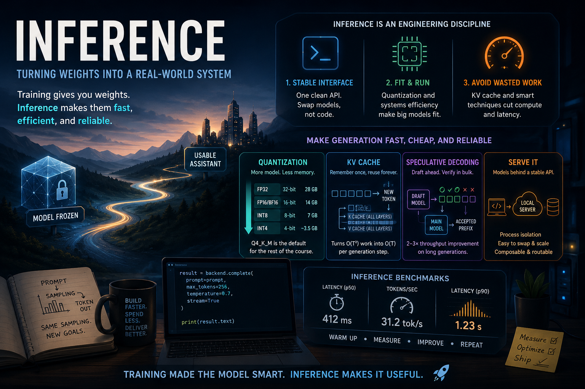
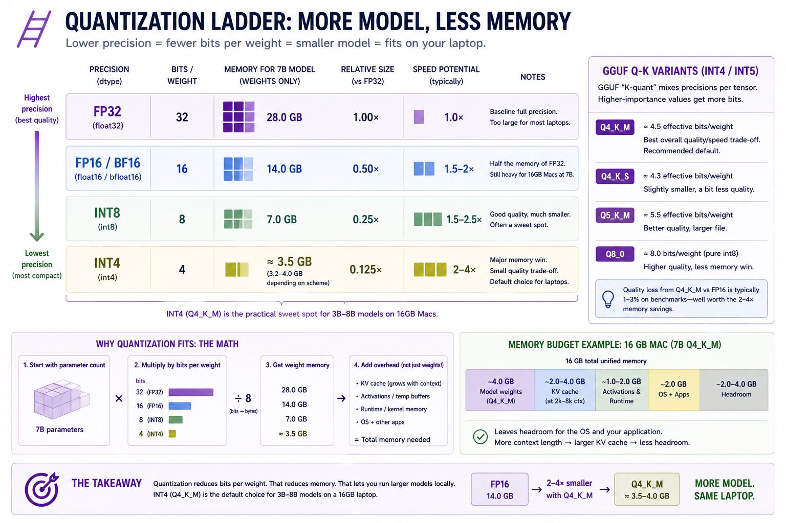
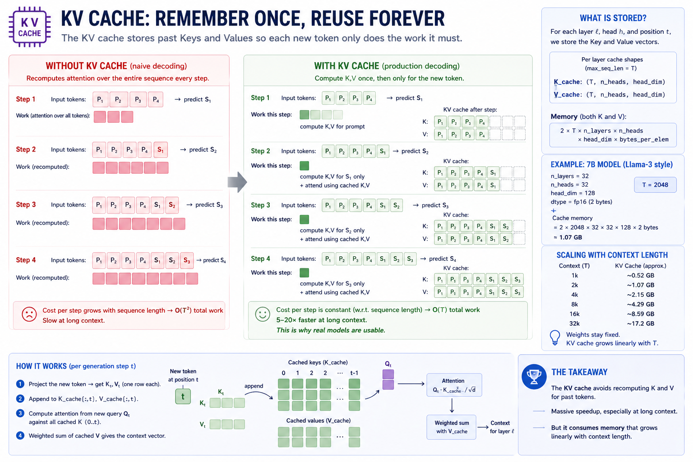
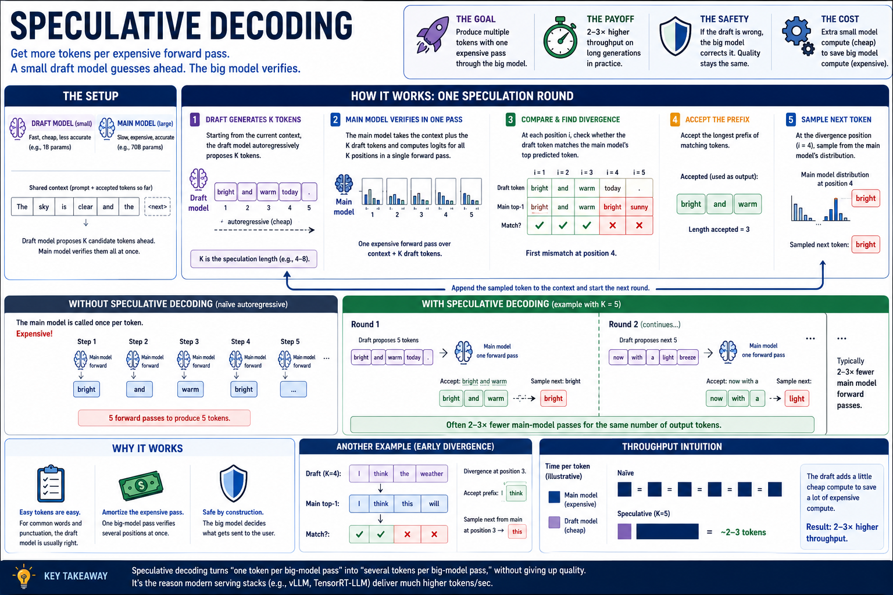

# Module 16 — Inference backends and production models

> **Question this module answers:** *How do we get from "I built it" to "I can use it"?*



Every module up to this point has been about making the model smarter. In this lesson we focus on making it faster, more reliable, and more scalable. 

---
## Before you start

* *Finish* `g2c/sampling` from [11-sampling](11-sampling.md) — `LocalTransformerBackend` drives the from-scratch model through `g2c.sampling.generate`
* *Finish* at least one saved model artifact from Module 10, 13, or 14, or run `./baselm.sh` — `ArtifactBackend` lets you use course-trained and BaseLM artifacts through the inference API
* *Install* Ollama. Use `./setup.sh` to verify installation.
* *Configure* ProdLM with `./prodlm.sh` 

---
## Where this fits in

In Modules 1-15 we went through the entire pipeline of building, training, and shaping a model. We now have something that's starting to resemble the assistant systems that make up modern LLM products. The remainder of the course will be about building the "shell" around it to make a useful assistant. Retrieval, tool usage, and agent harnesses — these are all critical, complex components of a system like ChatGPT. However, all of them live outside the model itself.

At this point in the course journey, we've arrived at the point where the model is "frozen". From here forward, we will no longer be updating weights. But we can't just declare mission accomplished, hand off the weights, and never think about it again. The best trained model in the world is useless if we can't serve and scale it to end users efficiently and reliably.

This week covers the topic of **inference**, which is the process of using fixed weights to produce outputs. Compared to the research-heavy nature of training, inference is fundamentally an engineering discipline. Even on today's "small" production models, generating text is enormously resource intensive. Up until this point, the course has been about how to make models smarter. This week we learn how to make them faster, cheaper, and more reliable.

## The big idea

Training gives you weights; inference turns those weights into a usable system. We are going to use the exact same sampling process that we learned in Module 11. But the difference is in prior modules we used sampling as a component of post-training and evaluation. We never worried too much about efficiency or reliability, because those contexts are inherently controlled environments that easily fit into a notebook.

We now turn our attention towards turning sampling generation into a model backend that external systems can depend on. That requires three practical moves:

1.  **Wrap the model behind a stable interface.**  Downstream modules should call `backend.complete(prompt, ...)`, not care whether the model is StudentLM, BaseLM, ProdLM, Ollama, or MLX.
2. **Make the model fit and run.**  At this point in the course, we'll be shifting into production models. We had no problem generating completions with the toy-scale models that we pre-trained. But now memory and GPU efficiency become first class priorities.
3. **Avoid wasting work during generation.** As models scale up, even small amounts of duplicated work become expensive. We'll explore intelligent caching solutions to drastically cut down on compute costs for production sized prompts.

### Quantization: how a 7B model fits in 4 GB


*Choosing a quantization level is an important exercise in the tradeoff curve between performance and accuracy.*

Quantization is a technique that allows us to tradeoff performance for accuracy given a set of model weights. It relies on the fact that the least significant bits in numerical parameters exert vastly less influence on the model's activations. We can represent a set of weights using 50% of the bits, and lose much much less than 50% of its numerical accuracy.

The easiest way to think about quantization is as a form of (lossy) compression. If you cut the number of bits in half, then you cut the memory footprint of the model (and its activations) in half. Of course this isn't a free lunch.

The least significant bits are less important, but their importance isn't zero. Downscaling the weights causes some degradation to the underlying model. The accuracy hit from quantization is real but small for instruction-tuned models in the int8 → int4 range. Q4_K_M typically loses 1–3% on benchmarks compared to fp16.

```
   ┌───────────────────────────────────────────────────────────────────────┐
   │   QUANTIZATION ARITHMETIC                                             │
   ├───────────────────────────────────────────────────────────────────────┤
   │                                                                       │
   │     Precision   Bits/param   7B model size    Speedup vs fp32         │
   │     ─────────   ──────────   ────────────    ────────────────         │
   │     fp32        32           28.0 GB          1.0×                    │
   │     fp16/bf16   16           14.0 GB          1.5–2× (memory bw)      │
   │     int8        8             7.0 GB          1.5–2.5× (often)        │
   │     int4        4             3.5 GB          2–4× (memory bw)        │
   │                                                                       │
   │   GGUF "K-quant" mixes precisions per-tensor:                         │
   │     Q4_K_M  ≈  4.5 effective bits/param ≈ 4.0 GB for 7B               │
   │     Q5_K_M  ≈  5.5 effective bits/param ≈ 4.7 GB for 7B               │
   │     Q8_0    ≈  8 bits/param            ≈ 7.0 GB for 7B                │
   │                                                                       │
   │   Quantization replaces:                                              │
   │     w  = w_fp16                                                       │
   │   with:                                                               │
   │     w  ≈ scale * round((w_fp16 - bias) / scale)                       │
   │   where (scale, bias) are computed PER-BLOCK (typically 32–128        │
   │   weights per block). The block's worth of weights fits in            │
   │   block_size * bits_per_param bits PLUS one fp16 scale.               │
   │                                                                       │
   └───────────────────────────────────────────────────────────────────────┘
```

The reason quantization speeds up inference isn't the math — int4 multiplications aren't faster than fp16 multiplications on most hardware. It's that **inference is memory-bandwidth-bound**. The time to multiply a weight by an activation is dominated by the time to *fetch the weight from RAM*. Halving the weight size halves the fetch time, even if the math itself is the same speed.

### KV cache: from O(T²) per token to O(T) per token


*Why 30 tok/s on a 7B model is even possible. The KV cache turns autoregressive decoding from O(T²) to O(T) per step — a 5–20× speedup at production context lengths.*

Unlike quantization, KV caching is pretty close to a free lunch — at least on larger models and context windows. It depends on the fact that in next-token autoregression, we are constantly revisiting the same prompt tokens.

Module 11's generation loop recomputes attention over the entire sequence every step:

```
   Step 1:   forward([P1, P2, P3])              →  predict S1
   Step 2:   forward([P1, P2, P3, S1])          →  predict S2
   Step 3:   forward([P1, P2, P3, S1, S2])      →  predict S3
   Step 4:   forward([P1, P2, P3, S1, S2, S3])  →  predict S4
   ...
```

At step `t`, the model recomputes K and V for tokens 0..t. That's `O(T²)` total work for a sequence of length T. The `K_t` and `V_t` projections at step `t` are *the same* as they were at step `t-1` for all positions before `t-1` — there's no need to recompute them.

The KV cache stores `K_0, K_1, ..., K_t` and `V_0, V_1, ..., V_t` as the model generates, so step `t+1` only needs to:

  1. Project the *new* token's K and V (one row's worth of work).
  2. Append to the cache.
  3. Compute attention from the new query against the entire cached K/V (one matmul against a length-`T+1` matrix).

Total: `O(T)` per step → `O(T²)` for the whole generation, but with a ~10× smaller constant. In practice, KV-cached inference is 5–20× faster than the naive loop for sequences past 128 tokens.

```
   ┌─────────────────────────────────────────────────────────────────────────┐
   │   KV CACHE — STATE THAT CARRIES FORWARD                                 │
   ├─────────────────────────────────────────────────────────────────────────┤
   │                                                                         │
   │   Cached state, per layer:                                              │
   │     K_cache:  (max_seq_len, n_heads, head_dim)                          │
   │     V_cache:  (max_seq_len, n_heads, head_dim)                          │
   │                                                                         │
   │   Per generation step:                                                  │
   │     1. project new token →  K_new, V_new   (one row each)               │
   │     2. write into K_cache[t], V_cache[t]                                │
   │     3. attention =  softmax(Q_new · K_cache[:t+1]ᵀ / √d) · V_cache[:t+1]│
   │                                                                         │
   │   Memory cost:                                                          │
   │     KV cache size  =  2 · max_seq_len · n_layers · n_heads · head_dim   │
   │                       · bytes_per_dtype                                 │
   │                                                                         │
   │   For 7B at fp16, 32 layers, 32 heads × 128 dim, T=2048:                │
   │     = 2 · 2048 · 32 · 32 · 128 · 2  bytes                               │
   │     = 1.07 GB                                                           │
   │                                                                         │
   │   This is why 7B at 4-bit + 16k context can blow past 16 GB —           │
   │   the cache scales linearly with context length while weights stay      │
   │   fixed.                                                                │
   │                                                                         │
   └─────────────────────────────────────────────────────────────────────────┘
```

### Speculative decoding


*Speculative decoding is to LLMs what branch prediction is to microprocessors*

Speculative decoding runs a small "draft" model (e.g., a 1B-param sibling of a 70B model) ahead of the main model, generating several candidate tokens at once. The main model then verifies all of them in a single forward pass — comparing its softmax over each position against what the draft chose. Whichever prefix the main model agrees with is accepted; the rest are discarded; the next round starts.

When the draft is right (the common case for "easy" tokens — function words, punctuation, completions of common phrases), one forward pass through the main model produces several output tokens. When the draft is wrong, no harm — the main model's logits at the divergence point determine the next token, same as without speculation.

In practice: 2–3× throughput improvement on long generations. We don't build it. We acknowledge it because every production serving stack uses it.

### The inference server pattern

To go from training to inference, the model has to become a general-purpose service. Up until now it was fine to represent a model as a PyTorch tensor in a notebook. But once we move to building general-purpose software *over* the model, we need a functional form that's stable, standardized, and modular.

```
   ┌────────────────────────────────────────────────────────────────────────┐
   │   LOCAL INFERENCE SERVERS — THE LAY OF THE LAND                        │
   ├────────────────────────────────────────────────────────────────────────┤
   │                                                                        │
   │   llama.cpp     C++ library + CLI. Loads GGUF, runs on CPU+GPU.        │
   │                  The grandparent of every other entry. Open source,    │
   │                  Apache 2.0, ~50k lines of optimized C++.              │
   │                                                                        │
   │   Ollama        Daemon + HTTP API + model registry on top of           │
   │                  llama.cpp. `ollama pull / list / run / serve`.        │
   │                  HTTP API at localhost:11434 by default. The           │
   │                  one-command-install path on macOS.                    │
   │                                                                        │
   │   MLX           Apple's tensor library + python bindings. In-process   │
   │                  (no HTTP). Faster than llama.cpp on M-series for      │
   │                  many ops; format-incompatible with GGUF (uses         │
   │                  safetensors-style sharded checkpoints).               │
   │                                                                        │
   │   vLLM          Server-class. CUDA-only or ROCm-only. Not relevant     │
   │                  for MacBook. Mentioned for completeness.              │
   │                                                                        │
   │   text-gen-webui Higher-level UI on top of llama.cpp + others.         │
   │                  Useful as an exploratory chat client; we don't        │
   │                  use it programmatically.                              │
   │                                                                        │
   └────────────────────────────────────────────────────────────────────────┘
```

The common approach to serving inference is over an **API Provider**. Even local models are typically served through an API on `localhost`. The overhead of the network stack is trivial compared to the latency of inference itself. And with it we get some major advantages.

For local models it creates process isolation, which allows us to manage and isolate the massive memory and GPU requirements of running the model. This allows software to treat inference as an abstracted backend. This makes switching models, providers or inference machines as easy as pointing at a different URL.

Finally, it allows for API *composability*. A provider itself can consume another API upstream in its own backend. A common example of this pattern is the *router*. Inference can be dynamically routed to models of varying capabilities depending on the shape of the workload. 

In this course we'll be taking advantage of composability to add a hook to a production-grade local provider inside the `g2c` framework:

```
   ┌──────────────────────────────────────────────────────────────────────┐
   │   THE INTERFACE                                                      │
   └──────────────────────────────────────────────────────────────────────┘

      ┌────────────────────────┐       ┌───────────────────────────┐
      │  ArtifactBackend       │       │  ProdLM / OllamaBackend   │
      │                        │       │                           │
      │  wraps saved artifacts:│       │  wraps an HTTP server:    │
      │   • StudentLM          │       │   • POSTs JSON to         │
      │   • BaseLM             │       │     /api/generate         │
      │   • SFT/DPO variants   │       │   • parses the response   │
      │                        │       │   • times the round-trip  │
      │  in-process            │       │                           │
      │  (PyTorch on MPS/CPU)  │       │  out-of-process           │
      │                        │       │  (llama.cpp via Ollama)   │
      └────────────────────────┘       └───────────┬───────────────┘
                   │                               │
                   ▼                               ▼
                  ┌────────────────────────────────┐
                  │  Backend.complete(...)         │
                  │     returns InferenceResult    │
                  │                                │
                  └────────────┬───────────────────┘
                               │
                               ▼
                          everywhere downstream
                          (RAG, tools, agent, eval)
```

### Inference Benchmarks

Training metrics tell us whether the model learned. Inference benchmarks tell us whether the model is usable. Once a model sits behind an assistant, a "good" answer that arrives 45 seconds later may still feel broken. Benchmarking is how we make that cost visible.

```
   ┌──────────────────────────────────────────────────────────────────────┐
   │   INFERENCE BENCHMARK BASICS                                         │
   ├──────────────────────────────────────────────────────────────────────┤
   │                                                                      │
   │   latency        How long one request takes from the caller's view.  │
   │                  Usually measured in milliseconds.                   │
   │                                                                      │
   │   tokens/sec     How many completion tokens the backend produces     │
   │                  per second. This is the headline throughput metric. │
   │                                                                      │
   │   wall clock     The real elapsed time around the whole call: Python │
   │                  wrapper, HTTP request, JSON parsing, server work,   │
   │                  and response decoding.                              │
   │                                                                      │
   └──────────────────────────────────────────────────────────────────────┘
```

Latency is the user-facing number: "how long did I wait?" Tokens/sec is the generation-speed number: "once the model is producing text, how fast is it?" They are related, but not identical. A short answer can have low latency but mediocre tokens/sec; a long answer can have high latency but strong tokens/sec.

Wall-clock latency measures the full round trip from the caller's perspective. Server-reported latency is what a backend such as Ollama reports from inside the inference server. The wrapper sees process scheduling, HTTP overhead, JSON encoding/decoding, and any client-side work. The server sees its own model runtime. For local inference, the difference is usually small but still worth naming.

Benchmark suites should also report distributions, not just averages. `p50` tells you the typical request. `p90` tells you the slow tail. Assistant systems are especially sensitive to the tail because an agent turn may require several backend calls in sequence; one slow call can make the whole interaction feel sluggish.

When benchmarking, be aware of cold-start overhead. The first request can include model load, memory allocation, Metal/MPS warmup, or KV-cache initialization. That number matters if users launch the assistant fresh. Later requests are the number you actually feel during a session. Warm up once, then benchmark a fixed prompt set with the same sampling settings.

## Concepts to internalize

- **Quantization buys you headroom, not magic.** A 4-bit 7B model fits in 4 GB and runs at usable speeds on M2; an fp16 7B does not fit on a 16 GB Mac at all (even before KV cache). The accuracy cost is 1–3% on benchmarks. 
- **KV cache is mandatory at scale.** Naive `O(T²)` decoding is fine at 32-token contexts; at 2k contexts it's not. 
- **Wall clock vs server-reported latency are different things.** Ollama tells you the GPU-side compute time. Your wrapper records wall-clock latency. Track both.
- **Tokens-per-second is the headline throughput metric.** But it depends on what you count: prompt processing tokens? Generation tokens? Both? When comparing numbers, check the convention.
- **The first request is always slower.** Cold cache, model load, MPS / Metal kernel JIT compilation. Always warm up before measuring.
- **Backends are values, not globals.** The wrapper classes are stateful, but they're not singletons. This is dependency injection.

### What we don't cover

- Details of GGUF, MLX, and other optimized model formats. It's enough to know these formats at a high level.
- Manual model quantization. Download a pre-quantized local model instead.
- Streaming, async I/O, and MLX serving. They are useful extensions, not required for the module deliverable.

---
## What you'll build

Package: `g2c/inference/`

```python
# backend.py
@dataclass(frozen=True)
class BackendInfo:
    name: str
    model_id: str
    extra: dict[str, Any] = field(default_factory=dict)        # implemented

@dataclass
class InferenceResult:
    prompt: str
    completion: str
    prompt_tokens: int | None
    completion_tokens: int | None
    latency_ms: float
    backend: BackendInfo
    metadata: dict[str, Any] = field(default_factory=dict)
    @property
    def tokens_per_second(self) -> float | None: ...           # implemented

class Backend(ABC):
    @property
    @abstractmethod
    def info(self) -> BackendInfo: ...
    @abstractmethod
    def complete(
        self, prompt: str, *, max_new_tokens: int = 128,
        temperature: float = 1.0, top_k: int | None = None,
        top_p: float | None = None,
    ) -> InferenceResult: ...


# local.py
class LocalTransformerBackend(Backend):
    def __init__(self, model, tokenizer, *,                    # implemented
                 model_id: str = "g2c-local",
                 eos_id: int | None = None,
                 name: str = "local",
                 extra: dict[str, Any] | None = None) -> None: ...
    @property
    def info(self) -> BackendInfo: ...                         # implemented
    @property
    def model(self): ...                                       # implemented
    @property
    def tokenizer(self): ...                                   # implemented
    def complete(self, prompt, *, max_new_tokens=128,
                 temperature=1.0, top_k=None, top_p=None,
                 ) -> InferenceResult:                         # SCAFFOLDED
        ...


# ollama.py
class OllamaError(RuntimeError): ...                           # implemented

class OllamaBackend(Backend):
    def __init__(self, model_id: str = "llama3.2:3b", *,        # implemented
                 base_url: str = DEFAULT_OLLAMA_URL,
                 timeout: float = 120.0,
                 urlopen=None,
                 name: str = "ollama",
                 extra: dict[str, Any] | None = None) -> None: ...
    @property
    def info(self) -> BackendInfo: ...                         # implemented
    @property
    def base_url(self) -> str: ...                             # implemented
    def _post_generate(self, body                              # implemented (HTTP transport:
                       ) -> tuple[dict, float]: ...            #   POST, error->OllamaError,
                                                               #   JSON parse, latency timing)
    def complete(self, prompt, *, max_new_tokens=128,
                 temperature=1.0, top_k=None, top_p=None,
                 ) -> InferenceResult:                         # SCAFFOLDED (map params +
        ...                                                    #   response fields; call
                                                               #   self._post_generate)
    def chat_with_tools(self, messages, tools=None, *,         # implemented
                        max_new_tokens=512, temperature=0.2,
                        top_k=None, top_p=None) -> ChatResult: ...
        # Native tool-calling path used by Module 18. Hits Ollama's
        # /api/chat endpoint with a structured tools= array. Not part
        # of this module's lesson; HTTP plumbing like `_post_generate`.


# artifact.py
class ArtifactBackend(LocalTransformerBackend):                  # implemented
    """Backend wrapper for saved StudentLM, BaseLM, SFT, and DPO artifacts."""

def load_artifact_backend(
    artifact_name: str | None = None, *,
    device: str | None = "auto",
    torch_dtype: str | None = None,
    required: bool = True,
) -> ArtifactBackend | None: ...


# prodlm.py
def write_prodlm_manifest(...): ...                              # implemented
def load_prodlm_backend(...): ...                                # implemented
def load_default_backend(kind: str = "auto", ...): ...           # implemented


# benchmark.py
@dataclass
class BenchmarkResult:                                         # implemented
    backend: BackendInfo
    n: int
    latency_ms_total: float
    latency_ms_mean: float
    latency_ms_p50: float
    latency_ms_p90: float
    completion_tokens_total: int | None
    tokens_per_second_overall: float | None
    per_request_latency_ms: list[float]
    per_request_tokens_per_second: list[float | None]
    results: list[InferenceResult] = field(default_factory=list)
    metadata: dict[str, Any] = field(default_factory=dict)

def benchmark(
    backend: Backend, prompts: list[str], *,
    max_new_tokens: int = 64, temperature: float = 1.0,
    top_k: int | None = None, top_p: float | None = None,
    metadata: dict[str, Any] | None = None,
) -> BenchmarkResult:                                          # SCAFFOLDED
    ...
```

Total scaffolded code: roughly 50 lines across three function bodies (`LocalTransformerBackend.complete`, `OllamaBackend.complete`, `benchmark`), plus the KV-cache path in exercise 7 (`LayerKVCache.append`, `MultiHeadAttention.forward_cached`, `TransformerLM.forward_cached` — another ~25 lines, and the only part of this module that is model internals rather than wiring). The Ollama path's HTTP transport — request building, error translation, JSON parsing, timing — is provided as `_post_generate`, so `OllamaBackend.complete` is just the contract mapping: sampling params in, response fields out. The pedagogical content is the wiring — taking a string in, a string out, and recording what happened in between.

## How to run the tests

Tests live in `tests/test_inference.py`. Initial state: 80 passed, 51 failed, 1 skipped.

```bash
source .venv/bin/activate

pytest tests/test_inference.py                          # all module-16 tests
pytest tests/test_inference.py -x                       # stop at first failure
pytest tests/test_inference.py -k Local                 # local-backend tests
pytest tests/test_inference.py -k Ollama                # ollama-backend tests
pytest tests/test_inference.py -k Benchmark             # benchmark tests
pytest tests/test_inference.py -k boilerplate           # the boilerplate sanity tests
pytest tests/test_transformer.py -k layer_kv_cache_append   # the cache container itself
pytest tests/test_multi_head_attention.py -k cached      # cached attention step
pytest tests/test_transformer.py -k cached               # cached model forward
pytest tests/test_sampling.py -k cached                  # end-to-end cached generation
pytest tests/test_inference.py -v                       # verbose
```

## Exercises

To launch the exercise notebook run:

```bash
./notebook.sh 16
```

If at any point you want to archive the work in your current notebook and restart fresh:

```bash
./notebook.sh 16 --fresh
```

The notebook defaults to BaseLM for the artifact backend, automatically preferring `-DPO`, then `-SFT`, then base when those stages exist. You can switch to a course-trained artifact in the model-selection cell and compare that local artifact path with ProdLM.

1. **Backend smoke test.** Compare artifact and ProdLM completions on a few prompts.
2. **Benchmark ProdLM.** Measure latency, throughput, and wall-clock behavior.
3. **Optional MLX backend.** Extension path: install `mlx-lm` and implement the same backend interface through MLX.
4. **ProdLM evaluation.** Re-run a Module 15-style eval through the ProdLM adapter.
5. **Quantization quality.** Compare fp16 and fake-quantized BaseLM outputs.
6. **Router backend.** Dispatch between a tiny artifact and ProdLM.
7. **Build the KV cache.** Implement `LayerKVCache.append`, `MultiHeadAttention.forward_cached`, and `TransformerLM.forward_cached` (`pytest -k cached` plus `-k layer_kv_cache_append`). The contract is equivalence: decoding one token at a time through the cache must produce the same logits as re-running the full uncached `forward` on the whole prefix. `Block.forward_cached` and `generate_cached` are provided, so what you write is the cache itself, the single-query attention step, and the position bookkeeping. Then benchmark cached against uncached generation and confirm the O(T²) → O(T) claim on your own model.
8. **Optional streaming.** Add a streaming completion method.
9. **Inference post-mortem.** Summarize speed, quality, memory, and routing tradeoffs.

## Pitfalls to expect

- **Ollama not running or wrong model tag.** Check `ollama list` and `ollama ps` before debugging code. A missing server or missing tag looks like an inference bug until you verify the runtime.
- **Prompt/completion slicing.** Local generation returns prompt plus continuation; backend wrappers must return only the generated portion.
- **Forgetting EOS.** Without an end token, local generation runs to `max_new_tokens` even when the model would have stopped.
- **Timing units.** Ollama reports nanoseconds, `perf_counter()` reports seconds, and the course result object stores milliseconds. Unit mistakes make throughput numbers useless.
- **Comparing across machines.** Throughput is only comparable within one hardware/runtime setup. Always note machine, model, quantization, context length, and max tokens.
- **Streaming format mismatch.** Non-streaming returns one JSON object; streaming returns NDJSON chunks. Parse them differently.
- **Backend interface vs behavior.** A class can satisfy the interface while giving misleading latency or token counts. Wrap timings yourself when benchmarking.


## M-series notes

This is the most memory-sensitive module of the course. Choose the model size + quant level to match your hardware:

```
   ┌───────────────────────────────────────────────────────────────────────┐
   │   MEMORY BUDGET BY MAC CONFIGURATION                                  │
   ├───────────────────────────────────────────────────────────────────────┤
   │                                                                       │
   │   8GB Mac:    1B–3B Q4 only.  llama3.2:1b, qwen2.5:0.5b, qwen2.5:1.5b.│
   │                Tight headroom; close other apps before running.       │
   │                                                                       │
   │   16GB Mac:   Comfortable up to 7B Q4.  llama3.2:3b is best default.  │
   │                llama3.1:8b Q4 works but leaves ~3 GB for everything   │
   │                else (browser, IDE, OS) — tight at long contexts.      │
   │                                                                       │
   │   32GB Mac:   Comfortable with 8B Q4 + headroom; 13B Q4 fits.         │
   │                qwen2.5:14b Q4 works but slow.                         │
   │                                                                       │
   │   64GB Mac:   13B Q4 comfortable; 30B Q4 fits but slow;               │
   │                70B Q4 fits at the edge (40+ GB), 1–5 tok/s.           │
   │                                                                       │
   │   128GB Mac:  70B Q4–Q6 comfortable; 70B Q8 fits.                     │
   │                                                                       │
   └───────────────────────────────────────────────────────────────────────┘
```

The course default is `llama3.2:3b`, and this is what will be set up automatically when students run `./prodlm.sh`.

- Fits in 4 GB on every reasonable Mac config.
- Fast enough for interactive use (25–40 tok/s on M2 16GB).

If you have ≥ 32 GB, switching to `llama3.1:8b` is worth it for Module 19 (agent loops) — the 8B handles tool-calling significantly better than the 3B.

Other practical notes:

- **Heat and throttling.** Sustained inference (5+ minutes of continuous calls) makes the M-series heat up; the GPU clock down-throttles to maintain temperature. Steady-state throughput after thermal throttling can be 70–80% of the cold-start steady state. For benchmarks, either run short suites (under a minute) or measure *both* the early and late steady states.
- **Disk space for models.** 4 GB per Q4 7B model. `ollama pull` to a local laptop with a 256 GB SSD eats real space. `ollama rm <model>` cleans up. `ollama list` shows what's there.
- **Network.** Ollama's first `pull` is gigabytes over HTTPS. Plan for the download time. Once pulled, all inference is local — no network during use.
- **Activity monitor.** During inference, you should see GPU usage spike on the GPU page. If GPU stays low and CPU spikes, your Ollama install is somehow running CPU-only (rare, but possible if Metal init failed). `ollama serve --verbose` in a terminal shows backend choice on startup.

---
## Reading

Primary:

- **The Ollama API documentation** (https://github.com/ollama/ollama/blob/main/docs/api.md). The reference for every field in the request/response. Read the `POST /api/generate` section in full — that's what you implement against.
- **The llama.cpp README** (https://github.com/ggerganov/llama.cpp/blob/master/README.md). Background context for what's actually running underneath Ollama. Read the "Quantization" section (the GGUF format and Q4_K_M / Q5_K_M / Q8_0 explanations).
- **Dettmers, Lewis, Belkada, Zettlemoyer, "LLM.int8(): 8-bit Matrix Multiplication for Transformers at Scale" (2022).** The canonical paper on int8 quantization for LLMs. Read §3 (the method) and §5 (the results table). The "outlier features" detail is what makes int8 work without large accuracy loss; the K_M / K_S quantization names in GGUF descend from this lineage.

Secondary:

- **The MLX examples repo** (https://github.com/ml-explore/mlx-examples). Skim the `lm` subfolder. It's the Apple-native counterpart to llama.cpp; the patterns are similar.
- **Pope, Douglas, Chowdhery et al., "Efficiently Scaling Transformer Inference" (2022).** The Google paper that popularized KV cache, attention sharding, speculative decoding. Read §3 (the throughput-vs-latency analysis) and §4 (KV cache layout). Production-grade; the abstractions exceed what we build here, but the framing is durable.
- **Leviathan, Kalman, Matias, "Fast Inference from Transformers via Speculative Decoding" (2023).** The original speculative-decoding paper. Skim §2 (the algorithm) and §4 (the empirical speedup). Don't implement.

Optional:

- **Frantar, Ashkboos, Hoefler, Alistarh, "GPTQ: Accurate Post-Training Quantization for Generative Pre-trained Transformers" (2022).** The other major lineage of LLM quantization (alongside LLM.int8). GPTQ is what GGUF Q4_K_M is morally a descendant of — second-order error correction during quantization. Skim §3.
- **Lin, Tang, Tang et al., "AWQ: Activation-aware Weight Quantization for LLM Compression" (2023).** Argues that activations matter more than weights for which dimensions to keep at higher precision. Influences modern quantization recipes.
- **Hugging Face's "GGUF" reference** (https://huggingface.co/docs/hub/gguf). The GGUF format spec. Useful when you want to introspect what's actually in a `.gguf` file.
- **Chen, Borgeaud, Irving et al., "Accelerating Large Language Model Decoding with Speculative Sampling" (2023).** Independent invention of the speculative-decoding idea, slightly different framing.

## Deliverable checklist

- [ ] All tests in `tests/test_inference.py` pass. 
- [ ] Ollama installed and ProdLM configured
- [ ] Notebook: `notebooks/solutions/16-inference.ipynb`. 
- [ ] **Inference-stack post-mortem** (Exercise 9) in `docs/inference-postmortem.md`. 3–4 paragraphs. The actual deliverable. Cover: what ran, where the gaps were, the cost-quality frontier, and which backend you're committing to for the rest of the course.
- [ ] You can explain — out loud, without notes — the rough memory cost of running a 7B model at fp32 vs fp16 vs int8 vs int4, and which fits on a 16 GB Mac.
- [ ] `pytest -k "cached or layer_kv_cache_append"` passes: your cached decode path produces the same logits as the uncached `forward`.
- [ ] You can explain — out loud, without notes — what a KV cache is, why it's necessary at scale, why no causal mask is needed in the cached step, and why the assistant path still runs on ProdLM's production cache rather than the toy one you built.
- [ ] You can explain — out loud, without notes — the difference between wall-clock latency (what `InferenceResult.latency_ms` records) and server-reported latency (what Ollama's `total_duration` reports), and what each is good for.
