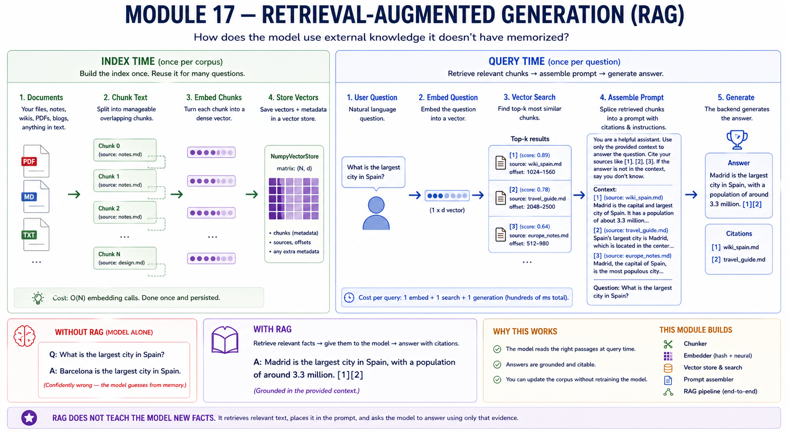
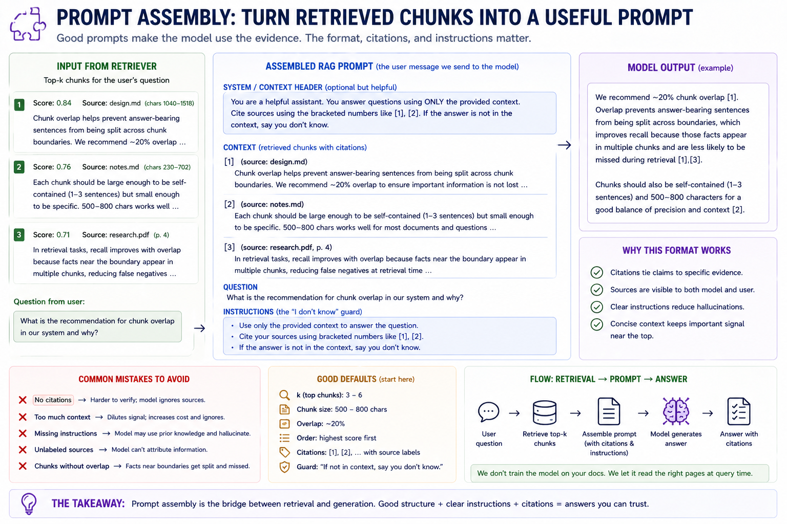

# Module 17 — Retrieval-augmented generation

> **Question this module answers:** *How can the model use external knowledge it doesn't have memorized?*



RAG is the smallest possible architecture for "give the model access to information it doesn't have memorized." Chunk the corpus, embed each chunk, store the vectors, embed the query, retrieve the top-k by cosine similarity, splice them into a citation-formatted prompt, send to the inference backend. None of the components are individually deep — but the wiring is the lesson, because RAG is the substrate Module 18's tools and Module 19's agent loop both build on.*

---
## Before you start

* *Review
	* Numpy review  `np.linalg.norm`, `@` (matrix multiply), `np.argpartition`, `np.argsort`
	* [[05-embeddings]] for embedding vectors, semantic geometry and cosine similarity
	* [[13-sft]] for the general assistant prompt format. 
	* [[16-inference]] for Ollama and the abstracted backend pattern
* *Finish* 
	* `g2c/inference` from [[16-inference]] 
* *Configure* Production embedding model with `./prodlm.sh` 

---
## Where this fits in

Modules 1–16 built a model and made it usable. The tiny model from Module 14 doesn't know facts — Module 16 fixed that by pivoting to a real pretrained model behind a unified `Backend`. But even a 7B-class model has gaps:

At inference time, models can "know" facts in one of two ways. One is that they're already embedded into weights of the model's internal world model. In [[15-evaluation]] we tested models on their factual recall of questions like "What's the largest city in Spain?". Models learn facts like these during training, primarily pretraining.

The other way a model can "know" a fact is, when it's supplied in the prompt. We can also pose questions like "Kate is in 10th grade, how many years until she graduate high school?" To produce the right answer, the model must take a fact supplied in the prompt ("Kate is in 10th grade") with a fact that it hopefully learned in pretraining ("High school ends at grade 12").

```
   ┌───────────────────────────────────────────────────────────────────────┐
   │  WHAT EVEN A 7B MODEL DOESN'T KNOW                                    │
   ├───────────────────────────────────────────────────────────────────────┤
   │                                                                       │
   │   • Anything not in its training data:                                │
   │       - your private notes, your company's wiki, last week's news     │
   │       - documents written after the model's training cutoff           │
   │       - long-tail factual claims it saw 0–3 times in pretraining      │
   │                                                                       │
   │   • Anything it memorized BADLY:                                      │
   │       - fine details of a specific paper it saw once                  │
   │       - exact phrasings, exact dates, exact numbers                   │
   │       - the line of code in `g2c/sampling/generate.py` line 47        │
   │                                                                       │
   │   • Anything it would need to update mid-conversation:                │
   │       - "given this document, answer X" workflows                     │
   │       - "the user just told me their cat's name, remember it"         │
   │                                                                       │
   └───────────────────────────────────────────────────────────────────────┘
```

**Retrieval** is how assistant systems bridges between a large collection of information in the form of a corpus (not necessarily the same corpus used in pretraining) and what information it selectively curates at [[16-inferance]] time to actually put into the prompt.

A simple example: "what did the president say in his speech last night?". First we know this fact isn't going to be internally known to the model, because it occurred too recently to be in the pretraining corpus. Therefore the assistant system must recall it from a retrieval corpus. If users frequently ask about current events, then it's reasonable for our assistant system's retrieval corpus to include something like BBC stories from the past week.

It's not practically feasible to dump "all news from the past week" into a context window, and let the model figure it out. Something has to curate the potentially relevant information before we send the prompt to the model. In this example, the model doesn't need news stories about soccer matches or celebrity gossip, but it does need news stories about the president.

Retrieval makes assistant systems more intelligent by curating relevant information and exposing it to the model at inference time. When executed right, the end user sees a transpa assistant system that seamlessly knows everything in the corpus.

## The big idea

The goal of retrieval is to query a large corpus for data relevant to an arbitrary prompt. The retrieval system doesn't need to "understand" the data. It just has to curate a small context-sized subset of the corpus based on relevance. 

In [[05-embeddings]] we learned a technique for converting language into geometry. Embeddings project tokens into a vector in a high dimensional semantic space. **Vector retrieval** that same idea to whole chunks of text. 

Instead of asking the language model to internally remember every fact, we build a searchable map of an external corpus. Each chunk gets reduced to a vector by an embedding model. Each user question gets reduced to a vector by the same embedding model. Retrieval is then a nearest-neighbor problem: find the chunk vectors closest to the question vector.

That gives the assistant a practical two-step memory system:

1. **Index time:** prepare the corpus before the user asks anything. Split documents into chunks, embed each chunk, and store `(chunk, vector)` pairs in an index.
2. **Query time:** when the user asks a question, embed the question, search the index for the closest chunks, and put those chunks into the prompt before calling the inference backend.

The important distinction is that retrieval does not answer the question by itself. Rather its a component of the **retrieval augmentation generation (RAG)** pipeline.  Retrieval only decides what evidence the model gets to read. Augmentation is how we incorporate that evidence into the prompt. Generation is running the LLM with the agumented prompt.

The generator still does the language work: combining the user's question with the retrieved context, reasoning over it, and producing the answer. If retrieval finds the right chunks, even a modest model can look much smarter. If retrieval finds the wrong chunks, a strong model may confidently answer from the wrong evidence.

This is why RAG is best understood as an assistant-scaffold pattern rather than a new model architecture. The model weights stay fixed. The corpus can change every day. The index can be rebuilt whenever documents change. At inference time, the model receives a curated slice of the corpus as prompt context and behaves as if it "knows" that information.

```
   ┌──────────────────────────────────────────────────────────────────────┐
   │  THE PIPELINE — TWO PHASES                                           │
   └──────────────────────────────────────────────────────────────────────┘

      ┌─────────────────────────────────┐
      │  INDEX TIME (once per corpus)   │
      │                                 │
      │   docs/  →  chunk_text  →       │
      │     [Chunk, Chunk, Chunk, ...] →│
      │       embedder.embed   →        │
      │         (N, d) vectors  →       │
      │           store.add             │
      │                                 │
      │   Cost: O(N) embedding calls.   │
      │   Done once; persisted.         │
      └─────────────┬───────────────────┘
                    ▼
      ┌─────────────────────────────────┐
      │  QUERY TIME (once per question) │
      │                                 │
      │   question   →                  │
      │     embedder.embed → (1, d)     │
      │       store.search →            │
      │         top-k (Chunk, score)    │
      │           assemble_rag_prompt → │
      │             prompt              │
      │               backend.complete →│
      │                 RAGAnswer       │
      │                                 │
      │   Cost: 1 embed + 1 search +    │
      │         1 generate. ~hundreds   │
      │         of ms total.            │
      └─────────────────────────────────┘
```

### Chunking

A document is too big to retrieve as a unit (a 50-page paper is one "topic" but you only want the paragraph that actually answers the question). A sentence is too small (the answer often spans 2–3 sentences). The **chunk** is the right intermediate — small enough to be specific, big enough to be self-contained.

```
   ┌──────────────────────────────────────────────────────────────────────┐
   │   CHUNK SIZE TRADEOFFS                                                │
   ├──────────────────────────────────────────────────────────────────────┤
   │                                                                       │
   │   Size       Pros                          Cons                       │
   │   ────       ────                          ────                       │
   │   100 char   Highly specific embedding;    Answers spanning 2 chunks  │
   │              one chunk = one fact          require fetching both;     │
   │                                            no inter-sentence context  │
   │                                                                       │
   │   500 char   Balanced; 1–3 sentences       Generic-feeling vectors    │
   │              of context                                               │
   │                                                                       │
   │   1500 char  Self-contained paragraphs;    Embedding "averages" over  │
   │              good for "what does this      topic; one distinctive     │
   │              section say"                  sentence gets diluted      │
   │                                                                       │
   │   3000+ char Whole sections preserved      Embedding is a coarse      │
   │              for the model to read         summary; retrieval misses  │
   │                                            specific facts             │
   │                                                                       │
   └───────────────────────────────────────────────────────────────────────┘
```

Overlap exists for exactly one reason: an answer-bearing sentence that crosses a chunk boundary appears in BOTH chunks rather than being split between them. Without overlap, the chunker's split points become noise — moving a paragraph break a few characters drops the answer's recall.

```
   No overlap:

	────────── chunk 1 ───────────────────┌───── chunk 2 ──────────────────────
										  |
	...big cities. The largest city in America is New York. It was settled in...
	                                      |
	────────── chunk 1 ───────────────────└────── chunk 2 ──────────────────────


   With overlap:

   ────────── chunk 1 ───────────────────┐
				 ┌───── chunk 2 ───────────────────────────────────────────────
				 |
   ...big cities. The largest city in America is New York. It was settled in...
	             |
	             └────── chunk 2 ──────────────────────────────────────────────
    ────────── chunk 1 ───────────────────┘
```

This module's chunker is the simplest possible: fixed-size sliding window with overlap. It ignores sentence and paragraph boundaries. A real chunker prefers natural breaks; the `chunk_text` recipe is intentionally minimal so the lesson is the math.

Chunking systems in the wild generally fall under three categories:

- **Character / token sliding window.** Fixed-size windows with overlap. What this module implements. Easy to implement, dependency-free, robust to messy text. Loses paragraph and sentence structure.
- **Recursive character splitting.** Try to split on `"\n\n"`, fall back to `"\n"`, fall back to `" "`, fall back to characters. Preserves natural breaks. A small but real upgrade over the sliding window.
- **Semantic chunking.** Embed sentences, group consecutive sentences whose embeddings are similar enough that they "belong together." Best quality, slowest, requires an embedder. Used by some agentic systems for indexing long technical documents.

### Embedding

![Embedding space and cosine search. Left half: a 2D scatter of chunk embeddings color-coded by cluster — Spain/Cities (green), Python/Code (blue), Cooking (orange), Machine Learning (purple). Texts about the same topic land in the same neighborhood. The user's query "What is the capital of Spain?" embeds to a point near the Spain/Cities cluster, marked with a star. A "cosine similarity intuition" panel pins the math: for L2-normalized vectors, `cos(u, v) = u · v` — small angle → high similarity → score near 1; orthogonal → score near 0; opposite → score near -1. Right half: the search algorithm in five steps. Step 1 — embed the query. Step 2 — dot the query against every row of the (N, d) store matrix to get N similarities. Step 3 — `np.argpartition(scores, -k)` finds the top-k indices in O(N) without sorting the full array. Step 4 — sort just those k indices by descending score. Step 5 — return the top-k chunks plus their similarity scores. A "key takeaway" panel: cosine similarity finds the chunks whose meaning is most similar to the query — not the chunks that share words.](17-rag/Module17-Embedding.png)
*With embedding vectors, semantic similarity reduces to geometry*

An embedding is a function from a string of text to a numerical vector in a high dimenstional space. Within an embedding space, semantic similarity is measured as the angle between the vectors. If two vectors share a small angle, then their coordinates in the semantic space are close in a geometric sense. The choice of embedding function determines what "similar" means:

* **Sparse / lexical.** The vector is mostly zeros; non-zero entries correspond to terms (or n-grams, or hash buckets). Fast, deterministic, no model required. Captures lexical overlap, no semantics. Good for "find passages mentioning the same words" — bad for "find passages on the same topic."

* **Dense / neural.** A model — typically a transformer encoder — turns each text into a fixed-dim float vector. Captures topic, paraphrase, and analogies. Requires a model. The substrate of every modern RAG system.

* **Hybrid.** Sparse + dense scores combined (typically by reciprocal-rank fusion). Robust across query types — keyword-heavy queries that dense embedders mishandle ("what does CVE-2024-3094 do?") still hit when sparse retrieval matches the literal token.

In this module we build `HashEmbedder` as a toy lexical model. It captures lexical signal — strings sharing tokens / n-grams cluster together. It's enough to make the pipeline work for tests, and to feel the limits: a question phrased differently from the source document doesn't retrieve. `OllamaEmbedder` (or any neural embedder) captures semantics — the same idea expressed in different words still clusters. For real retrieval over heterogeneous queries, you want a neural embedder. 
```
   ┌───────────────────────────────────────────────────────────────────────┐
   │   EMBEDDER COMPARISON                                                 │
   ├───────────────────────────────────────────────────────────────────────┤
   │                                                                       │
   │   HashEmbedder:                                                       │
   │     "Madrid"            ≈  "Madrid"            (identical, sim=1)     │
   │     "Madrid"            ≈  "madrid"            (lowercase, sim=1)     │
   │     "Madrid"            ≈  "Madrideño"         (substring, sim=0.4)   │
   │     "Madrid"            ≈  "the capital city"  (no overlap, sim≈0)    │
   │     "running"           ≈  "runs"              (shared "run", sim=0.3)│
   │                                                                       │
   │   OllamaEmbedder (nomic-embed-text):                                  │
   │     "Madrid"            ≈  "the capital of Spain"  (semantic, sim=0.5)│
   │     "running"           ≈  "jogging"             (paraphrase, sim=0.6)│
   │     "the cat sat"       ≈  "the dog stood"    (similar shape, sim=0.4)│
   │     "the cat sat"       ≈  "running on a treadmill"                   |
   |                                    (different topic, sim=0.05).       │
   │                                                                       │
   └───────────────────────────────────────────────────────────────────────┘
```


### Retrieval

Once we have query and corpus vectors, we want to construct a **k-Nearest Neighbors (kNN)** algorithm to find the chunks with the closest semantic similarities. We rely on the fact that embeddings are normalized to unit length. For unit normalized vectors, the cosine of the angle is monotonically decreasing with distance. This reduces similarity comparison to a simple, fast, GPU-friendly dot product.

```
Vectors are unit normal:
	||u|| = 1         
	||v|| = 1 
	
Similarity score ∈ [0,1]:
	cos(u, v) = u · v
```

Cosine similarity gives us a scalar similarity score for each of the `N` chunks in the corpus. To find the top-K closest chunks we apply the following algorithm:

1. Argpartition the top-K scores. (Argpartition don't sort, avoid overhead of full sort)
2. Sort the remaining top-K scores.
3. Lookup and return the chunks corresponding to the top-K scores

That's the whole search algorithm for a flat index. Linear in `N` and therefore corpus size. Performance focused search algorithms — HNSW, IVF, GPU indexes — replace the above with something sub-linear in `N`. This usually involves trading off kNN with **approximate nearest neighbors (ANN)**. 

```
   ┌──────────────────────────────────────────────────────────────────────┐
   │   FLAT vs ANN — WHEN TO CARE                                          │
   ├──────────────────────────────────────────────────────────────────────┤
   │                                                                       │
   │     Corpus size    Flat search    HNSW    Notes                      │
   │     ──────────     ───────────    ────    ─────                       │
   │     100            < 1 ms         < 1 ms  flat is simpler             │
   │     10k            ~5 ms          ~1 ms   flat is fine                │
   │     100k           ~50 ms         ~2 ms   HNSW starts winning         │
   │     1M             ~500 ms        ~3 ms   flat is too slow            │
   │     10M            ~5 s           ~5 ms   ANN required                │
   │                                                                       │
   │   "Module 17 corpus" — your local docs/ — is in the 100–1k chunk      │
   │   range. Flat search is microseconds. Worry about ANN only when        │
   │   you've outgrown the laptop.                                         │
   │                                                                       │
   └──────────────────────────────────────────────────────────────────────┘
```

### Prompt assembly


*The "I don't know" guard at the bottom of the prompt actually triggers refusal — it's the single highest-leverage line in the whole template.*

Once the retriever has handed you `[chunk_1, chunk_2, ..., chunk_k]`, the question is how to splice them into the model's input. The default template:

```
   {DEFAULT_SYSTEM}

   Context:
   [1] (source: {chunks[0].source})
   {chunks[0].text}

   [2] (source: {chunks[1].source})
   {chunks[1].text}

   ...

   Question: {question}

   {DEFAULT_INSTRUCTION}
```

Three things this format is doing:

1. **The numbered brackets `[i]`** give the model and any downstream parser a way to refer to a specific chunk. The model often produces answers like `"As described in [1], Madrid is the capital."` — verifiable.
2. **The `(source: ...)` label** lets the model name the document by its filename or URL when answering. Without it, citations can only be `[1]` — less useful.
3. **The trailing `instruction`** is the "I don't know" guard. Without it, models hallucinate when context is insufficient. With it, instruction-tuned models will (more often than not) actually abstain.

Note what's *not* in the template: chat-template markers like `<|user|>...<|assistant|>`, role tags, system prefixes like `system: `. Those belong to the chat template, which lives outside the RAG layer. The RAG prompt assembler produces the *body* of the user turn; whoever's calling the backend wraps it in the chat template their backend expects.

## Concepts to internalize

- **The vector is not the meaning, it's a *coordinate for* the meaning.** Two strings with similar embeddings are close in the geometry of *that embedder*.  There's no "ground truth" embedding space — only embedders that are useful for specific retrieval tasks.
- **Retrieval quality dominates RAG quality.** A 7B model handed the right chunk answers correctly; the same model handed the wrong chunk hallucinates.
- **The "I don't know" guard is the single highest-leverage line in the prompt.** Models that have it abstain on insufficient context; models that don't, hallucinate.
- **Chunks should be self-contained.** A chunk that ends mid-sentence forces the model to hallucinate the missing context. Real chunkers prefer natural breaks for this reason.
- **Citations are alignment, not formatting.** The point of `[1] (source: foo.md)` isn't pretty output — it's that a reviewer can verify the claim.
- **Embedders and chat models are different beasts.** A chat model `complete(prompt) → completion` expects to generate. An embedder `embed(text) → vector` expects to *score*  Confusing them (e.g., trying to use a chat model as an embedder) is a classic early mistake. They share the same family of architectures (transformers) but diverge entirely in usage.

### What we don't cover

- **Implementing HNSW or any other ANN index.** Approximate search, sub-linear. Production scale wants this; course scale does not. Building HNSW from scratch is a 200-line project and a different lesson.
- **Implementing a sentence-transformer-style dense embedder.** Training a contrastive bi-encoder is its own multi-week curriculum. We use `OllamaEmbedder` to plug into a pretrained one. Treat the embedder as a black box that turns text into a 768-vector.
- **Hybrid retrieval**. All RAG
- **Re-ranking with a cross-encoder.** Production RAG pipelines often retrieve top-k=50 with a cheap dense embedder and then re-rank top-k=5 with an expensive cross-encoder.
- **Async embedding.** Embedding 10k chunks against a remote service one-at-a-time takes minutes. Real pipelines batch via async. We don't — the lesson is the math.
- **Quantized indexing.** 1M chunks at 1024-dim in `float32` is 4 GB — already worth thinking about quantizing the index. We don't optimize for this; for course-scale corpora the naive numpy array is fast enough.

---
## What you'll build

Package: `g2c/rag/`

```python
# chunk.py
@dataclass(frozen=True)
class Chunk:
    text: str
    source: str
    start: int
    end: int
    metadata: dict[str, Any] = field(default_factory=dict)        # implemented

def chunk_text(
    text: str,
    *,
    source: str,
    chunk_size: int = 1500,
    chunk_overlap: int = 150,
    metadata: dict[str, Any] | None = None,
) -> list[Chunk]:                                                  # SCAFFOLDED
    ...


# embed.py
class Embedder(ABC):
    @property
    @abstractmethod
    def dim(self) -> int: ...                                      # implemented
    @abstractmethod
    def embed(self, texts: list[str]) -> np.ndarray: ...           # implemented

class HashEmbedder(Embedder):
    def __init__(self, *, dim: int = 512,                          # implemented
                 ngram_range: tuple[int, int] = (3, 5),
                 seed: int = 0) -> None: ...
    def embed(self, texts: list[str]) -> np.ndarray:               # SCAFFOLDED
        ...

class OllamaEmbedder(Embedder):
    def __init__(self, model_id="nomic-embed-text", *, dim=768,    # implemented
                 base_url=DEFAULT_OLLAMA_URL, timeout=120.0,
                 urlopen=None) -> None: ...
    def embed(self, texts: list[str]) -> np.ndarray: ...           # implemented


# store.py
class NumpyVectorStore:
    def __init__(self, *, dim: int) -> None: ...                   # implemented
    def add(self, chunks, vectors) -> None: ...                    # implemented
    def search(self, query, *, k=5) -> list[tuple[Chunk, float]]:  # SCAFFOLDED
        ...

def cosine_similarity(a, b) -> float: ...                          # implemented


# retrieve.py
@dataclass(frozen=True)
class RetrievedChunk:                                              # implemented
    chunk: Chunk
    score: float
    rank: int

class DenseRetriever:                                              # implemented
    def __init__(self, embedder, store): ...
    def retrieve(self, query, *, k=5) -> list[RetrievedChunk]: ...


# prompt.py
@dataclass(frozen=True)
class RAGPrompt:                                                   # implemented
    text: str
    question: str
    chunks: tuple[Chunk, ...]

def assemble_rag_prompt(question, chunks, *,                       # SCAFFOLDED
                        system=DEFAULT_SYSTEM,
                        instruction=DEFAULT_INSTRUCTION,
                        ) -> RAGPrompt:
    ...


# pipeline.py
@dataclass
class RAGAnswer:                                                   # implemented
    question: str
    answer: str
    retrieved: list[RetrievedChunk]
    prompt: RAGPrompt
    inference: InferenceResult
    metadata: dict[str, Any] = field(default_factory=dict)

class RAGPipeline:                                                 # implemented
    def __init__(self, retriever, backend, *,
                 system=DEFAULT_SYSTEM,
                 instruction=DEFAULT_INSTRUCTION) -> None: ...
    def answer(self, question, *, k=5, max_new_tokens=256,
               temperature=0.2, top_k=None, top_p=None,
               ) -> RAGAnswer: ...
```

Total scaffolded code: roughly 60 lines across four function bodies. Everything else is pre-implemented because the lesson is the math, not the orchestration.

## How to run the tests

Tests live in `tests/test_rag.py`. Initial state: 73 tests pass, 69 tests fail

```bash
source .venv/bin/activate

pytest tests/test_rag.py                          # all module-17 tests
pytest tests/test_rag.py -x                       # stop at first failure
pytest tests/test_rag.py -k Chunk                 # chunker tests
pytest tests/test_rag.py -k Search                # vector store search tests
pytest tests/test_rag.py -k Prompt                # prompt assembly tests
pytest tests/test_rag.py -k Pipeline              # end-to-end pipeline tests
pytest tests/test_rag.py -k Integration           # full-pipeline smoke
pytest tests/test_rag.py -v                       # verbose
```

## Exercises

Open the working notebook with `.venv/bin/python scripts/open_notebook.py 17`. The notebook carries the exact indexing, retrieval, and RAG pipeline prompts. Run `./prodlm.sh` first if you have not already pulled the local chat and embedding models.

1. **Index your own notes.** Build a vector index over a corpus you care about.
2. **Compare embedders.** Measure HashEmbedder vs OllamaEmbedder on the same questions.
3. **End-to-end RAG chatbot.** Wire embedder, store, retriever, prompt builder, and backend.
4. **Persist the index.** Save and reload chunks plus vectors.
5. **Probe failure modes.** Test answerable, adversarial, and unanswerable questions.
6. **Hybrid retrieval.** Combine lexical and dense ranking.
7. **Cross-encoder reranking.** Add a slower reranker after dense retrieval.
8. **Smarter chunking.** Compare fixed windows with recursive chunking.
9. **RAG post-mortem.** Characterize where retrieval helps and where it breaks.

## Pitfalls to expect

- **Chunk stride off-by-one.** The step is `chunk_size - overlap`; using `overlap` as the step creates too many chunks, and using `chunk_size` removes overlap entirely.
- **Vector normalization.** Cosine search assumes unit vectors. Normalize embeddings before storing or comparing.
- **Unsorted top-k.** `argpartition` finds candidates but does not sort them. Sort the final top-k before returning.
- **Wrong embedding model.** Use the same embedder for corpus and query, and do not call an embedding endpoint with a chat-model tag.
- **Embedding dimension mismatch.** The vector store and embedder must agree on dimension; model swaps usually require rebuilding the index.
- **Citation numbering.** Prompt citations are 1-based and should follow the order of retrieved chunks.
- **Empty retrieval context.** Decide how to handle no useful chunks before asking the model to answer from an empty context.
- **RAG does not verify itself.** Retrieval and citation formatting reduce hallucination risk; they do not prove the generated answer is grounded.


## M-series notes

This module is comfortable on every M-series Mac. Practical considerations:

- **Embedding wall time.** `nomic-embed-text` runs at 30–80 chunks/sec on M-series, depending on Mac config and chunk size. A 1000-chunk corpus indexes in 15–30 seconds. On a 10k-chunk corpus, the indexing budget starts to matter — plan for a few minutes.
- **Vector store memory.** A 10k-chunk corpus at 768-dim float32 is 30 MB. A 100k-chunk corpus is 300 MB. Comfortable on every Mac.
- **Inference still happens via `OllamaBackend`.** All Module 16 caveats apply — first call is slow, steady-state matches the model size, etc. The RAG pipeline doesn't change the inference cost; it just changes the prompt the inference sees.
- **MLX-accelerated embedders.** `mlx-lm` doesn't ship a built-in embedder, but several MLX-converted embedding models are on HuggingFace. The conversion is a one-line `mlx_lm.convert` for most encoder-only architectures. For a corpus you re-embed often, MLX is 2–3× faster than Ollama's GGUF embedder on M-series. Not a deliverable; a worthwhile exercise once you know the embedder model you're keeping.
- **Disk space for embedding models.** `nomic-embed-text` is ~265 MB. `mxbai-embed-large` is ~670 MB. `bge-large` (if you go that route) is ~1.3 GB. Smaller than the chat models from Module 16 — not a constraint.

---
## Reading

Primary:

- **Lewis, Perez, Piktus et al., "Retrieval-Augmented Generation for Knowledge-Intensive NLP Tasks" (NeurIPS 2020).** The paper that named "RAG." Read §3 (the model) — the joint training of retriever + generator is more elaborate than what we build, but the framing of "retrieve, then condition the generator" is the durable idea. The empirical results in §4 are still the canonical demonstration.
- **Karpukhin, Oğuz, Min et al., "Dense Passage Retrieval for Open-Domain Question Answering" (EMNLP 2020).** The DPR paper — the "use a bi-encoder, embed both queries and passages, retrieve by inner product" recipe that defines modern dense retrieval. Read §3 (training) and §4 (results). Skim §5 (analysis).
- **Robertson and Zaragoza, "The Probabilistic Relevance Framework: BM25 and Beyond" (2009).** The canonical BM25 reference. Skim §3 (the BM25 formula) — even if you don't implement BM25 in this module, knowing what it does helps you reason about hybrid retrieval. Section 4 walks through the term-frequency-and-saturation intuition.

Secondary:

- **Reimers and Gurevych, "Sentence-BERT: Sentence Embeddings using Siamese BERT-Networks" (EMNLP 2019).** The paper that established the "fine-tune a transformer with a contrastive loss to produce sentence embeddings" recipe. Most modern embedders (`nomic-embed`, `bge-base`, `mxbai-embed`) descend from this lineage. Read §3 (the architecture) and §4 (the loss function options).
- **Malkov and Yashunin, "Efficient and robust approximate nearest neighbor search using Hierarchical Navigable Small World graphs" (2018).** The HNSW paper. Skim if you're curious how production vector stores get sub-linear retrieval. Don't implement; this module's flat search is enough for course scale.
- **Anthropic, "Contextual retrieval" blog post (Sep 2024).** A practical exposition of "prepend a chunk-specific summary to each chunk before embedding" as a retrieval-quality lever. Modest engineering, real wins. Read it after Exercise 1 — it's the next thing you'd try.

Optional:

- **Khattab, Zaharia, "ColBERT: Efficient and Effective Passage Search via Contextualized Late Interaction over BERT" (SIGIR 2020).** The "late interaction" alternative to bi-encoders — score query and passage at the *token* level, not the sentence level. Higher quality, more compute. The retrieval-quality frontier was set here for several years.
- **Jiang, Lin, Liu et al., "Active Retrieval Augmented Generation" (EMNLP 2023).** The "decide DURING generation whether to retrieve" angle — a step toward Module 19's agent loop. The model can issue mid-generation "retrieve again" requests when it's about to produce a fact-laden span.
- **Asai, Wu, Wang et al., "Self-RAG: Self-Reflective Retrieval-Augmented Generation" (ICLR 2024).** Trains the LLM to emit "retrieve" and "critique" tokens that gate the retrieval calls. Combines RAG with light agentic reasoning. Skim — useful as a pointer to where this is going.

## Deliverable checklist

- [ ] All tests in `tests/test_rag.py` pass
- [ ] Ollama running with at least one embedding model pulled. `ollama list` shows `nomic-embed-text` (or your chosen embedder).
- [ ] Notebook: `notebooks/17-rag.ipynb` complete
- [ ] **RAG post-mortem** (Exercise 9) in `docs/rag-postmortem.md`. 3–4 paragraphs. The actual deliverable — what you indexed, what worked, what broke, what you'd build next.
- [ ] You can explain — out loud, without notes — why retrieval quality dominates RAG quality, and why improving the retriever buys more than improving the model.
- [ ] You can explain — out loud, without notes — what cosine similarity means as a dot product, and why every embedder in this module L2-normalizes its rows.
- [ ] You can explain — out loud, without notes — what chunk overlap is for, and what fails without it.
- [ ] You can explain — out loud, without notes — why the "I don't know" guard in the prompt is high-leverage, and what the model does without it.
