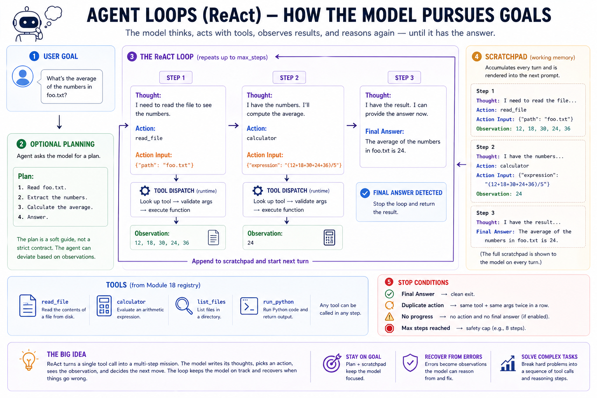
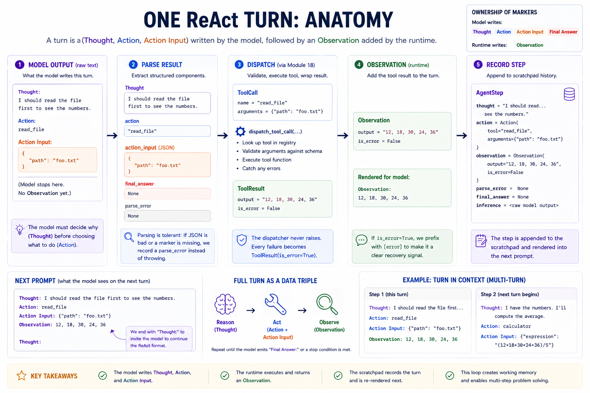
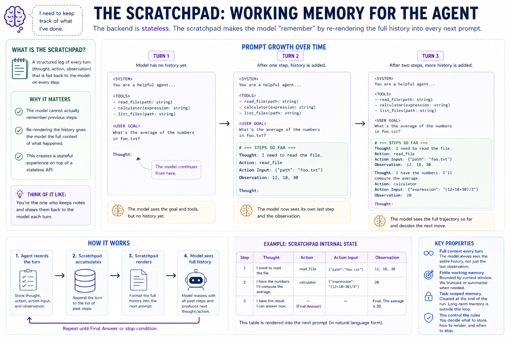

# Module 19 — Agent loops

> **Question this module answers:** *How do we make the model pursue goals?*



*The agent loop is a thin wrapper around tool dispatch: it adds explicit reasoning, persistent memory (the scratchpad), an optional plan, smarter stop conditions, and graceful recovery from tool errors. The model still does all the cognitive work; the agent loop just keeps it on rails.*

---
## Before you start

* *Finish* `g2c/tools` from [[18-tools]] — the agent dispatches through `dispatch_tool_call`, reusing the registry, schema validation, and error wrapping
* *Finish* `g2c/inference` from [[16-inference]] — the agent calls `backend.complete(...)` for every reasoning step
* *Configure* ProdLM with `./prodlm.sh --model-id llama3.2:3b` or another local instruction model — the exercises need a model that can follow ReAct-style formatting
* *Refresh* JSON request/response patterns — tool inputs and tool results are structured data even when the model emits them as text
* *Refresh* basic regular expressions — the parser extracts line-oriented markers from free-form model completions

---
## Where this fits in

Module 16 gave us a stable model backend. Module 17 added retrieval. Module 18 gave the model tools. Now we need the runtime pattern that lets the model pursue a goal across several calls, observe what happened, recover from mistakes, and eventually stop.

Introducing tools fixed the "model needs to call a function" problem. But many real tasks need a *sequence* of calls, where each call depends on what the last one revealed:

```
   ┌───────────────────────────────────────────────────────────────────────┐
   │  TASKS THAT NEED MORE THAN ONE TOOL CALL                              │
   ├───────────────────────────────────────────────────────────────────────┤
   │                                                                       │
   │   • "Summarize the longest file in this directory":                   │
   │       1. list files                                                   │
   │       2. read each, find the longest                                  │
   │       3. read that one fully                                          │
   │       4. write the summary                                            │
   │                                                                       │
   │   • "What's the average of the numbers in foo.txt?":                  │
   │       1. read foo.txt                                                 │
   │       2. parse numbers                                                │
   │       3. compute average                                              │
   │                                                                       │
   │   • "Find a Python error in this snippet":                            │
   │       1. read the file                                                │
   │       2. run it                                                       │
   │       3. read the error                                               │
   │       4. propose a fix                                                │
   │                                                                       │
   │                                                                       │
   └───────────────────────────────────────────────────────────────────────┘
```

The tool loop from Module 18 can keep calling tools, but it does not give the model an explicit place to reason between calls. The model has to choose the next action directly from the running transcript. 

A key insight we gained last week is that while inference itself is inherently stateless, we can simulate "memory" between successive calls by supplying the previous interactions into the prompt of the next interaction. We used that paradigm to interact with external tools. But in this lesson we'll learn how that framework can be extended to supporting thinking, planning, and goal directed multi-step action. 

In this lesson, we are now past the point where we focus on improving the model itself. Instead we are now in the realm of **prompt engineering** where we make the same models smart with intelligently structured prompts.

## The big idea

An **agent** is a goal-directed inference loop. It calls a model, interprets the model's output, optionally takes an action in the outside world, records what happened, and calls the model again with that record included in the next prompt.

The **agent harness** is the deterministic software that runs this loop. The model still does ordinary inference. The harness gives that inference a structure: memory through an accumulated transcript, actions through tools, and stop conditions so the loop can finish or fail closed.

The **transcript** is the full record of one run. In this module, the part of the transcript rendered into each prompt has two pieces. The initial **prompt context** contains system instructions, tool descriptions, the user's goal, and sometimes an optional plan. The **scratchpad** is the part that grows: the model's thoughts, requested actions, action inputs, and tool observations. The full prompt for each model call is rebuilt from both pieces:

```text
prompt = prompt_context + scratchpad + "Thought:"
```

That final `Thought:` is the cue for the next step. It tells the model to continue in the format the harness knows how to parse.

No new math, no training, no changes to the underlying model. Just a structured runtime around repeated model calls that gives the model memory, tools, and control flow for complex tasks.

### ReAct

The pattern we build in this module is **ReAct**, short for **reasoning + acting**. Instead of asking the model to jump directly from a user request to a final answer, ReAct asks the model to alternate between deciding what to do next and taking an action.

A tool-using ReAct step has four fields:

```text
Thought: I need to inspect the file before answering.
Action: read_file
Action Input: {"path": "numbers.txt"}
Observation: 3
7
10
20
```

The model writes `Thought`, `Action`, and `Action Input`. The runtime executes the action and appends `Observation`. Then the next model call sees the updated scratchpad.

This is powerful because many useful tasks cannot be solved in one model call. The model may need to read a file, run a calculation, inspect an error, search a document, or recover from a bad tool call. ReAct gives the model a structured place to reason between those steps.

A ReAct run ends when the model stops acting and emits a final answer:

```text
Thought: I now know the final answer.
Final Answer: The average is 10.
```

A key empirical finding from the ReAct paper is that models do better on multi-step tool-use tasks when reasoning and action are separated. The `Thought` line gives the model a place to commit to *why* it is about to call a tool. Without that separation, models often conflate reasoning and action, and tool selection gets noisy.

In simplified pseudocode:

```python
plan = maybe_make_plan(user_goal, tools)
prompt_context = build_prompt_context(user_goal, tools, plan)
scratchpad = []

for step in range(max_steps):
    prompt = render(prompt_context, scratchpad) + "\nThought:"
    model_output = model(prompt)
    parsed = parse_react_step(model_output)

    if parsed.final_answer is not None:
        return parsed.final_answer

    observation = run_tool(parsed.action)
    scratchpad.append(parsed.thought, parsed.action, observation)

return stopped_without_answer
```

Each piece is small. The parser extracts structure from model text. The tool dispatcher turns actions into observations. The scratchpad records the working trace. Stop conditions prevent the loop from running forever.

![Agent state machine — the ReAct loop. A flowchart of `Agent.run` from start to exit. (1) INITIALIZE: build the system prompt; optionally call `make_plan(...)` for a goal + numbered steps; create an empty Scratchpad. (2) MAIN STEP: render the prompt (system + plan + user message + scratchpad + trailing `Thought:`); call `backend.complete(...)`; receive a completion. (3) PARSE: `parse_react_step(completion)` extracts a `ParsedStep(thought, action, final_answer, parse_error)`. (4) BRANCH: if `final_answer` present → return clean exit (`stopped_reason="final_answer"`); if `action` present → dispatch through Module 18's `dispatch_tool_call`, build an `Observation`, append `AgentStep` to scratchpad, loop; if neither (parse error or stuck) → if `halt_on_stuck` halt with `no_progress`, else record a parse-error observation and continue. (5) STOP-CONDITION CHECK (after each step): if duplicate action with `loop_detection=True` → halt with `duplicate_action`; if `max_steps` reached → halt with `max_steps`. A right-side panel pins the four stop conditions: `final_answer` (clean), `duplicate_action` (loop detection), `no_progress` (stuck step + halt_on_stuck), `max_steps` (safety net). A "scratchpad format" sidebar shows how each step renders back into the next prompt. A "key idea" callout at top: the agent repeatedly asks the model what to do next, executes the chosen action, and keeps going until either a final answer appears or a stop condition fires.](19-agent/Module19-Loop.png)
*The control-flow picture for `Agent.run`: model output is parsed, actions are dispatched, observations go into the scratchpad, and the next prompt is rebuilt from that state.*

### One ReAct step


*Inside one iteration of the loop.*

```
   ┌──────────────────────────────────────────────────────────────────────┐
   │   ONE REACT STEP                                                     │
   ├──────────────────────────────────────────────────────────────────────┤
   │                                                                      │
   │     model emits:                                                     │
   │         Thought: I need to add 21 and 21 to get the answer.          │
   │         Action: calculator                                           │
   │         Action Input: {"expression": "21 + 21"}                      │
   │                                                                      │
   │     parser extracts:                                                 │
   │         thought  = "I need to add 21 and 21 to get the answer."      │
   │         action   = Action(tool="calculator",                         │
   │                           arguments={"expression": "21 + 21"})       │
   │                                                                      │
   │     dispatcher (Module 18) executes:                                 │
   │         result = ToolResult(output="42", is_error=False)             │
   │                                                                      │
   │     agent records:                                                   │
   │         observation = Observation(output="42", is_error=False)       │
   │         AgentStep(thought, action, observation, ...)                 │
   │                                                                      │
   │     scratchpad renders for next step:                                │
   │         Thought: I need to add 21 and 21 to get the answer.          │
   │         Action: calculator                                           │
   │         Action Input: {"expression": "21 + 21"}                      │
   │         Observation: 42                                              │
   │                                                                      │
   └──────────────────────────────────────────────────────────────────────┘
```

The model sees prior `Thought` / `Action` / `Action Input` / `Observation` blocks on every subsequent step. It gets to read its own working history and decide what to do next. This is the scratchpad's job: turn stateless `complete(prompt)` calls into a stateful loop.

### The scratchpad


*Each prompt is built from stable prompt context plus the growing scratchpad.*

```
   ┌──────────────────────────────────────────────────────────────────────┐
   │   PROMPT GROWTH — STEP BY STEP                                       │
   ├──────────────────────────────────────────────────────────────────────┤
   │                                                                      │
   │   Step 1 prompt:                                                     │
   │       <system>                                                       │
   │       <tools>                                                        │
   │       <plan, optional>                                               │
   │       Question: <user msg>                                           │
   │       Thought:                  ← model continues from here          │
   │                                                                      │
   │   Step 2 prompt (step 1's work trace now visible):                   │
   │       <system>                                                       │
   │       <tools>                                                        │
   │       <plan, optional>                                               │
   │       Question: <user msg>                                           │
   │                                                                      │
   │       Thought: <step 1 thought>                                      │
   │       Action: <step 1 action.tool>                                   │
   │       Action Input: <step 1 action.arguments>                        │
   │       Observation: <step 1 observation>                              │
   │                                                                      │
   │       Thought:                  ← model continues from here          │
   │                                                                      │
   │   Step 3 prompt (step 1 + step 2 visible):                           │
   │       ...                                                            │
   │       <step 1 block>                                                 │
   │                                                                      │
   │       <step 2 block>                                                 │
   │                                                                      │
   │       Thought:                  ← model continues from here          │
   │                                                                      │
   └──────────────────────────────────────────────────────────────────────┘
```

The **prompt context** is mostly stable: system instructions, tool descriptions, the user's goal, and maybe a plan. The **scratchpad** is the part that grows: one block per ReAct step. The broader **transcript** is the full record of the run, but the scratchpad is the specific working section the agent renders back into the next prompt.

This append-only layout also matters for efficient inference. With a KV cache, the model can reuse the cached keys and values for the unchanged prefix of the prompt and only compute the newly appended tokens. That works best when each step preserves the previous prompt exactly and appends the new scratchpad block at the end. If the harness rewrites earlier text, reorders blocks, or edits old observations, the cached prefix no longer matches and the backend has to recompute more of the prompt.

### The marker contract

ReAct's text protocol has five named markers:

```
Thought:        # reasoning text, written by the model
Action:         # tool name, written by the model
Action Input:   # JSON object, written by the model
Observation:    # tool result, injected by the runtime
Final Answer:   # user-facing answer, written by the model
```

For a tool step, the model emits `Thought`, `Action`, and `Action Input`. The runtime appends `Observation` and asks for the next step. When the model has enough information, it emits `Thought` and `Final Answer`, and the loop exits.

Why these markers and not, say, `<thought>...</thought>` XML?

- **It is the canonical ReAct format.** Yao et al. introduced these markers, and many instruction-tuned models have seen them.
- **It is easy to parse.** Each marker is a fixed string at line start.
- **It separates reasoning from action.** The parser can extract the tool call without treating the free-form thought as structured data.

### Errors are observations, not crashes

```
   ┌──────────────────────────────────────────────────────────────────────┐
   │  WHAT HAPPENS WHEN A TOOL CALL GOES WRONG                            │
   ├──────────────────────────────────────────────────────────────────────┤
   │                                                                      │
   │   Model emits:                                                       │
   │       Action: nonexistent_tool                                       │
   │       Action Input: {"x": "y"}                                       │
   │                                                                      │
   │   Module 18's dispatch_tool_call returns:                            │
   │       ToolResult(output="no tool named 'nonexistent_tool'; ...",     │
   │                  is_error=True)                                      │
   │                                                                      │
   │   The agent wraps:                                                   │
   │       Observation(output="no tool named ...", is_error=True)         │
   │                                                                      │
   │   The scratchpad renders for the next step:                          │
   │       Thought: <model's thought>                                     │
   │       Action: nonexistent_tool                                       │
   │       Action Input: {"x": "y"}                                       │
   │       Observation: [error] no tool named 'nonexistent_tool'; ...     │
   │                          ^^^^^^^                                     │
   │                          this prefix is the recovery signal          │
   │                                                                      │
   │   Model sees its own bad action followed by [error] ..., decides     │
   │   what to do differently, and emits the corrected action on the      │
   │   next step. No stack trace. No loop crash. No lost conversation.    │
   │                                                                      │
   └──────────────────────────────────────────────────────────────────────┘
```

The dispatcher from Module 18 wraps tool failures as `ToolResult(is_error=True)`. The agent converts that into `Observation(is_error=True)` and renders it with an `[error]` prefix. The loop does not crash just because the model chose a bad tool or malformed argument. It feeds the error back to the model as information.

### Stop conditions, layered

```
   ┌──────────────────────────────────────────────────────────────────────┐
   │  STOP CONDITION TABLE                                                │
   ├──────────────────────────────────────────────────────────────────────┤
   │                                                                      │
   │   stopped_reason   when it fires           what it means             │
   │   ──────────────   ─────────────────       ────────────────────────  │
   │   final_answer     model emitted Final     clean exit, model is done │
   │                    Answer                                            │
   │                                                                      │
   │   duplicate_       same action + same      model didn't understand   │
   │     action         args two steps in a     its last observation, is  │
   │                    row, with               looping. Stop.            │
   │                    loop_detection=True                               │
   │                                                                      │
   │   no_progress      neither action nor      model emitted prose with  │
   │                    final answer, with      no structured content.    │
   │                    halt_on_stuck=True      Halt rather than retry.   │
   │                                                                      │
   │   max_steps        loop ran out of         the safety net. Returns   │
   │                    iterations              final_answer=None — the   │
   │                                            model never decided to    │
   │                                            stop. Tune max_steps for  │
   │                                            the task.                 │
   │                                                                      │
   └──────────────────────────────────────────────────────────────────────┘
```

The default Agent has `loop_detection=True`, `halt_on_stuck=False`, `max_steps=8`. That combination handles:
- Clean tasks: model emits Final Answer in 1-3 steps. ✓
- Tasks with a tool error: model recovers (the `[error]` observation feeds back). ✓
- Tasks where the model loops: `loop_detection` cuts it off. ✓
- Tasks where the model goes off-format: parse-error observation feeds back; it usually recovers. ✓
- Truly bad situations: `max_steps` cuts off after 8 steps. ✓

Tuning these per-task is a real consideration — `loop_detection=False` for legitimate-retry workflows; `halt_on_stuck=True` when the model has only one shot at format compliance; smaller / larger `max_steps` for one-shot vs. long-task agents.

## Concepts to internalize

- **A turn is a triple, not an utterance.** The model's per-turn output isn't free-form text; it's structurally `(thought, action OR final_answer)`. The parser's job is to extract that structure; the loop's job is to feed it back. Treating the model as a structured-output device is what makes everything work.

- **The scratchpad turns stateless inference into state.** Each backend.complete is a memoryless function call. The scratchpad makes the model *appear* to remember by re-rendering history into every subsequent prompt. The model isn't actually remembering; the prompt is.

- **Errors are part of the conversation.** Module 18's "errors as data" extends to multi-step: the agent's loop survives model wobble (bad parse, unknown tool, bad args, runtime exception) and feeds it back as the next turn's observation. After a few attempts, confused models often find their way to a working answer because the errors are conversational, not crashes.

- **Planning is a soft prior, not a hard contract.** The Plan is rendered into the prompt and helps the model stay on track, but the model is free to deviate. The plan is most useful for tasks with obvious structure ("read X, transform Y, write Z"); least useful for tasks where the model just needs to call one tool.

- **Loop detection is a heuristic, but a useful one.** Same tool + same args two steps in a row catches the most common loop pattern (model didn't understand the observation, retries identical call). It's not a proof of looping; the flag exists so you can opt out for legitimate-retry tasks.

- **The trailing `Thought:` nudge is load-bearing.** Without it, instruction-tuned models often start the next turn with prose ("I think we should..."), which the parser tolerates but which costs tokens and accuracy. The `_build_prompt` helper appends `\n\nThought:` after the scratchpad; this is what keeps the model in format.

- **`max_steps` exists because models can lose the thread.** The combination of "nothing in the prompt actually requires the model to stop" and "context length is finite" means you need a hard cap. Module 18 had `max_steps=5`; Module 19 defaults to `8` because a planned task often needs the planning step + 3-5 tool calls + the final answer. Tune per-task.

### What we don't cover

- Tree-of-thoughts, reflection loops, async/parallel agents, streaming parsers, and supervisor-worker systems.
- **Production sandboxing**. All Module 18 caveats still apply: the local `run_python` tool is pedagogical, not a hosted-agent sandbox.
- **Token-aware context management and long-term memory.** Module 19 uses a simple scratchpad; Module 20 layers on conversation-level assistant behavior.


---
## What you'll build

Package: `g2c/agent/`

```python
# base.py
@dataclass(frozen=True)
class Action:                                                     # implemented
    tool: str
    arguments: dict[str, Any]

@dataclass(frozen=True)
class Observation:                                                # implemented
    output: str
    is_error: bool = False

class AgentError(Exception): ...                                  # implemented

@dataclass
class Plan:                                                       # implemented
    goal: str
    steps: list[str] = field(default_factory=list)

@dataclass
class AgentStep:                                                  # implemented
    completion: str
    thought: str
    action: Action | None
    observation: Observation | None
    final_answer: str | None
    parse_error: str | None
    inference: InferenceResult

@dataclass
class AgentRunResult:                                             # implemented
    user_message: str
    plan: Plan | None
    final_answer: str | None
    steps: list[AgentStep]
    stopped_reason: str
    metadata: dict[str, Any] = field(default_factory=dict)


# parser.py
@dataclass(frozen=True)
class ParsedStep:                                                 # implemented
    thought: str
    action: Action | None
    final_answer: str | None
    parse_error: str | None

def parse_react_step(text) -> ParsedStep: ...                     # SCAFFOLDED


# memory.py
class Scratchpad:                                                 # implemented
    def __init__(self, *, max_chars=None): ...
    def append(self, step) -> None: ...
    def steps(self) -> list[AgentStep]: ...
    def render(self) -> str: ...                                  # SCAFFOLDED

# planner.py
def extract_plan(text, user_message) -> Plan | None:              # SCAFFOLDED
    ...

def make_plan(backend, user_message, registry, **kw) 
	-> Plan | None: ...                                           # implemented


# prompts.py
def render_system_prompt(tools) -> str: ...                       # implemented
def render_planning_prompt(user_message, tools) -> str: ...       # implemented
def render_plan_block(goal, steps) -> str: ...                    # implemented


# agent.py
class Agent:
    def __init__(self, backend, registry, *,                      # implemented
                 max_steps=8, plan=True, loop_detection=True,
                 halt_on_stuck=False, scratchpad_max_chars=None,
                 max_new_tokens=512, temperature=0.2,
                 top_k=None, top_p=None): ...

    def _build_prompt(self, user_message, plan, scratchpad) 
	    -> str: ...                                               # implemented

    def run(self, user_message) -> AgentRunResult:                # SCAFFOLDED
        ...
```

Total scaffolded code: roughly 100 lines across four function bodies. The lesson is the contracts (parsing, scratchpad rendering, plan extraction, loop control). The orchestration is layout.

## How to run the tests

Tests live in `tests/test_agent.py`. Initial state: 45 tests pass, 76 tests fail

```bash
source .venv/bin/activate

pytest tests/test_agent.py                          # all module-19 tests
pytest tests/test_agent.py -x                       # stop at first failure
pytest tests/test_agent.py -k Parse                 # parser tests
pytest tests/test_agent.py -k Plan                  # planner tests
pytest tests/test_agent.py -k Scratchpad            # scratchpad tests
pytest tests/test_agent.py -k AgentRun              # main loop tests
pytest tests/test_agent.py -k Integration           # full-pipeline smoke
pytest tests/test_agent.py -v                       # verbose
```

## Exercises

Open the working notebook with `.venv/bin/python scripts/open_notebook.py 19`. These exercises require ProdLM running through Ollama with a local instruction model that can follow ReAct-style formatting; run `./prodlm.sh` first if needed.

1. **One-shot calculator.** Compare simple tool use with and without planning.
2. **Multi-step file task.** Read data, compute with a tool, and answer.
3. **Loop detection.** Compare runs with loop detection on and off.
4. **Plan contribution.** Measure whether explicit planning helps multi-tool tasks.
5. **Recovery characterization.** Study behavior after tool errors.
6. **Custom tool.** Add a domain-specific affordance and test how the agent uses it.
7. **Scratchpad cap.** Explore transcript truncation and reasoning continuity.
8. **Deliverable CLI.** Build an interactive agent loop.
9. **Failure-mode catalog.** Name concrete agent failures and mitigations.
10. **Compare Module 18.** Identify where ReAct earns its overhead.

## Pitfalls to expect

- **The `\s*` newline-gobbling regex bug in the parser.** A regex like `r"Action\s*:\s*([^\n]+)"` looks safe but `\s*` matches *all* whitespace including `\n`. Given input `"Action:\nAction Input: ..."` it consumes the newline and captures the next line's content as the action name. The fix: post-colon whitespace must be `[ \t]*` (horizontal only). The test `test_thought_does_not_eat_next_marker` pins this; if it fails or your action names look like "Action Input: {...}", this is the bug.

- **Final Answer not winning over Action.** When the model emits both, Final Answer must be authoritative (the model is signaling "I'm done"). If the parser returns the Action, the loop keeps going past where it should stop — burning tokens and confusing the model.

- **Empty Final Answer treated as a real answer.** The parser should treat `"Final Answer:"` followed by nothing (or whitespace) as a parse error, not a valid empty answer. Returning a blank `final_answer=""` to the user is rarely what you want.

- **`json.dumps(args)` vs `repr(args)` in the scratchpad.** Python repr uses single quotes (`{'key': 'value'}`); JSON uses double (`{"key": "value"}`). The model originally emitted JSON; rendering back as Python repr trains it to think the format changed mid-conversation. Always `json.dumps`.

- **Forgetting the `[error]` prefix on error observations.** Without it, the model often parrots the error string back as if it were a successful answer ("The calculator returned: missing required arguments"). With it, instruction-tuned models reliably treat the observation as a recovery signal.

- **Forgetting the trailing `Thought:` nudge after the scratchpad.** Without it, instruction-tuned models often start the next turn with prose ("I think we should..."), which the parser tolerates but which costs tokens and accuracy. The `_build_prompt` helper appends `\n\nThought:` after rendering everything else; if you remove it, format compliance drops.

- **Loop detection comparing args via `==` on dicts.** Two dicts with the same keys in different insertion order can compare equal in Python (since 3.7's preserved insertion order doesn't affect `==`), but the safer approach is `json.dumps(args, sort_keys=True)` — it's explicitly canonical and works even if you switch to `OrderedDict` somewhere.

- **Loop detection over too long a window.** Comparing the last action against ALL prior actions (instead of just the immediately preceding one) catches more loops but also catches legitimate retries (paginated reads, re-checks). The simple "two in a row" rule is a tradeoff; tighten it only if you know you need to.

- **Halt-on-stuck triggering on a single bad parse.** Models occasionally emit a single weird turn (a code fence around their reasoning, an extra `Observation:` they shouldn't have produced) and the next turn is fine. With `halt_on_stuck=True`, you cut them off after one strike. Default `False` is more forgiving; flip to `True` only when you have a good reason.

- **Plan rendered into the prompt but the model ignores it.** This is fine — the plan is a soft prior, not a hard contract. If the model deviates because the world doesn't match the plan, that's *good* behavior. If you want hard plan enforcement, you'd build a different system (state-machine agent, plan-verifier wrapper). Module 19 does soft planning by design.

- **`make_plan` raising and crashing the run.** The agent's `run` method wraps the planning call in `try/except` and falls through to `plan=None` on any exception. If you replace `make_plan` with a stricter version that raises, the whole run dies. The graceful-degradation contract is load-bearing.

- **Running on the from-scratch Module 10 model.** Your self-trained StudentLM/StoryLM artifact was not trained on ReAct or tool-use data. It may generate text, but it will not reliably follow the agent markers. Use ProdLM with an instruction-tuned model for the main path. Module 16's caveat continues to apply: the from-scratch model is for comparison, not the required agent backend.

- **`max_steps` calibrated wrong.** Default is 8. If the model needs to call several tools sequentially after a planning step, 8 might not be enough. If the model loops on bad calls, 8 might be too generous. Tune per-task; check `result.stopped_reason == "max_steps"` to know when you've hit the cap.

- **Forgetting Module 18's `validate_arguments` is still scaffolded.** The agent's tool dispatch goes through `dispatch_tool_call` → `validate_arguments`. If you build Module 19 without finishing Module 18's scaffold first, the integration tests will fail with `NotImplementedError` from inside the dispatcher. Finish 18 → test 18 → start 19.

- **`scratchpad_max_chars` set too low.** If the cap is smaller than a typical step's rendered size, the scratchpad ends up rendering only the very last step, and the model effectively forgets what it just tried. The cap should be at LEAST a few times the average step size; production agents usually summarize old steps instead of dropping them.

- **Confusing `Action.tool` (Module 19) with `ToolCall.name` (Module 18).** They mean the same thing but use different field names. The agent's parser produces `Action(tool=...)`; the dispatcher needs `ToolCall(name=...)`. The agent module's `run` does the conversion — if you build a custom dispatch path, watch for this.


## M-series notes

This module is comfortable on every M-series Mac. Practical considerations:

- **Each step is one backend call.** A typical run is 1 (planning) + 3-6 (loop) = 4-7 backend calls. With Ollama + Llama 3.2 3B at ~50 tokens/sec on M1, each step is 1-3 seconds; full runs are 10-20 seconds. A stronger 7B-8B model is slower but follows multi-step ReAct prompts better; on M1/16GB it is borderline-comfortable, on M2+/32GB it is smooth.

- **Context length grows with step count.** A 5-step run with verbose tool results easily reaches 4-8k tokens of prompt. Llama 3.2's 128k context window is comfortable; smaller-context models would force aggressive scratchpad truncation. The default `scratchpad_max_chars=None` (unlimited) works for 8-step runs; for longer agents, set a cap and add a summarization pass.

- **Subprocess startup cost dominates `run_python`.** All Module 18 caveats apply — `subprocess.run([sys.executable, "-c", code])` pays ~50-200ms per call on M-series. If `run_python` is called frequently, the agent's wall time becomes dominated by subprocess startup. Module 18's pitfall section discusses the long-lived child-process variant; out of scope here, but worth knowing.

- **Planning latency.** The planning phase is one extra backend call (~1-3 seconds with Llama 3.2:3b). For one-shot tasks this is pure overhead; for multi-step tasks it pays off. Disable with `plan=False` when the task is obviously single-step.

- **Memory considerations are inherited from Module 16/18.** The agent loop itself is pure Python plumbing — microseconds per step. The model's inference is the memory-hungry part, and the requirements are the same as Modules 16, 17, 18.

---
## Reading

Primary:

- **Yao, Zhao, Yu et al., "ReAct: Synergizing Reasoning and Acting in Language Models" (ICLR 2023).** The paper this module is built around. Read §2 (the prompt format) and §3 (HotpotQA, ALFWorld results). The key empirical finding: explicit `Thought:` interleaving improves both reasoning and tool selection over either alone. Most of the prompt template choices in this module trace directly to this paper.

- **Anthropic, "Building effective agents" (Dec 2024).** A practical taxonomy of agentic patterns: prompt chains, routing, parallelization, orchestrator-workers, evaluator-optimizer, ReAct. Read it after you finish this module to see where ReAct sits in the broader landscape and which patterns are worth investing in next. The "augmented LLM = LLM + tools + memory + retrieval" framing in §1 is exactly what Modules 17-19 built.

- **Wang, Xu, Lan et al., "Plan-and-Solve Prompting" (ACL 2023).** The paper behind the planning phase. Empirically: a separate planning step, then a separate execution step, beats one-shot ReAct on multi-step reasoning tasks. Module 19's optional planning phase is the simplest possible version of this idea.

Secondary:

- **Park, O'Brien, Cai et al., "Generative Agents: Interactive Simulacra of Human Behavior" (UIST 2023).** A small town of LLM-driven agents with memory, planning, and reflection. The architecture diagram in §4 (memory stream → reflection → plan → action) is the next conceptual step beyond Module 19. Skim for the architecture overview; the simulation itself is interesting but not directly applicable.

- **Shinn, Cassano, Berman et al., "Reflexion: Language Agents with Verbal Reinforcement Learning" (NeurIPS 2023).** Adds a "review your last attempt" step where the agent self-critiques and tries again. Useful when verification is cheap (test pass/fail) and generation is expensive. Not built here, but the design space is right next to ReAct.

- **Liu, Li, Du et al., "AgentBench: Evaluating LLMs as Agents" (ICLR 2024).** A benchmark suite covering tool use, web browsing, OS interaction, and game-playing. The most-useful section is the per-task error analysis in §4 — patterns of failure (planning errors, tool selection errors, loops) that any agent builder hits. Worth reading as a "what should I be measuring" reference.

Optional:

- **Yao, Yu, Zhao et al., "Tree of Thoughts" (NeurIPS 2023).** Generalizes ReAct to a search over multiple reasoning paths with backtracking. Skim §3 — the BFS / DFS over thought trees is a real architectural step beyond straight-line ReAct, but at substantial cost (each thought node is a backend call).

- **Jimenez, Yang et al., "SWE-bench" (ICLR 2024).** Real-world software-engineering agent benchmark — actual bug fixes from real GitHub issues. Skim §3 for the task structure and §5 for the leaderboard. Useful as a "what does production agentic actually look like" reference; humbling about how far simple ReAct gets you (it doesn't).

- **Mialon, Dessì, Lomeli et al., "Augmented Language Models: a Survey" (TMLR 2023).** A survey of tool use, retrieval, reasoning chains, and agent loops as of late 2022. Good for situating ReAct in a broader context. Slightly outdated but still the best survey.

## Deliverable checklist

- [ ] All tests in `tests/test_agent.py` pass: 121 tests, all green.
- [ ] ProdLM configured and Ollama running. `ollama list` shows `llama3.2:3b` (or your chosen model).
- [ ] Notebook: `notebooks/19-agent.ipynb`. Wires `Agent` + a multi-tool registry, runs Exercises 1, 2, 3, 4 with output cells visible.
- [ ] **Failure-mode catalog** (Exercise 9) in `docs/agent-failure-modes.md`. Three failure modes, each with a transcript, hypothesis, and proposed mitigation. The actual deliverable.
- [ ] You can explain — out loud, without notes — why the parser must use `[ \t]*` instead of `\s*` after the markers' colons.
- [ ] You can explain — out loud, without notes — why Final Answer wins over Action when both appear in the same completion.
- [ ] You can explain — out loud, without notes — why the scratchpad renders the model's *own* past Thought lines back into the prompt (and not just observations).
- [ ] You can explain — out loud, without notes — what the four stop conditions are and when each fires.
- [ ] You can explain — out loud, without notes — why errors are propagated as `Observation(is_error=True)` rather than raised as exceptions, and what changes in the model's behavior because of the `[error]` prefix.
