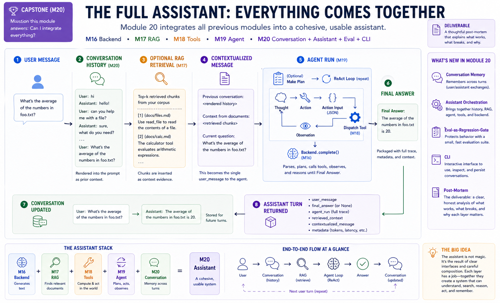
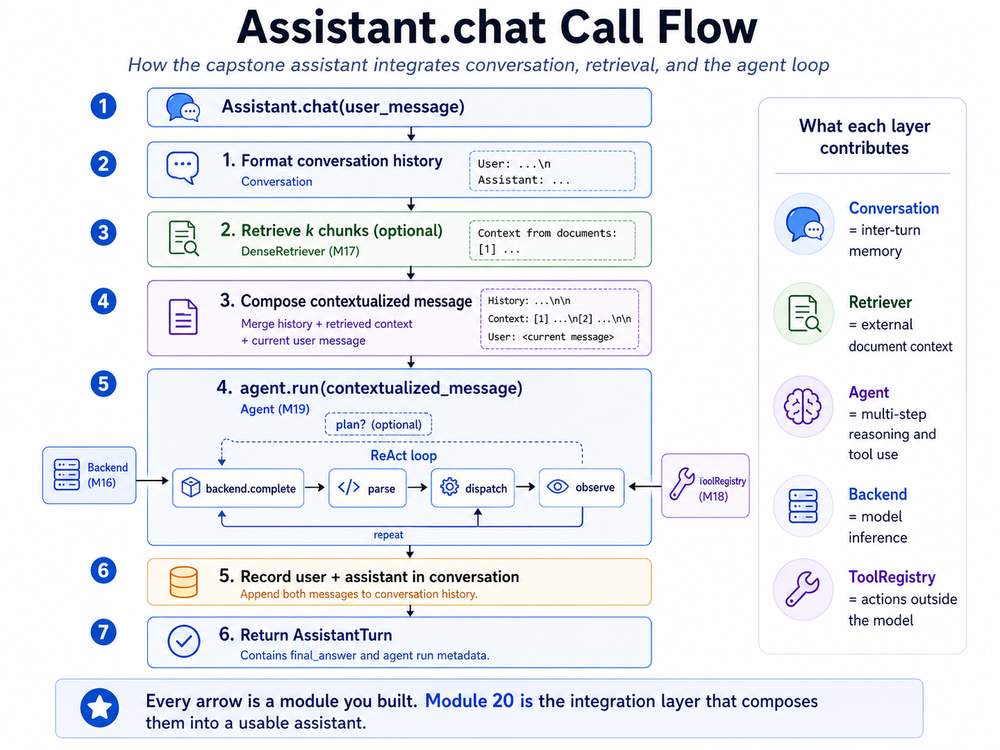

# Module 20 — Capstone: TinyGPT

> **Question this module answers:** *Can I integrate everything?*



By the end of this module you will have a working chat assistant — and, more importantly, a characterization of where each layer earns its keep, where it breaks down, and where the from-scratch model stops being viable.

---
## Before you start

* *Finish* `g2c/agent` from [19-agent](19-agent.md) — `Assistant.chat` wraps `Agent.run`, threading conversation history into each turn
* *Finish* `g2c/tools` from [18-tools](18-tools.md) and `g2c/inference` from [16-inference](16-inference.md) — the assistant supplies the tool registry and backend that the agent runs against
* *Finish* `g2c/rag` from [17-rag](17-rag.md) (optional) — only needed if you wire prefix-style retrieval into the assistant

---
## Where this fits in

Module 20 is the capstone. It introduces very little new machinery. The work is integration: compose the backend, retriever, tools, agent loop, conversation memory, eval gate, and CLI into one assistant you can actually use.

You've built nineteen modules. Module 1 was a basic autograd engine; Module 10's pretraining was a real loss curve on a real corpus; Module 19's agent was a multi-step ReAct loop with error recovery. The components are all there. They've been tested in isolation but never *together*.

The capstone is where you find out:

```
   ┌───────────────────────────────────────────────────────────────────────┐
   │  THINGS YOU LEARN BY ASSEMBLING                                       │
   ├───────────────────────────────────────────────────────────────────────┤
   │                                                                       │
   │   • Where does each layer EARN its keep?                              │
   │       - The from-scratch model (M10) generates fluent text but        │
   │         can't follow chat instructions reliably.                      │
   │       - SFT (M13) makes it follow prompts.                            │
   │       - DPO (M14) makes it polite.                                    │
   │       - The pretrained pivot (M16) brings real-world knowledge.       │
   │       - RAG (M17) brings YOUR-corpus knowledge.                       │
   │       - Tools (M18) bring computation and side effects.               │
   │       - The agent loop (M19) brings multi-step reasoning.             │
   │       - Conversation memory (M20) makes it usable.                    │
   │                                                                       │
   │   • Where does each layer BREAK?                                      │
   │       - The model's responses get repetitive at low temperature.      │
   │       - The retriever picks the wrong chunks on ambiguous queries.    │
   │       - The agent loops on poorly-described tools.                    │
   │       - The conversation drifts when context exceeds the cap.         │
   │       - Some questions need three of these all at once and one of     │
   │         them goes wrong, masking the others.                          │
   │                                                                       │
   │   • Where does the from-scratch model STOP being viable?              │
   │       - Anywhere that depends on instruction-tuning, world            │
   │         knowledge, or multi-step reasoning. (Spoilers: most           │
   │         interesting tasks.)                                           │
   │       - The capstone uses ProdLM, a local pretrained instruction      │
   │         model, for this reason. The from-scratch model lives on as    │
   │         a comparison baseline — you can swap it in via                │
   │         `LocalTransformerBackend` and feel the gap.                   │
   │                                                                       │
   └───────────────────────────────────────────────────────────────────────┘
```

The post-mortem at the end of this module is the deliverable that compresses these observations into a permanent record. It's the actual learning outcome of the course.

```
   ┌──────────────────────────────────────────────────────────────────────┐
   │  THE ASSISTANT'S CALL FLOW                                            │
   └──────────────────────────────────────────────────────────────────────┘

      Assistant.chat(user_message)
          │
          ├── 1. format conversation history       ── Conversation
          │       "User: ...\nAssistant: ..."
          │
          ├── 2. retrieve k chunks (optional)      ── DenseRetriever (M17)
          │       "Context from documents:\n..."
          │
          ├── 3. compose contextualized message
          │       <history>\n\n<context>\n\n<user_message>
          │
          ├── 4. agent.run(contextualized)         ── Agent (M19)
          │       │
          │       ├── plan?    backend.complete    ── Backend (M16)
          │       └── ReAct loop:
          │             complete → parse → dispatch → observe ──── repeat
          │                                          │
          │                                          ToolRegistry (M18)
          │
          ├── 5. record user + assistant in conversation
          │
          └── 6. return AssistantTurn
```

Every arrow is a module you built. The integration layer is small (~100 lines of new code in `Conversation` and `Assistant`); the substrate is everything else.


*The architecture diagram for `Assistant.chat`. Each step in this flow corresponds to a method or class you've already built in earlier modules; Module 20's contribution is the `Conversation` and `Assistant` primitives plus the orchestration that threads them together. Tracing one user question through this diagram is the fastest way to see where the integration layer earns its keep.*

## The big idea

Module 20 is the integration layer. Earlier modules built the parts; this module decides what data flows between them, what state survives across calls, and what gets logged so you can debug behavior.

The core path is:

```text
user message
  -> Conversation.format_for_prompt()
  -> optional retrieval context
  -> contextualized message
  -> Agent.run(...)
  -> final answer
  -> append user + assistant messages to Conversation
  -> evaluate / save / continue
```

There is no new model architecture here. The assistant is useful because the runtime composes the model with memory, retrieval, tools, an agent loop, and a regression gate.

### Two memory layers


*Conversation is the assistant's inter-turn memory; scratchpad is the agent's intra-turn working memory. They solve different problems and should not be merged.*

Module 19's **scratchpad** lives inside one `Agent.run`. It records ReAct steps: thoughts, actions, action inputs, and observations. When that agent run ends, the scratchpad is done.

Module 20's **conversation** lives across many `Assistant.chat` calls. It records user and assistant messages. It is what lets the user say "do that again" or "now use the previous answer" in a later chat turn.

```text
Conversation: across the chat session
  User: what is 7 * 8?
  Assistant: 56
  User: multiply that by 3

Scratchpad: inside one Agent.run
  Thought: I need to use the prior answer.
  Action: calculator
  Action Input: {"expression": "56 * 3"}
  Observation: 168
```

The separation is load-bearing. If you put old scratchpad traces into the conversation, the model may repeat stale tool calls from finished tasks. If you omit conversation history, ordinary follow-ups stop making sense.

### The contextualized message

`Assistant.chat` does not pass the raw user message directly to the agent. It first builds a **contextualized message**:

```text
Previous conversation:
User: hi
Assistant: hello
User: what's the weather?
Assistant: I don't have a weather tool yet.

Context from documents:
[1] (source: docs/weather.md)
The weather tool is in g2c/tools/builtins.py and uses ...

how do I add a weather tool?
```

That whole block becomes the `user_message` passed to `Agent.run`. The agent then wraps it in the Module 19 ReAct prompt and starts its normal loop.

The ordering matters:

1. Render prior conversation history.
2. Retrieve optional context for the current query.
3. Append the current user question.
4. Run the agent.
5. Record the user message and final assistant answer in conversation memory.

The current user message is not included in the rendered history. It is appended separately so the model can distinguish prior conversation from the question being answered now. The tests pin this because double-including the current message is an easy bug.

### Prefix RAG versus tool RAG

The default assistant uses **prefix-style RAG**: retrieval happens once before the agent runs, and retrieved chunks are inserted into the contextualized message.

```text
query -> retrieve chunks -> put chunks in prompt -> run agent
```

That is simple, predictable, and fast. The model does not have to decide whether to search.

The alternative is **tool-style RAG**: register retrieval as a `search_corpus` tool and let the agent decide when to call it.

```text
run agent -> model may call search_corpus -> observation returns chunks
```

Tool-style RAG is more flexible, but less reliable. It adds extra agent steps, and the model can forget to retrieve. Prefix-style is the baseline here because Module 20 is about integration, not maximizing agent autonomy.

### Eval as a regression gate

Module 15 evaluated model behavior. Module 20 evaluates the integrated assistant. The question is not "is this model generally good?" The question is "did my latest prompt, tool, retrieval, or config change break behavior that used to work?"

```python
cases = [
    EvalCase(
        name="arith",
        question="What is 47 * 23?",
        expected_substring="1081",
        expected_tool="calculator",
    ),
    EvalCase(
        name="docs",
        question="What does Module 17 build?",
        expected_substring="retrieval",
        rag=True,
    ),
]

report = run_evaluation(assistant, cases)
assert report.pass_rate >= 0.8
```

A good Module 20 eval suite is small: 5-15 cases that cover the assistant's main paths. Run it after every config change. If the pass rate drops, inspect the failed `AssistantTurn`: retrieved context, contextualized message, agent steps, and stopped reason.

### The unified assistant interface

The capstone package gives the rest of the course one stable surface:

```text
g2c/assistant/
  AssistantConfig       # all assistant-level knobs
  Message               # one user or assistant message
  Conversation          # inter-turn chat history
  AssistantTurn         # full record of one chat() call
  Assistant.chat(...)   # the integrated assistant runtime
  EvalCase              # one behavioral regression case
  EvalReport            # eval summary
  run_evaluation(...)   # eval gate
  run_cli(...)          # terminal interface
```

The scaffolded work is small: `Conversation.format_for_prompt` and `Assistant.chat`. The lesson is the architecture: what state is kept, where context is inserted, how failures are represented, and how the whole system is tested.

## Concepts to internalize

- **The capstone is integration, not invention.** No new algorithms here. The conversation primitive is the session-level counterpart to Module 19's scratchpad. The assistant is `agent.run`, but with conversation and retrieval context threaded through it. The eval is a behavioral regression gate over the integrated system.

- **Memory layers must not mix.** Scratchpad is per-task. Conversation is per-session. Mixing them produces an agent that re-tries old tool calls from finished tasks. The clean separation isn't aesthetic; it prevents a category of bugs.

- **Failed runs still need a coherent log.** If `agent.run` doesn't produce a `final_answer`, the assistant records a placeholder in the conversation so the next turn's history is coherent. The `AssistantTurn.final_answer` stays `None` so machine-readable consumers (the eval harness) can detect the failure unambiguously. Two channels, two purposes.

- **The eval gate runs in seconds and refuses regressions.** The point is not to measure how good the assistant is in absolute terms; it's to ensure that the next thing you change doesn't break the things that worked. Cheap. Run it often. 5-15 cases is the right ballpark; more cases dilute the signal because you stop paying attention to which specific cases regressed.

- **Prefix-style RAG is a real architectural commitment.** It means the model never decides whether to retrieve. That's a feature (predictability, lower latency) and a constraint (the model can't "give up retrieval" when the corpus has nothing relevant). The exercise on tool-style RAG makes this tradeoff concrete.

- **The post-mortem is the actual deliverable.** All 19 prior modules had a code deliverable. This one's deliverable is a *document* — `docs/capstone-postmortem.md` — that articulates what each layer does, where it earns its keep, and where it breaks. The code is the substrate that makes a thoughtful post-mortem possible. Plan accordingly.

- **The from-scratch model is a comparison baseline, not the main backend.** Your Module 10 model may generate recognizable text, but it was not trained to follow chat instructions, call tools, or use ReAct reliably. The capstone uses `ProdLM`, a local pretrained instruction model sized to your machine. The from-scratch model remains useful because it makes the scale gap concrete.

- **Most "agent failures" are integration failures.** When the assistant gets a question wrong, the bug is rarely in the agent loop itself. It's almost always upstream: the wrong tool was registered, the wrong chunks were retrieved, the conversation history truncated the relevant message, the prompt template was unclear. Debug by checking `AssistantTurn` fields in order: `retrieved_context`, `contextualized_message`, `agent_run.steps`. The trail of what the assistant *saw* is more useful than what the model *did*.

### What we don't cover

These are real assistant-system topics, but not part of this capstone implementation:

- Persistent memory across sessions.
- Streaming token output.
- A web UI.
- Multi-agent orchestration.
- Reflection or self-critique loops.
- Token-budget-aware summarization of old context.
- Production sandboxing for arbitrary code execution.

The CLI and `/save` command are enough for this course: they let you use the assistant, preserve transcripts, and write a grounded post-mortem.

### Two channels under the hood

`AssistantConfig.use_native` toggles which agent the assistant wires up internally. The default (`True`) constructs a `NativeAgent` — structured tool calling via the backend's `chat_with_tools` method, which is what Module 19's Exercise 12b showed this to be the cleaner channel for real models. Setting `False` falls back to the ReAct `Agent` from Module 19, which uses text-format Thought/Action markers and a regex parser.

The `Assistant.chat(...)` surface is identical between the two — same input, same `AssistantTurn`, same conversation semantics. The choice only affects what bytes flow between the assistant and the model. Default to native; flip to ReAct when comparing or when the backend only implements `complete`. Exercise 9b in the notebook runs the same task on both for a side-by-side look.

---
## What you'll build

Package: `g2c/assistant/`

```python
# config.py
class AssistantError(Exception): ...                              # implemented

@dataclass
class AssistantConfig:                                            # implemented
    name: str = "g2c-assistant"
    max_steps: int = 8
    plan: bool = True
    loop_detection: bool = True
    halt_on_stuck: bool = False
    max_new_tokens: int = 512
    temperature: float = 0.2
    top_k: int | None = None
    top_p: float | None = None
    rag_enabled: bool = True
    rag_k: int = 5
    max_history_messages: int | None = 20
    scratchpad_max_chars: int | None = None
    use_native: bool = True   # NativeAgent by default; False → ReAct Agent


# conversation.py
@dataclass(frozen=True)
class Message:                                                    # implemented
    role: str
    content: str

class Conversation:                                               # implemented
    def __init__(self, messages=None, *, max_messages=None): ...
    def add_user(self, content) -> Message: ...
    def add_assistant(self, content) -> Message: ...
    def clear(self) -> None: ...
    @property
    def messages(self) -> list[Message]: ...
    def last_user_message(self) -> Message | None: ...
    def format_for_prompt(self) -> str:                           # SCAFFOLDED
        ...


# assistant.py
@dataclass
class AssistantTurn:                                              # implemented
    user_message: str
    final_answer: str | None
    agent_run: AgentRunResult
    retrieved_context: str
    contextualized_message: str
    metadata: dict

class Assistant:
    def __init__(self, backend, registry, *,                      # implemented
                 config=None, retriever=None,
                 conversation=None, agent=None): ...

    def reset(self) -> None: ...                                  # implemented
    def _maybe_retrieve(self, query, *, use_rag) -> str: ...      # implemented
    def _build_contextualized_message(...) -> str: ...            # implemented

    def chat(self, user_message, *,                               # SCAFFOLDED
             use_rag=None) -> AssistantTurn:
        ...


# eval.py
@dataclass(frozen=True)
class EvalCase:                                                   # implemented
    name: str
    question: str
    expected_substring: str | None = None
    expected_tool: str | None = None
    rag: bool | None = None

@dataclass(frozen=True)
class EvalCaseResult: ...                                         # implemented

@dataclass
class EvalReport: ...                                             # implemented

def run_evaluation(assistant, cases, *,                           # implemented
                   reset_each=True) -> EvalReport: ...


# cli.py
CLI_HELP: str                                                     # implemented
def run_cli(assistant, *,                                         # implemented
            prompt="? ", inp=None, out=None) -> None: ...
```

Total scaffolded code: roughly 50 lines across two function bodies. The lesson is the architecture (where each layer fits, what flows between them); the orchestration is layout.

## How to run the tests

Tests live in `tests/test_assistant.py`. On the clean scaffold, boilerplate tests pass and the scaffolded behavior tests fail until you implement `Conversation.format_for_prompt` and `Assistant.chat`.

```bash
source .venv/bin/activate

pytest tests/test_assistant.py                          # all module-20 tests
pytest tests/test_assistant.py -x                       # stop at first failure
pytest tests/test_assistant.py -k Conversation          # conversation tests
pytest tests/test_assistant.py -k Chat                  # the orchestration
pytest tests/test_assistant.py -k Eval                  # the regression gate
pytest tests/test_assistant.py -k CLI                   # the CLI loop
pytest tests/test_assistant.py -k Integration           # full-pipeline smoke
pytest tests/test_assistant.py -v                       # verbose
```

## Exercises

To launch the exercise notebook run:

```bash
./notebook.sh 20
```

If at any point you want to archive the work in your current notebook and restart fresh:

```bash
./notebook.sh 20 --fresh
```

These exercises assemble the full assistant and capture the final post-mortem. The live assistant defaults to ProdLM; set `MODEL_SELECTION = "course"` to try your strongest course artifact, preferring `-DPO`, then `-SFT`, then base. Concrete artifact base names follow the same fallback.

1. **Wire up the assistant.** Connect backend, tools, and conversation state.
2. **Eval gate.** Build a small regression suite for the assistant.
3. **Multi-turn calculator.** Test whether conversation memory carries references forward.
4. **Add RAG.** Compare answers with and without retrieved context.
5. **RAG as a tool.** Let the model decide when to search.
6. **Compare backends.** Swap in a tiny from-scratch model and characterize the failure boundary.
7. **Conversation truncation.** Stress-test limited history.
8. **Failure-mode catalog.** Localize failures to model, retrieval, tools, agent loop, or memory.
9. **Deliverable CLI.** Package the assistant into a usable local command loop.
10. **Capstone post-mortem.** Write the final architecture and lessons-learned document.

## Pitfalls to expect

- **Duplicating the current user message.** Render history before adding the current turn, or the latest question appears twice.
- **No final answer.** Agent runs can stop without an answer. Store that failure explicitly instead of adding `None` as assistant text.
- **Scratchpad vs conversation memory.** Tool traces are intra-task scratchpad; user/assistant messages are cross-turn conversation. Keep them separate.
- **Silent RAG failure.** A broken retriever is configuration failure. Do not hide it and silently answer without retrieval.
- **History cap tradeoff.** Too little history breaks references; unlimited history eventually exceeds context. The cap is a design choice, not a default to ignore.
- **RAG on irrelevant turns.** Prefix retrieval can inject noise. Use per-turn control or tool-style RAG when the model should decide.
- **Eval cases testing the wrong layer.** Module 20 evals should test assistant integration, not only the base model's factual memory.
- **Regression gates only help if run.** Re-run the small eval suite after prompt, config, retriever, or tool changes.


## M-series notes

The capstone inherits Module 16-19's compute footprint. There is no new compute-heavy work in Module 20 itself; the assistant is orchestration on top of components you've already characterized.

- **Per-turn latency is dominated by agent backend calls.** With `plan=True`, a typical chat turn is one planning call plus one to five ReAct loop calls. With the default `llama3.2:3b` ProdLM, this is comfortable on an M-series laptop. Larger local models may reason better but will cost more latency and memory.

- **RAG adds one embedding call per turn.** The retriever embeds the query, then searches the in-memory store. Both are sub-100ms with `OllamaEmbedder`; the retrieval overhead is negligible compared to the agent's backend calls.

- **Conversation history grows the prompt linearly.** With `max_history_messages=20` and average message length of 200 chars, you're adding about 4k chars, roughly 1k tokens, to each prompt. For longer sessions or smaller-context models, lower the cap or summarize old turns.

- **The CLI's `/save` is essentially free.** A 100-turn transcript is well under 1 MB of JSON; `Path.write_text` finishes in milliseconds. No reason not to save aggressively.

- **The eval suite should stay small.** Ten cases at a few seconds per case is an inner-loop tool. If it grows into an overnight benchmark, it has stopped serving its Module 20 purpose.

- **The from-scratch baseline is a comparison, not a usable chat backend.** It is worth one eval pass so you can document where it breaks. Do not expect it to serve as the capstone assistant's main model.

---
## Reading

The capstone has fewer required readings — most of the conceptual ground was covered earlier. The reading list here is for situating the capstone work in the broader landscape and informing the post-mortem.

Primary:

- **Re-read the original course brainstorm/syllabus.** Walk through the 20-week arc end-to-end. Each module's "Question it answers" should now have a concrete answer from your own implementation. Where do your answers diverge from the syllabus's framing? Those are the most interesting parts of your post-mortem.

- **Anthropic, "Building effective agents" (Dec 2024).** A practical taxonomy of agentic patterns: prompt chains, routing, parallelization, orchestrator-workers, evaluator-optimizer, ReAct. You read this for Module 19; re-read it now to assess where your assistant sits and which patterns are worth investing in next.

- **Karpathy, "Intro to Large Language Models" (talk; YouTube).** A 60-minute "what is an LLM" overview that maps cleanly onto the modules of this course. Watch it after finishing the course. The framing in the talk should now feel familiar — you've built each piece. Where does your version differ?

Secondary:

- **OpenAI, "GPT-4 system card" (2023).** A worked example of a real production assistant's capabilities + failure modes + safety mitigations. The structure (capability → eval → failure mode → mitigation) is roughly what your post-mortem should mirror, scaled down by ~100×.

- **Anthropic, "Claude's constitutional AI" (Dec 2022, and later iterations).** The "what we want the model to do" layer that your DPO module skirted. Worth understanding as the next conceptual step beyond preference tuning.

- **Yang et al., "SWE-bench" (ICLR 2024).** Real-world software-engineering agents. Skim §3 (the task structure) and §5 (the leaderboard). Useful as a "what does production agentic actually look like" reference; sobering about how far simple ReAct gets you (it doesn't, on hard tasks).

Optional:

- **Schick et al., "Toolformer" (2023).** The "function-calling fine-tuned" version of tool use, contrasted with the "prompt-engineered" version your assistant uses. Worth reading if you're considering whether to fine-tune for tools rather than prompt for them.

- **Park et al., "Generative Agents" (UIST 2023).** A simulation of LLM-driven agents with memory, planning, and reflection. The architecture diagram in §4 is one conceptual step beyond your assistant. Mostly interesting for the simulation; the architecture transfers.

- **Bommasani et al., "On the Opportunities and Risks of Foundation Models" (Stanford, 2021).** The "what are these things really" survey from the start of the foundation-model era. Slightly outdated but still the most thoughtful big-picture survey. Read after you've shipped your assistant; the framing will land differently than it would have at the start of the course.

## Deliverable checklist

- [ ] All tests in `tests/test_assistant.py` pass.
- [ ] ProdLM configured. `./prodlm.sh llama3.2:3b` is the recommended fast default.
- [ ] Notebook: `notebooks/20-capstone.ipynb`. 
- [ ] **Eval suite**: `notebooks/20-eval-cases.py` (or similar) with 5-15 `EvalCase`s. Pass rate ≥ 80% on your assistant configuration.
- [ ] **Failure-mode catalog** (Exercise 8) in `docs/capstone-failure-modes.md`. Five failure modes, each with a transcript, localization, and proposed mitigation.
- [ ] **The post-mortem** (Exercise 10) at `docs/capstone-postmortem.md`. The actual deliverable. 1500-3000 words. The required sections are listed in Exercise 10.
- [ ] CLI wrapper script that you've actually used for a work session. Doesn't need to be polished; needs to exist.
- [ ] You can explain — out loud, without notes — why the conversation primitive is separate from the scratchpad and what would break if you merged them.
- [ ] You can explain — out loud, without notes — what `format_for_prompt` does NOT include and why.
- [ ] You can explain — out loud, without notes — why the eval harness doesn't catch retriever exceptions.
- [ ] You can explain — out loud, without notes — where exactly the from-scratch Module 10 model stops being viable as a chat backend, with one concrete example.
